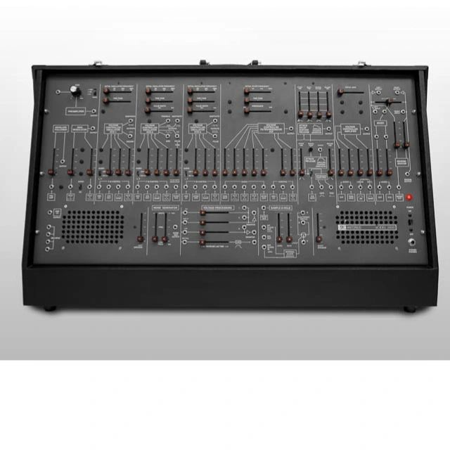
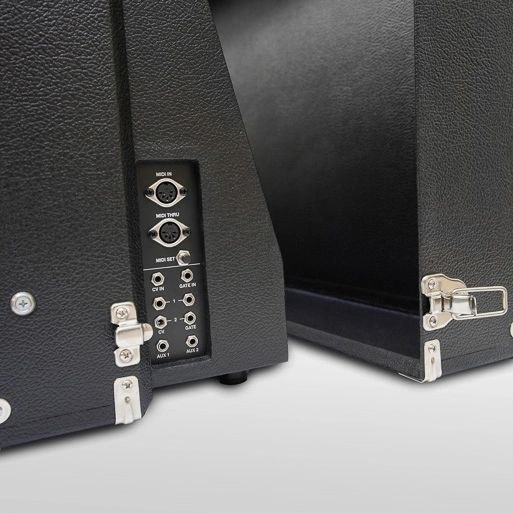
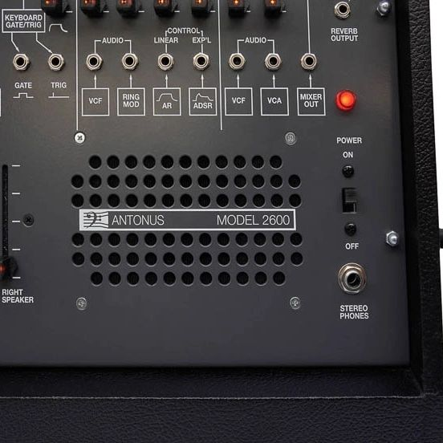

# Antonus2600 Original Size

> **Tipp**
>
> ### Welcome to your new documentation space!
>
> This is the home page of the Antonus 2600 documentation space within Confluence. 
>
> You find here everything for the build and useful support informations and links to other websites to finish or service your synth.

  

    

> **Next you might want to:**
>
>

## Search this documentation

## Popular Topics

## Featured Pages

## Recently Updated Pages
