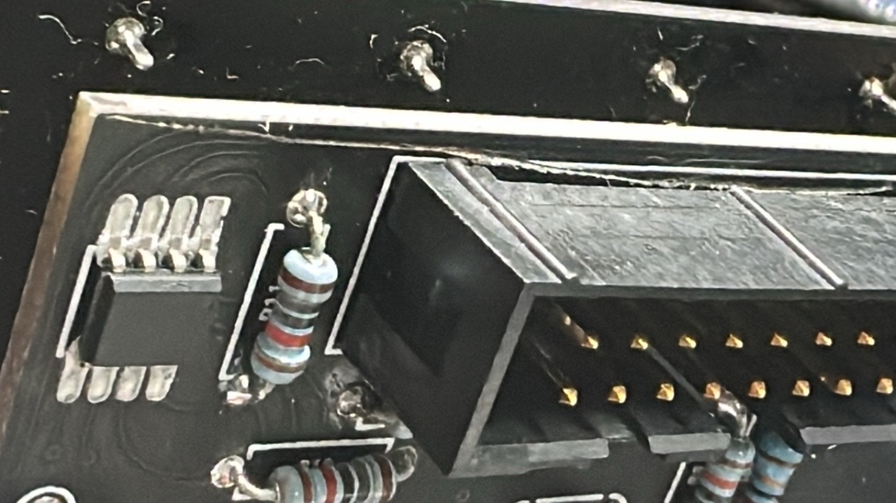
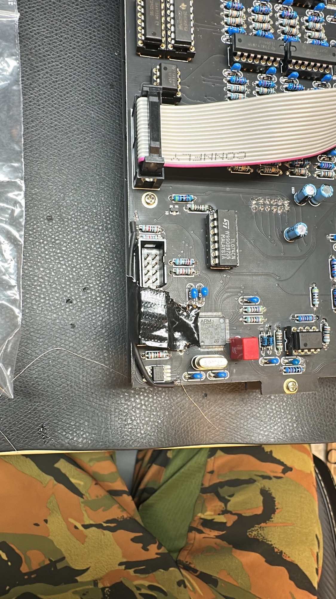

# DDRM issues

few examples what can go wrong

DIN MIDI not working, breakout MIDI LED is flashing but on the OLED is no voice triggering visible

Caused by: defect trace between IDC Connector and ARM uC on Mainboard

fixed by: shielded transformer copper wire soldered at the traces

