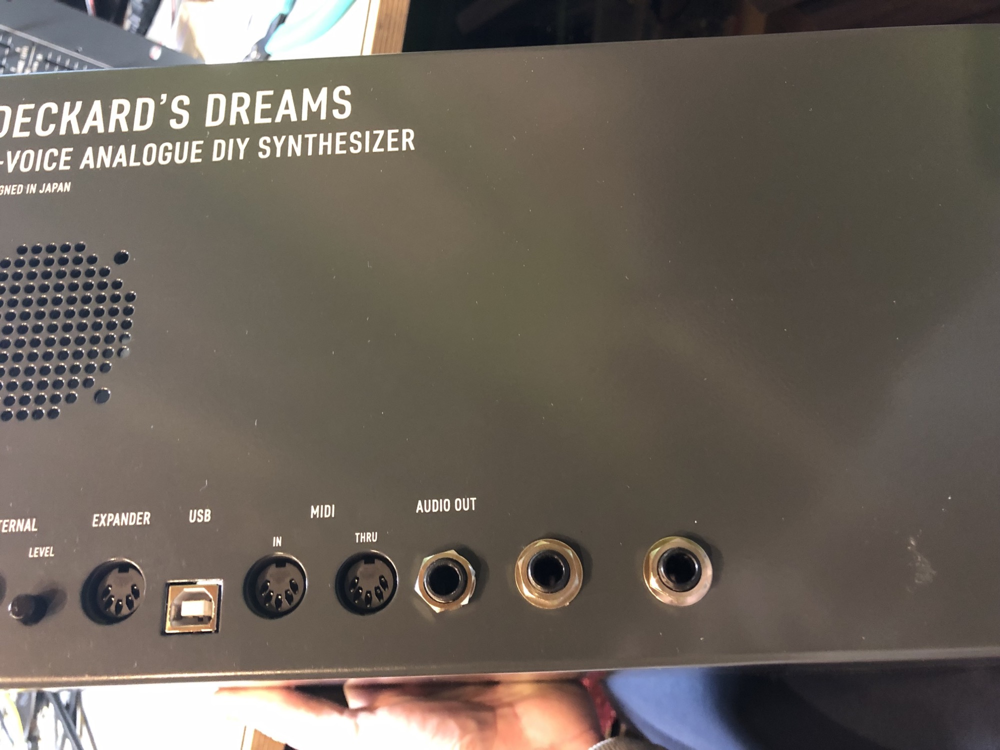
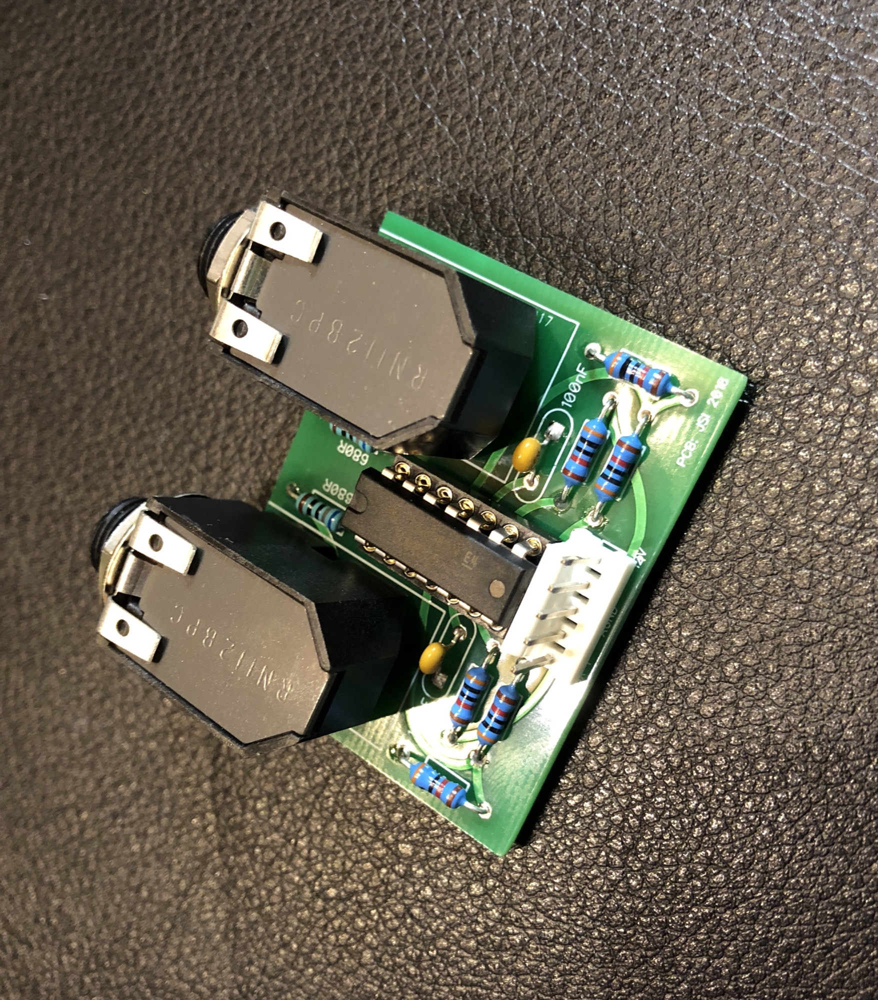
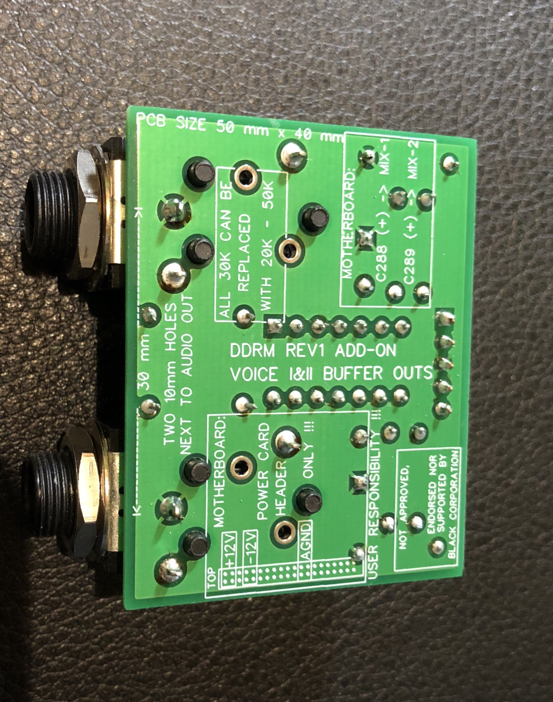
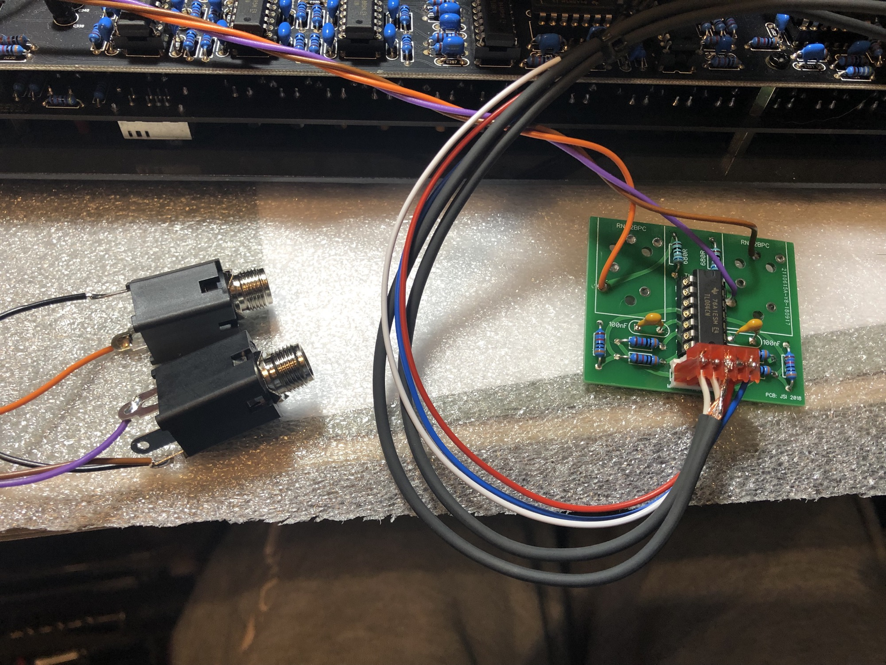
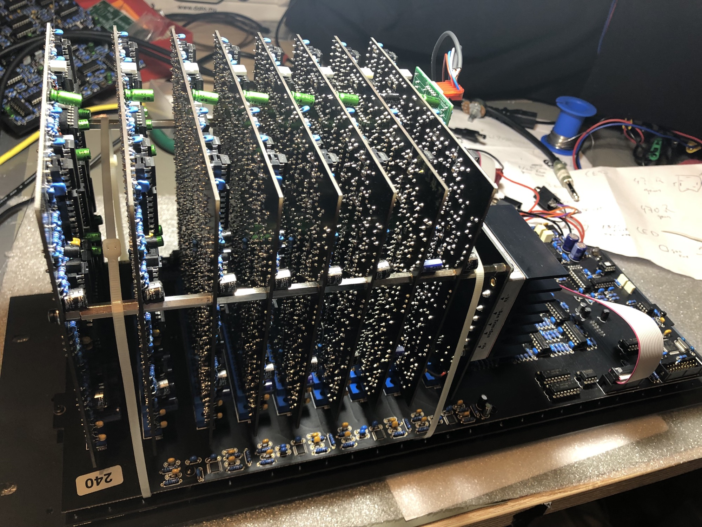
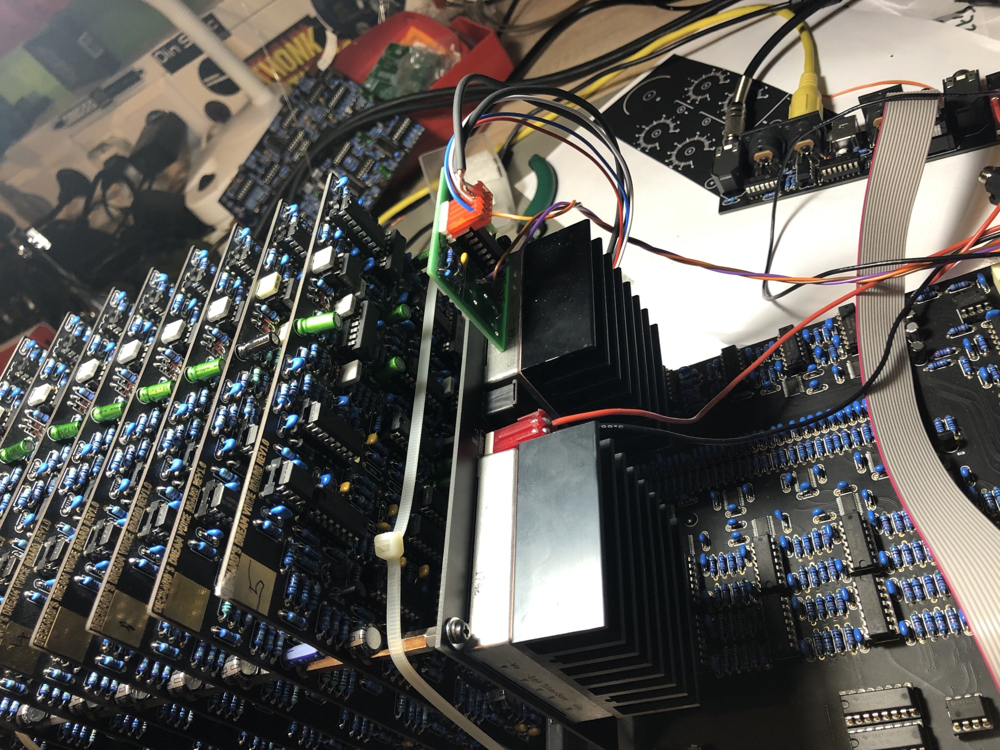
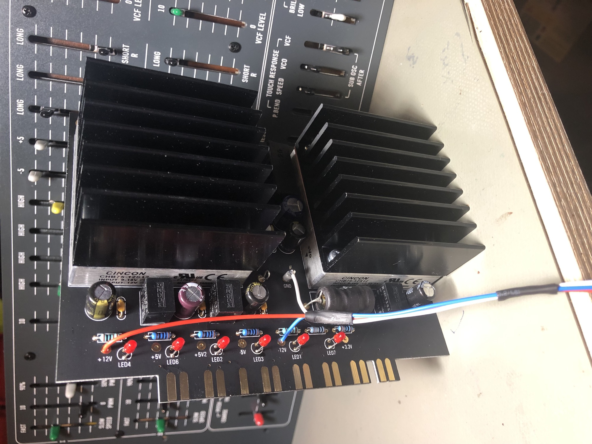
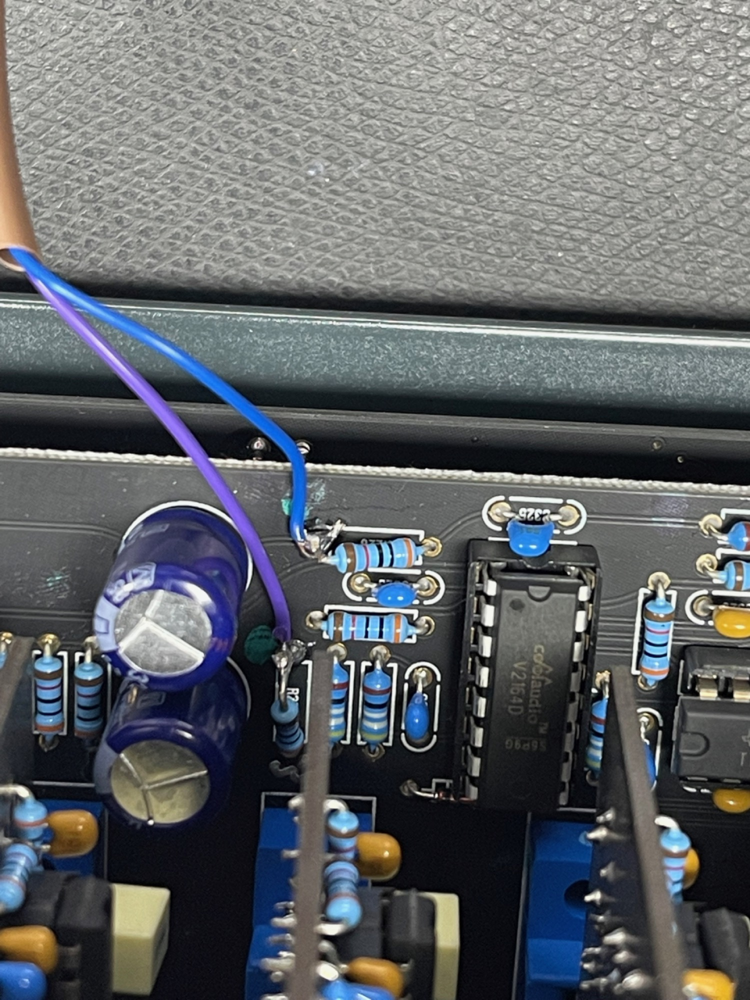
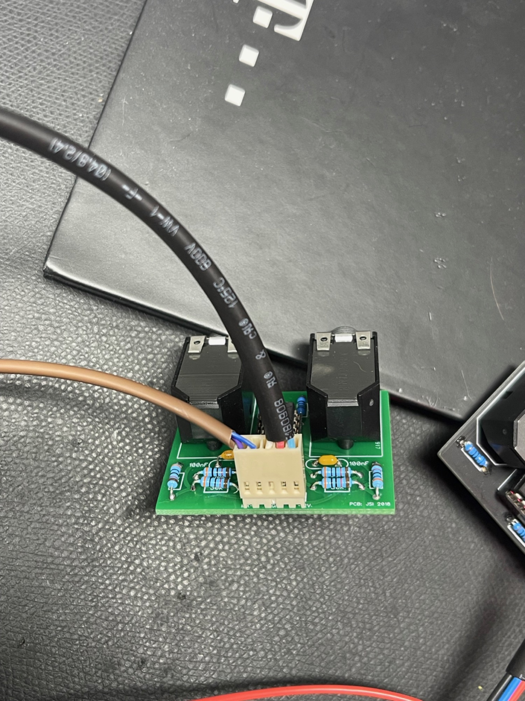
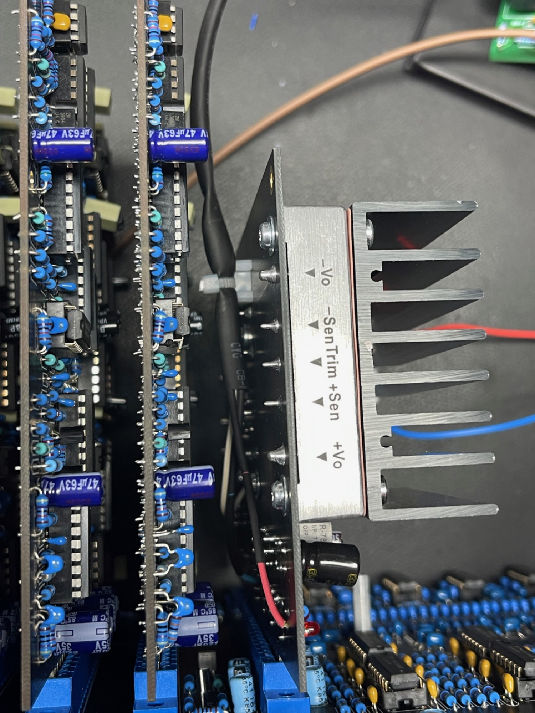

# DDRM Stereo Out Modification

> This modification provides a stereo output from the REV1 DIY Deckard’s Dream synthesizer by using the summed outputs from both voices before they are mixed to a single audio signal on the motherboard. It DOES NOT provide a stereo signal to the headphone jack, and the volume knob on the front panel DOES NOT function for the stereo outputs.
>
> The stereo output can be used to provide more flexibility when recording. It separates the individual voices that are normally mixed within the synthesizer. As a result, some patches that require precise mixing of these voices will sound different when separated (but of course they can be properly mixed again later). It provides a wide stereo image when used with similar, but slightly different voices.
>
> There is no fabricated circuit board for this at this point. You must design your own, either by using PCB design software or using a simple prototype board, which will work fine as it has a minimal number of components.
>
> PLEASE NOTE: This modification is provided by and for the Deckard’s Dream DIY community only and IS NOT APPROVED, ENDORSED NOR SUPPORTED BY BLACK CORPORATION. Please DO NOT contact the factory for support with this. The user making the modification assumes any and all responsibility. The developers of this modification ARE NOT RESPONSIBLE in any way to any damage, loss, malfunction, diminished value or any other detrimental effects caused by this modification to your Deckard’s Dream synthesizer or any outboard gear connected to it. If you don’t agree with the foregoing, please do not proceed with making these modifications to your synthesizer.

PCBs are available from [DIYSYNTH.de](http://diysynth.de)   (my shop)

BOM:

| Amount | Part | mouser |   |
|---|---|---|---|
| 2 | jacks | RN112BPC |   |
| 1 | IC-sockel 14pin | 575-11041314410010 |   |
| 1 | TL064CN | [595-TL064CN](https://www.mouser.de/ProductDetail/Texas-Instruments/TL064CN?qs=sGAEpiMZZMtCHixnSjNA6J5DQWv82hgvZWQM5RKWv9Q%3d) |   |
| 6 | 30k resisitors | [603-MFR-25FBF52-30K1](https://www.mouser.de/ProductDetail/Yageo/MFR-25FBF52-30K1?qs=sGAEpiMZZMtlubZbdhIBIOunD5kldQozCQUEOwiqxmI%3d) | order 10 to get the best price |
| 2 | 680R resistors | [MF0207FTE52-680R](https://www.mouser.de/ProductDetail/Yageo/MF0207FTE52-680R?qs=sGAEpiMZZMu61qfTUdNhG9FodMeJR7x93Z%252baTc2HpTs%3d) |   |
| 2 | 100nF MLCC | 810-FG26C0G2A104JRT6 |   |
| 1 | MTA100 5 pole header | [571-640456](https://www.mouser.de/ProductDetail/TE-Connectivity-AMP/640456-4?qs=sGAEpiMZZMs%252bGHln7q6pm5E1Eb6qwPl2JeT3h411LaE%3d)5 |   |
| 1 | MTA100 5 Pole jack | [571-3-640441-](https://www.mouser.de/ProductDetail/TE-Connectivity-AMP/3-640441-4?qs=sGAEpiMZZMs%252bGHln7q6pm48SVpWlpfsEJOIWlmXrtO0%3d)5 |   |
| 1 | cables |   |   |

[DD Stereo Out Modification.pdf](assets/DD-Stereo-Out-Modification.pdf)

[DD Stereo Out Modification.pdf](assets/DD-Stereo-Out-Modification.pdf)
