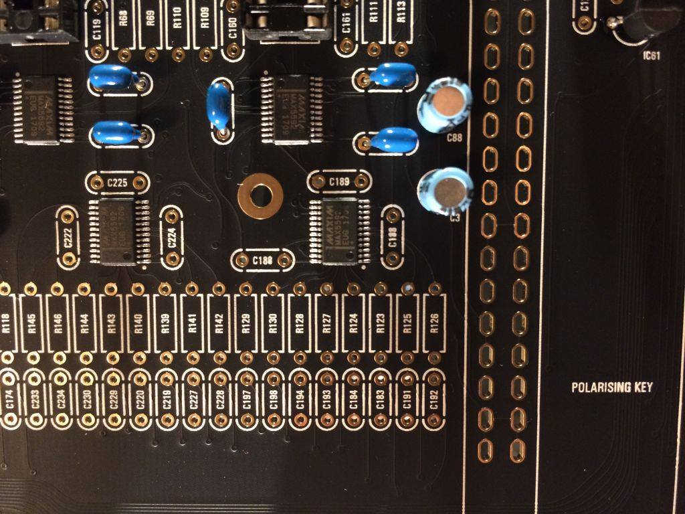
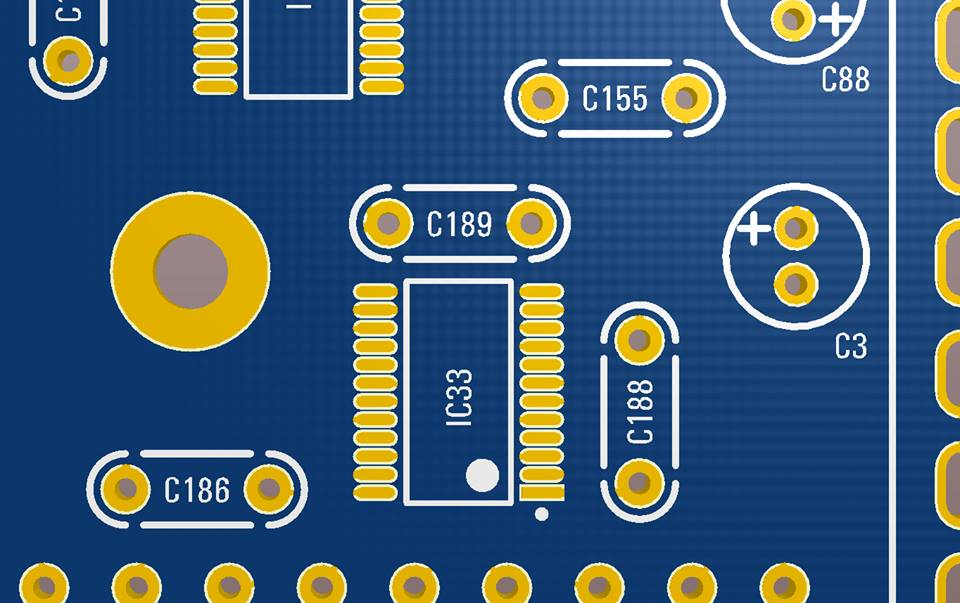
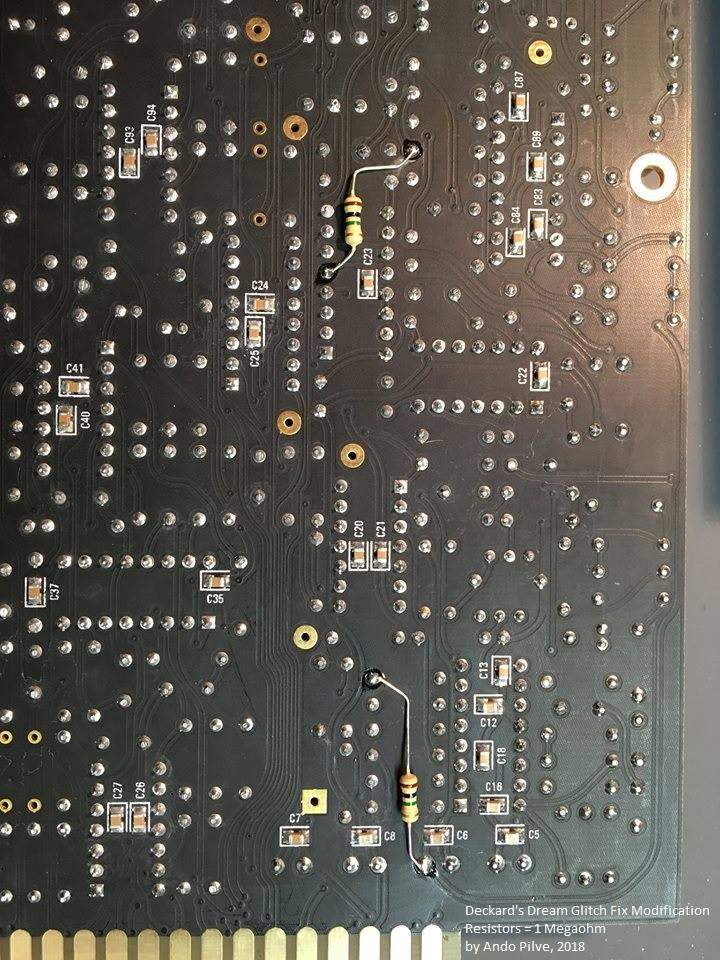
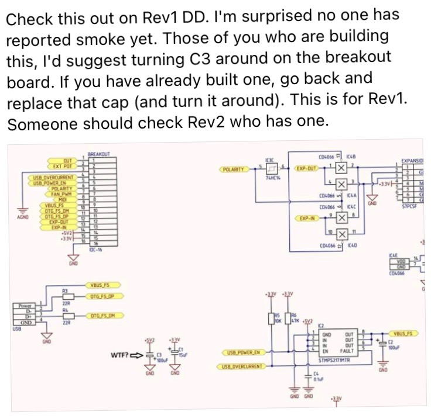
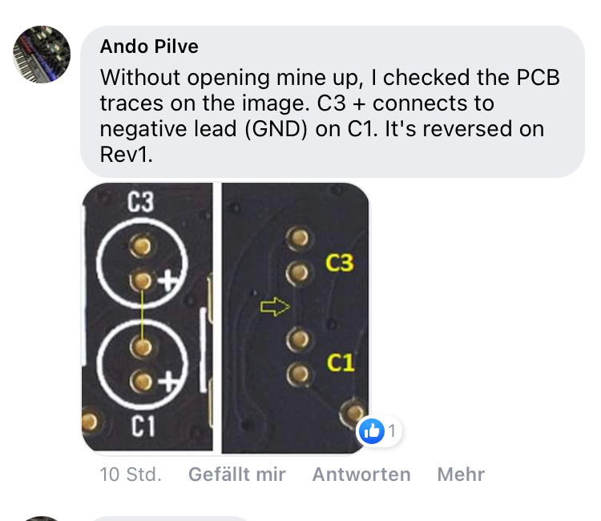
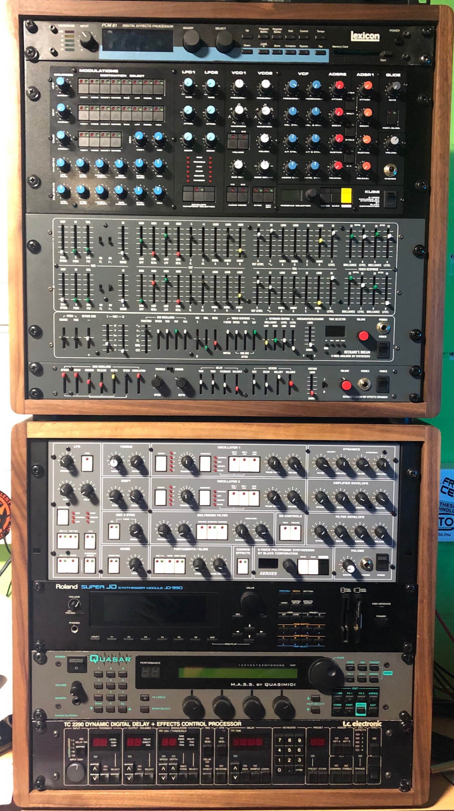

# DDRM rev.1 guide

**Page History:**

| Date | Autor | change |   |
|---|---|---|---|
| 15.Jan.2018 | LED-man | 1.1 BOM added, glitch issue, page design changes |   |
| 20.April 2018 | LED-man | github link added, firmware link, pcb version added |   |
| 09.May 2018 | LED-man | Firmware Versions updated, REV2.0 pcb page added |   |
| 18.May 2018 | LED-man | Firmware 1.2.4 with patches added |   |
| 25.July 2018 | LED-man | alfa3340 info, patcheditor links, firmware 1.2.5 |   |
| 29. Aug 2018 | LED-man | power wiring page created on subpage |   |
| 25. Oct 2018 | LED-man | update Firmware Versions, Stereo Output Mod |   |
| 2020 | LED-man | general changes - structure of this page |   |
| 10/2020 | LED-man | bug on breakoutboard - C3 polarity is wrong |   |
| 10/2021 | LED-man | BOM outputboard - replace 6N138 to 6N139 |   |

Table of Contents

> **Deckard's Dream Synthesizer**
>
> Hi all, this is the place to find the latest building documents for Black Corporation's Deckard's Dream polyphonic synthesizer.
>
> Currently, this project is at **rev 1.0**, PCB's are currently being released to builders. (18.Oct. 2017) and are being constructed.
>
> A new PCB version **rev. 2.1** was released end of 2018,**this page is only for rev.1.x**
>
> **the REV.2.0 guide is here [DDRM rev.2 guide](../ddrm-rev-2-guide/index.md)**

> **Info**
>
> Product Info:
>
> the **D**eckard's **Dr**ea**m** product is available as Build to order and DIY KIT Version, both released in 2017.
>
> Its also known or coined as the "DDRM".
>
> The difference in the DIY KIT and assembled (Build to order) are:
>
> - the component format, the DIY KIT is mostly THT, the build to order synth is mostly in SMT.
> - The case size is not as deep for the build to order as it is for the DIY.
>
> Note: Although the DIY has most of the SMT devices pre-installed onto the PCBs, there are over 675 SMT decoupling capacitors (0805) and one small (SOIC8) power switch device that MUST be installed by the builder, in addition to the through hole components
>
> Examples of Presets and voices: [https://soundcloud.com/deckardsdream](https://soundcloud.com/deckardsdream)

## Technical Specs: (click to expand)

Mehr anzeigen

### Synthesizer features

- 8-voice polyphonic analogue synthesizer
- Fully analogue signal path
- 2 synthesis layers per voice
- 256 presets

### Layer architecture

- VCO with square, saw and sine waveforms
- PWM with sine-wave LFO
- Manual PW (50-90%)
- 12dB HP and LP discrete filters with separate resonance controls
- ADSR filter envelope with adjustable initial and attack levels
- ADSR VCA envelope
- Velocity and aftertouch controls for filter brilliance and volume levels

### Master controls

- Global coarse/fine tune
- VCO2 detune
- LFO with sine, saw, ramp, square and stepped random waveforms
- LFO destinations: VCO, VCF, VCA
- Crossfade between layers 1 and 2
- Global filter brilliance and resonance control for additional resonance
- Polyphonic aftertouch destinations: LFO speed, LFO to VCO amount, LFO to VCF amount, filter brilliance, volume level
- Keyboard tracking adjustment for VCF and VCA

### Controls

- MIDI/MPE with polyphonic aftertouch
- Polyphonic pitchbend
- Unison
- MIDI over USB
- 128 factory and 128 user presets
- Alternate scales and tunings
- Software editor by [Spektro Audio](http://spektroaudio.com)

### Display

- 128×64 OLED display

### Connectors

- DC input jack (9-24V)
- External modulation input jack (1/4″)
- Expander jack (DIN5)
- USB jack (type B, device/host)
- MIDI IN jack (DIN5)
- MIDI THRU jack (DIN5)
- AUDIO OUT LOW jack (1/4″)
- ### AUDIO OUT HIGH jack (1/4″)

### Physical specifications\* the DIY VERSION is different for the depth and weight

- 19″ 4U rack-mount
- Width: 483mm / 19″
- Height: 178mm / 7″
- Depth: 200mm / 7.8″
- Weight: ~ 4.8 kg / 10.6 lbs incl external PSU brick.

## **Current identified Errors/Omissions/Errata:**

| Date | Location | Identified issue | Resolution |
|---|---|---|---|
| Oct 20, 2017 | PCB: Motherboard rev 1.0 | Steve Sommers - Capacitor C188 designation is duplicated. C186 is missing.  | From Roman:  |
| Oct 21, 2017 | PCB: Voice card Rev 1.0 | Resistors R40, R45, R151 and R146 have space on the circuit boards, but there is nothing specified in the BOM | These are not used and were left in place for possible filter modifications. Leave the components spaces empty (do not put anything there). |
| Nov 11, 2017 | PSU Board Rev 1.0 | DACs not initializing on some boards. Note: Updated in BOM 1.0.8 | PSU Board Changes per Roman: Change C12 to 1uf 6.3V or higher Change C13 - 330uf 6.3V or higher 8MM DIA /3.5 LS C13 increased delays the boot of +3.3v digital rail, c12 reduced makes 5v analog rail boot faster, so, DACs start with no problem Without change sometimes they don’t start, since digital 3.3v comes to DAC before 5v |
| Dec 23, 2017 | All boards | Roman suggests that both power consumption, and heat reduction can be obtained by substituting all TL072/TL074 OPAmps with the lower current TL062/TL064. Roman also states that the pre-built units contained the TL062/TL064s | This was first suggested as a substitution for the voice cards only with TL072/TL074s being used on all other boards. However, Roman has since updated the BOM to use TL062/TL064s throughout. (*REV1.0.9)* |
| Jan 15, 2018 | All Voiceboards | waveform glitch not the same like CS-80 | To apply the "glitch fix", you will need to solder two 1.0 Meg resistors per voice board, one for each oscillator. They can be easily added to the back side of the circuit board, so all existing components can remain unchanged. In the schematic, the 1M resistors should be added to the voice board from IC4 pin 4 to +12V, and from IC4 pin 5 to +12V. Below is an image of the modification done to my voice board, showing you the optimal locations for the resistors to minimize lead length. The tolerance for the resistors is not critical at all, 5% resistors can be easily used. If needed, you can apply a small amount of silicon glue to hold the resistors in place, or even add insulation to the leads to prevent the possibility of a short. **click to enlarge ** |
| 2.October 2020 | **DIY version** **rev.1 only**Breakoutboard PCB | Capacitor C3 - the polarity is wrong labeled on the PCB this affects the 5.2V power rail for the fan and USB. | remove the capacitor and install them with swapped polarity. you can use a new capacitor 15uF 10V/16V RM2mm max.5mm diameter (as before) ignore the schematics - there's a 100uF shown - but the BOM shows an 15uF capacitor thanks to all involved people to report this bug.   |
| 10/2021 | all Versions | BOM failure | replace the 6N138 to 6N139 or you run in stucking notes (the 6N138 needs 4.5V but we only have 3.3V, the 6N139 runs fine with 3.3V) |

## **Bugtracker (not updated)**

further bugs, issues, problems are reported here (here are user reported issues due to soldering failures or other issues reported too)

[https://github.com/ffont/ddrm-issues/issues](https://github.com/ffont/ddrm-issues/issues)

(i prefer to visit the Facebook Deckardsdream Build Group)

**Deckard's Dream Home and Store**: [http://www.deckardsdream.com](http://www.deckardsdream.com)

## Current BOM 1.10 from 08.Jan.2017 (still valid in04/2019)

[DD-BOM-REV1.1.0.pdf](../assets/DD-BOM-REV1.1.0.pdf)

[DD-BOM-REV1.1.0.xlsx](../assets/DD-BOM-REV1.1.0.xlsx)

**Shared Mouser Basket:** [https://www.mouser.com/ProjectManager/ProjectDetail.aspx?AccessID=9ba27b85b3](https://www.mouser.com/ProjectManager/ProjectDetail.aspx?AccessID=9ba27b85b3)   (**not approved** - check for SMT caps)

Ultravox reply: "The cart doesn't include items that the BOM says are sourced from eBay, Small Bear, synthcube, etc."

About partsourcing:  check the price for the next price break ( 3 resistors are more expensive than 10)

for EU users: order from www.TME.eu standard parts, its cheaper than Mouser

> **Alfa 3340**
>
> According to Alfa, i spread the good new: After some common work last week with them on DD and AS3340, We can officially announce that Deckard is happy with theses chips 
>
> 
>
> Here are the values to update : 
> - FM input (initial current - solve the corrupted calibration) : R6/R112 to 390k 
> - 12V adaptation (supply current to internal 3340 Zener) : R39/R145 to 560r 
> - PWM Comparator output (minimize pwm control on frequency) : R22/R128 to 51k
>
> please note, this parts are not present in the BOM and guides !

## User Manual

[deckards\_dream\_manual\_130.pdf](assets/454865_deckards_dream_manual_130.pdf)

## Official Build Guide: ~~[http://www.deckardsdream.com/build](http://www.deckardsdream.com/build).~~

**[Voice Card Assembly Document.](../assets/Deckard_VoiceCard_assembly_01_01_18-2.pdf)**This was created by Lysandre Follet, and has been tested as correct by a couple builders.

**[Power wiring scheme](power-wiring/index.md)**

Backup from Assembly rev.1 guide:   **[Build – DECKARD'S DREAM.pdf](assets/Build-DECKARD-S-DREAM.pdf)**

> **Achtung**
>
> some users reported that the board doesn´t fit in the case - the mainboard pcb is too big..
>
> on the mainboard is on top and bottom a small 3-4mm pcb stripe, that need´s to be removed.

## Build Tips

prepare BOM and Parts:

modify the BOM, change it to single sheets (tabs) instead in one list or you can easily scroll in the long list to the wrong board (like motherboard instead control board)

when you have received the parts, prepare different boxes (resistors, capacitors, ICs, hardware)

sort the bags to values like 1R-9,99K 1K-9.99K 10K-100K and so on.. same for capacitors.

start on the boards with the most used values like 499R

this speed up your build

measure one part from each bag and label the bag like "T" for tested.

check the BOM for the quantity for the board and count each value, drop it in a small box or put the secure on your desk before you install.

## OLED Display:

make sure your OLED folow this pinout  **VCC-GND-SCL-SDA**, very often shows the shop the correct pinout but deliver another type.

**AND shorten  the pins on the display side (where the Frontpanel is) to prevent shorts to the Frontpanel, (some pins are too long and can touch the frontpanel)**

if you cant source the correct display  (pin) use restore legs and bend they - use cable shrink tube to protect this for shorts

## Powersuply Warning

don't mix the external PSU bricks or you destroy your Device.

The Kijimi use a 24V DC PSU

DDRM v1 DIY use a 12V DC PSU

DDRM v2 DIY use a 12V DC PSU

## Troubleshooting

a lot of users reported problems with slider calibration or display failures, auto tune.

the most issues are from a faulty ARM chip, this can easily happen by:

wrong component values on motherboard and Controlboard, shorted 3.3V power.

a short connection from 3.3V to ground or (12V/5V/-12V) is enough to kill a function in your ARM Chip.

Q: what can you do in case of failure ??

A: read and understand the schematics and double check the BOM against your parts (there are few different values between BOM and Schematic) the latest BOM (see above) is correct not the schematics !

> **good to know**
>
> some users plugged the powersupply in a voicecard slot and earn a damaged ARM processor.
>
> to minimize this risk, few solutions:
>
> put a tape on the voicecard slots 2-8
>
> or use a cable tie to shorten/bind the powercable between powersupply and breakoutboard as short as possible (you can´t attach the powersupply furthermore in a voicecard slot)

> **Tipp**
>
> when you have trouble with your voicecards like a whistle on upper or lower card or wrong VCF...
>
> the calibration process is not perfect, swap this "faulty" voicecard with another card and run the calibration for the single voicecard not for all.
>
> if everything wents wrong: insert only one voicecard in Slot1, run calibration (not the tune function). when everything is fine, add the second card to slot 2 and run again calibration - on slot 2, insert card 3 and so on..

**Firmware and Bootloader, Manuals moved to this Page:**

[User Manual and Firmware](../user-manual-and-firmware/index.md)

## **Modification**

**subpage:**

**[DDRM Stereo Out Modification](ddrm-stereo-out-modification/index.md)**

## **Knowledge and other links**

Build: [Deckards Dream General Build Thread](https://www.muffwiggler.com/forum/viewtopic.php?t=189382)

Discussion: [DIY CS-80 imminent...(Deckard's Dream)](https://www.muffwiggler.com/forum/viewtopic.php?t=177810)

[https://www.facebook.com/groups/deckardsdream/](https://www.facebook.com/groups/deckardsdream/)

## **Parts Resources:**

Synthcube complete parts kits: [http://synthcube.com/cart/ddrm-deckard-s-dream-kit](http://synthcube.com/cart/ddrm-deckard-s-dream-kit)

Thonk Group Buys for CEM3340: [https://www.thonk.co.uk/shop/curtis-cem3340-ic-vco-chip/](https://www.thonk.co.uk/shop/curtis-cem3340-ic-vco-chip/)

Wooden Case: Ross Lammond (UK) [http://www.lamonddesign.co.uk/index/](http://www.lamonddesign.co.uk/index/)

**a very helpful Tool for the SMD Soldering**: (and sponsoring for this website hosting)

([link here](https://www.amazon.de/gp/product/B01AL2YAQ6/ref=as_li_tl?ie=UTF8&tag=ledman-21&camp=1638&creative=6742&linkCode=as2&creativeASIN=B01AL2YAQ6&linkId=24106e9b77f9981031face0643a172db))

## Wooden Case: I can offer this cases - in different sizes and colors

