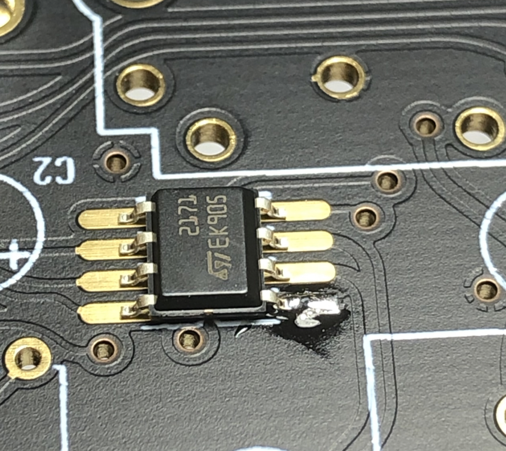
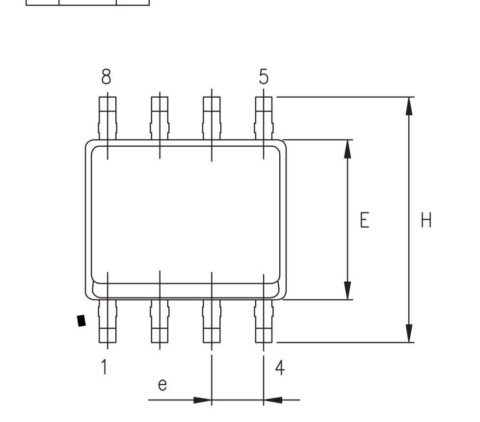
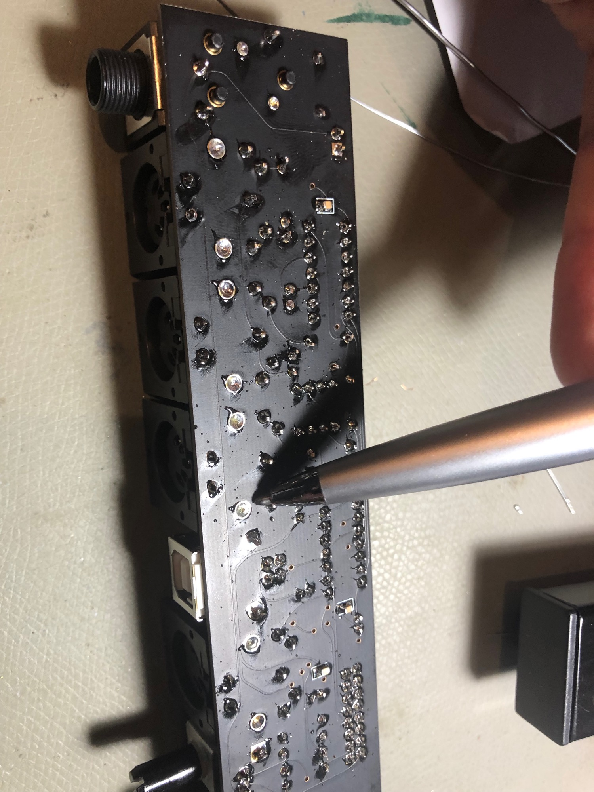

# DDRM v2 build tips

## i built my DDRM v2 in 09/2019 (after 5 rev1. builds)

## BOM

## make sure you have an 6N139 instead of 6N138 in the output board or you run in an issue with stocking notes

## Soldercore:

use no clean solder core, (do not use organic based flux based core)

you need 0,5mm and 1mm core

## PSU card

double check the pinout of all capacitors (long leg is positiv end)

LEDs:  the Mouser LEDs don't follow the standard pinout !!!   - the long leg is negativ 

normal LEDs are as shown, when you look in your LED - you can see a long and short part inside..  that's not happen on our LEDs from the mouser BOM !! please check it

**short leg is the flat end of the pcb silk (there's a circle with a flat end on the pcb printed)**

## Breakoutboard:

for the LED: the Mouser LEDs don't follow the standard pinout !!!   - the long leg is negativ 

the SMT IC orientation is followed by the skewed IC side (not with the IC print)

add solder core on one pad and add the IC, then move it in the correct way that all pins are in the correct alignment.

         

clean the pcbs:

close the holes with solder - its easier for washing...

use hot water for no clean solder core, otherwise isoporopyl.

## **Powersuply Warning**

don't mix the external PSU bricks or you destroy your Device.

The Kijimi use a 24V DC PSU

DDRM v1 DIY use a 12V DC PSU 

DDRM v2 DIY use a 12V DC PSU

## **NO SOUND BUG**

The 2pin MTA100 header on the mainboard close to the PSU Slot is wrong labeled, ground and SIG is in wrong orientation (GND = SIG, SIG is GND)
