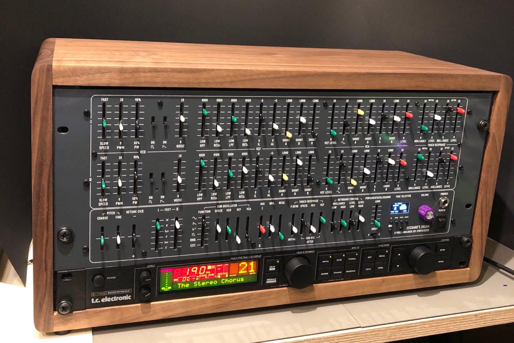

# DDRM Home

> **Deckard's Dream Synthesizer**
>
> Hi all, this is the place to find the latest building documents for Black Corporation's Deckard's Dream polyphonic synthesizer.
>
> feel free to share videos, audio demos for this pages (contact me)

For now we have 4 different versions of the DDRM  Rev1.x and Rev2., each revision comes in a DIY version and assembled Version

if you like my work, feel free to use my paypal gift function

<form action="https://www.paypal.com/cgi-bin/webscr" method="post" target="_top">
<input type="hidden" name="cmd" value="_donations">
<input type="hidden" name="business" value="percysworld@web.de">
<input type="hidden" name="lc" value="GB">
<input type="hidden" name="item_name" value="DSL-man">
<input type="hidden" name="no_note" value="0">
<input type="hidden" name="currency_code" value="EUR">
<input type="hidden" name="bn" value="PP-DonationsBF:btn_donateCC_LG_global.gif:NonHostedGuest">
<input type="image" src="https://www.paypalobjects.com/en_US/i/btn/btn_donateCC_LG_global.gif" border="0" name="submit" alt="PayPal - The safer, easier way to pay online!">

</form>

[https://www.youtube.com/watch?v=IUvQr-EnVHw](https://www.youtube.com/watch?v=IUvQr-EnVHw)

## Recent space activity

## Space contributors
