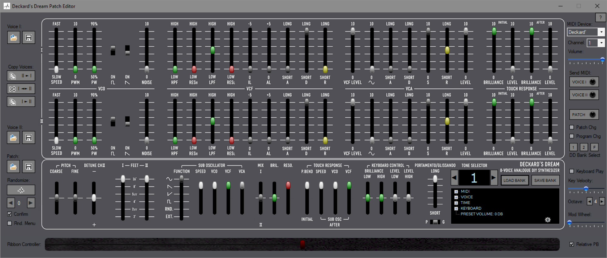
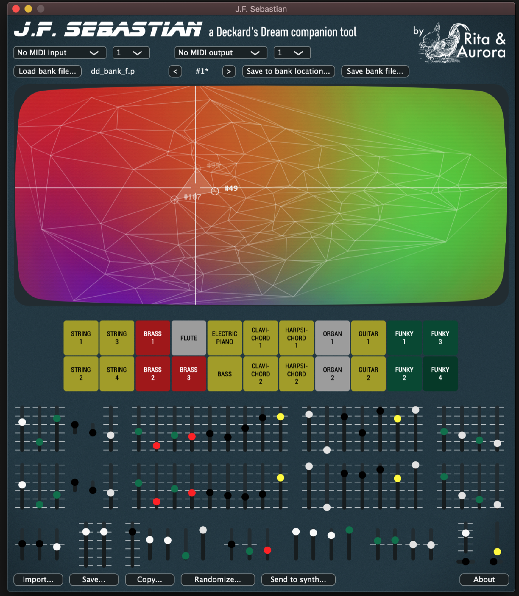

# User Manual and Firmware

updated05-2026

## **Firmware and Bootloader**

**check the download location: black-**[**http://black-corporation.com**](http://black-corporation.com)**for updates, i prefer to wait few weeks before you install a newer version, or check the closed facebook group for comments.**

**official Firmware and Guide for rev.1 and rev.2 (not MK2)**

Firmware installation procedure/guide:

[Deckard's Dream software loading procedures R0.9.3.docx](../assets/Deckard-s-Dream-software-loading-procedures-R0.9.3.docx)

latest Firmware 1.4 from December 2020 and stable for DDRM rev.1 rev2 (sometimes called as MK1) **its NOT for the MK2**

[DD1.4.0 2.bin](assets/DD1.4.0-2.bin)

[Deckard's Dream Xmas Update\_1.4.zip](assets/Deckard-s-Dream-Xmas-Update_1.4.zip)

. (Bundle with patches)

(just boot the DDRM in USB Mode and drop the above bin file in the USB drive and reboot the DDRM, works on Windows and OSX)

**DDRM MK1 + MK2 (not DIY versions !)**

[DDRM MK1+MK2 Update Pack 1.5.0+2.2.0.zip](assets/DDRM-MK1-MK2-Update-Pack-1.5.0-2.2.0.zip)

**MK2 prebuild only:**

[DD2.3.0.bin](assets/DD2.3.0.bin)

[DDBootloaderMKII.hex](assets/DDBootloaderMKII.hex)

 **Release Notes**

Mehr anzeigen

`Deckard’s Dream Release Notes`

`Deckard’s Dream 1.4.0`

`New Features and Improvements:`

`10 available user banks upgraded from 3.`

`Panel Mode (PNL) can be entered by pressing
SHIFT+ENTER.`

`FACTORY presets are now editable and may be saved
over. (This includes TIME settings).`

`UP/DOWN buttons can now be pressed and held to dial
in values of parameters, for example, those in the
TIME menu.`

`Added LFO RETRIG in TIME menu.`

`Added behavior options for incoming CC messages
(PICK UP, MERGE, INSTANT).`

`Improvements in Microtuning functionality. Ability
to upload scala (.scl) files as well as user
programmable scales. Tuning programs are
automatically saved to the first empty slot with
names. Deckard’s Dream can store 10 Microtuning
programs. More information about scala and`

`Microtuning and a plethora of tunings programs can
be found here:
http://www.huygens-fokker.org/scala/downloads.html`

`Unit stays in PNL or PRESET Mode after power cycle.
Added Legato settings in MONOPHONIC voice mode.`

`Pressing BACK in the SETTINGS menu takes the user
back to the previous line in the MENU instead of
the top of the menu.`

Bugfixes:

`Fixed a bug where PWM 2 speed was affected by PWM 1
when PWM MODE was set to SEPARATE.`

`MPE and Poly Aftertouch modes have been greatly
stabilized.`

`Aftertouch response in MPE mode for BRILLIANCE and
LEVEL fixed.`

`Display in the time menu for ATTACK TIME and DEC/
REL time now shows seconds instead of Hz.`

`Unit stays in (PANEL or PRESET) state when powered
off and back on.`

`Fixed a glitch with VCF envelope which occasionally
stayed open when it should have closed.`

`Fixed a bug in GLISSANDO in which it did not work
properly with extreme high or low notes.`

`Modulation control now correctly affects FEET I and
FEET II.`

`Cards per voice is no longer an option in UNISON
(all cards are used per voice by definition).`

`CC chart has been updated.
General bug fixes and interface improvements.`

It is strongly recommended to update the boot loader of your Deckards Dream if you have access to a Windows computer and an ST-LINK device.[https://tinyurl.com/DDRMBootloader](https://tinyurl.com/DDRMBootloader)

`Feel free to contact us if you need any more information.`

`Black Corporation GK
                  www.black-corporation.com
                          150-0042
                    Tokyo-to, Shibuya-ku
                       Udagawacho 36-6
                   World Udagawa Bldg. 7F
                            Japan`

**Old version:**

[DD-FIRMWARE-REV1.3.0.zip](../ddrm-rev-2-guide/assets/DD-FIRMWARE-REV1.3.0.zip)

~~this also contains the latest Bootloader   !~~

[~~http://www.deckardsdream.com/downloads/DD-1.2.3.zip~~](http://www.deckardsdream.com/downloads/DD-1.2.3.zip)~~(updated factory presets file and an extra presets bank by Michael Rosner (comes as a BANK2))~~

**latest 3.0 Bootloader (rev.1 and rev.2 not MK2)**

[DD-BOOTLOADER-REV3.0.hex.zip](../ddrm-rev-2-guide/assets/DD-BOOTLOADER-REV3.0.hex.zip)

 (unzip the file)

**Menu Structure:**

[DD-MENU-STRUCTURE-REV1.0 (1).pdf](../ddrm-rev-1-guide/assets/DD-MENU-STRUCTURE-REV1.0-1.pdf)

**MIDI Chart** (MIDI Control Change Message Mapping for the DDRM) 

[DD-MIDI-CHART-REV1.0.pdf](assets/DD-MIDI-CHART-REV1.0.pdf)

## **Patch Editor**

Deckard's Dream Patch Editor is now available. 

Demo (free) version allows opening bank, patch, and voice files and viewing the slider settings for each patch. You can also control DD remotely via MIDI. It has built-in keyboard control (using your computer keyboard) and a CS-80 style ribbon controller. Full version can save files also and randomize the patches. 

Download link (Windows only): 
[https://drive.google.com/open?id=139IcCANbdjOIYvS6aVu7oSoUculzzEK2](https://drive.google.com/open?id=139IcCANbdjOIYvS6aVu7oSoUculzzEK2) 

User Manual (PDF): 
[https://drive.google.com/open?id=1xMHwV3TBTWAK5WPEw8NV0F6aiztP5ZnF](https://drive.google.com/open?id=1xMHwV3TBTWAK5WPEw8NV0F6aiztP5ZnF) 

## latest DDRM Editor (for free)

[http://spektroaudio.com/deckards-dream-editor](http://spektroaudio.com/deckards-dream-editor)

Max for Live (for both Mac and Windows), macOS Standalone app and Audio Unit MIDI FX plugin.

"wo last things before I leave:
1 - While the 1.0 has been working well for me, software for me is always a work in progress. If you find any proper bugs or issues, please email me via the Contact form on the website or leave a comment on this post. I'll keep an eye on it.
2 - The AU version was built using a free Juce license so you'll see a nice splash image for Juce in the corner. I'll fix this once start working more with AU / VST plugins and get a proper license."

## **J.F Editor Plugin**

link: [Rita and Aurora](https://ritaandaurora.github.io/ddrm-jfsebastian/?fbclid=IwAR0on-g81yGtJMYh-W2hXeeo3Q5XgPEznFcm7Tw-7RiTg_XPutSIBjbqQkI)

[https://www.youtube.com/watch?v=cHdO393UwKI&feature=emb\_title](https://www.youtube.com/watch?v=cHdO393UwKI&feature=emb_title)

## **Usage:**

to get the full power of your DDRM use a polyphone Midi Keyboard with poly aftertouch.

the DDRM can analyze the "new" MPE protocol over Midi.

just try a Roli Seaboard or a Linnstrument

more MPE devices are listed here: [http://www.rogerlinndesign.com/other-mpe-controllers.html](http://www.rogerlinndesign.com/other-mpe-controllers.html)

**Important**: Ableton Live 10 don't support MPE - you have to change the DDRM Midi Mode otherwise you get some problems with hanging Notes or freezes.
