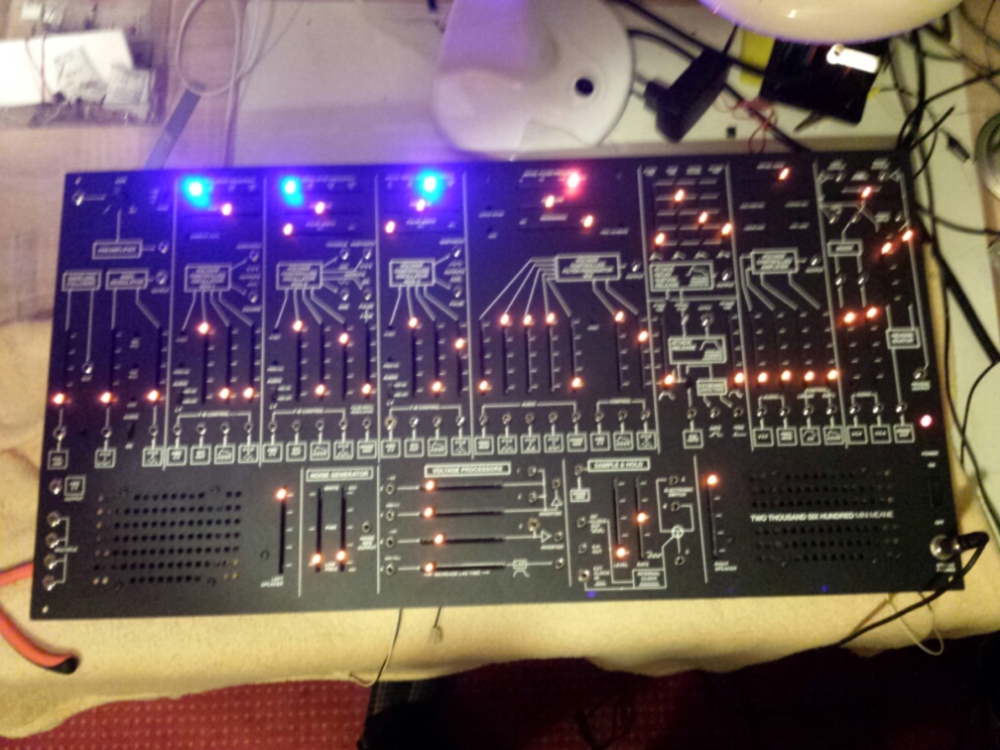

# first TTSH Arp2600 Clone finished

**First TTSH finished on  14.03.2014 by me.**

check the building doc: [TTSH ARP 2600 Clone](../../../diy-synth-other/projects/ttsh-arp-2600-clone/index.md)

Check main project website from me: [TTSH ARP 2600 Clone](../../../diy-synth-other/projects/ttsh-arp-2600-clone/index.md)

