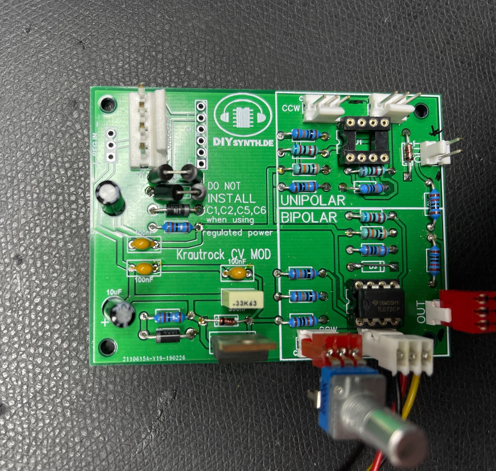
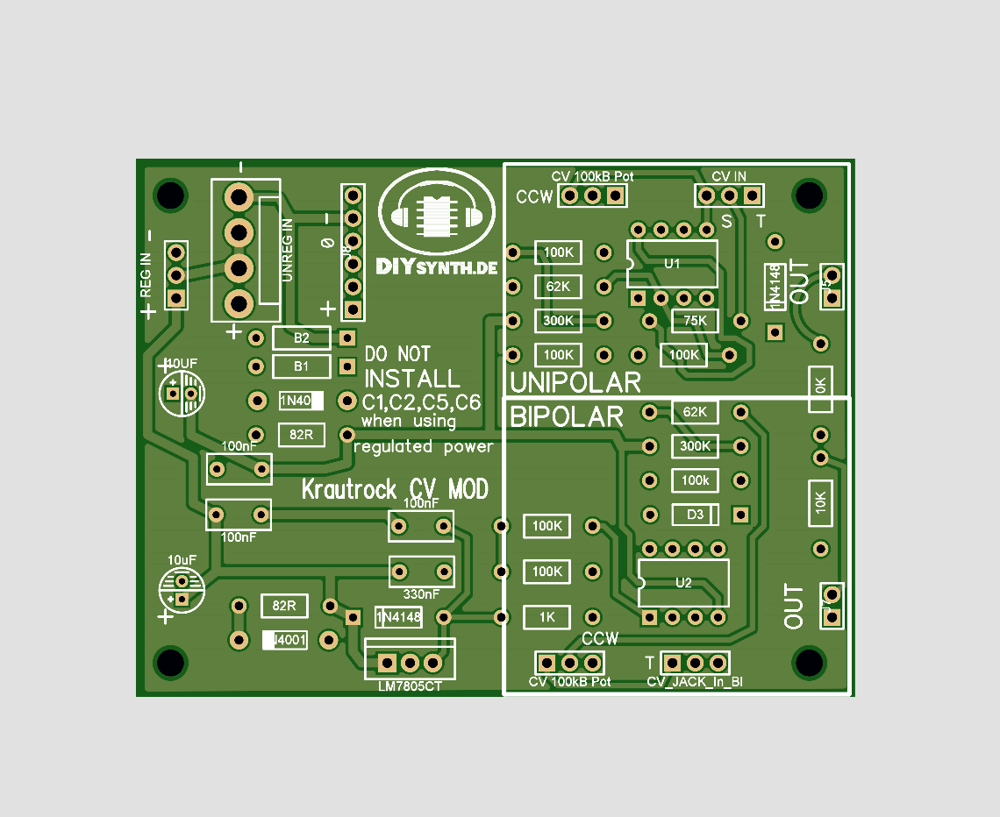
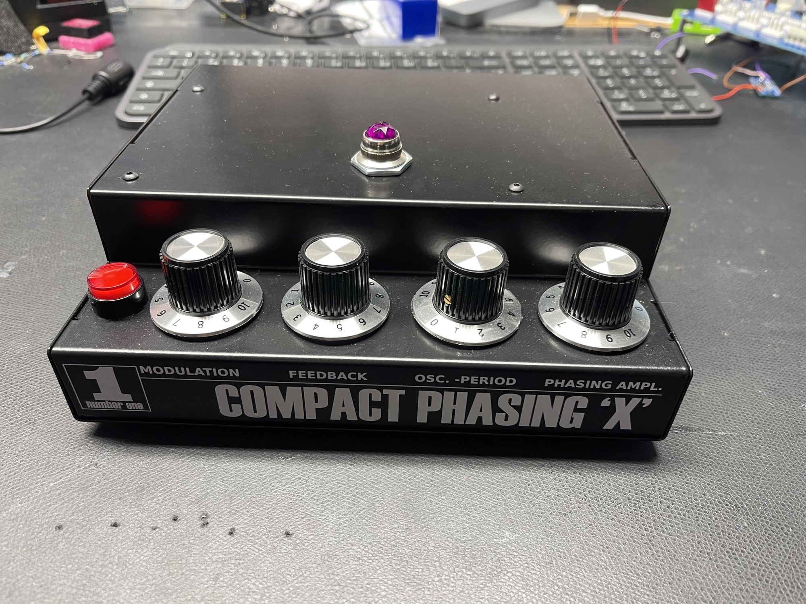
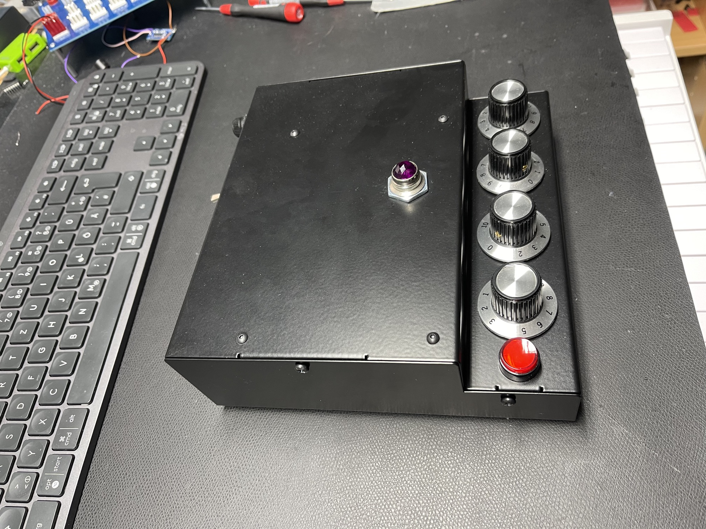
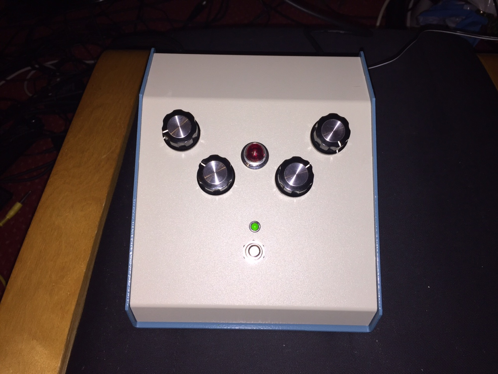

# J.Haible Krautrock Phaser standalone

A Juergen Haible Krautrock Phaser (Schulte compact phasing A clone) was born as standalone Device.

more Infos here:

[Juergen Haible Krautrockphaser in MOTM](../../modular-in-5u-projects/juergen-haible-krautrockphaser-in-motm/index.md)

**Additional Mods in some of my Krautrock Phaser:**

CV MOD: (this PCB was tested and works) let me know if you want a pcb.

[jh\_krautrock\_cv\_input\_mod\_v2\_630.png.pdf](assets/jh_krautrock_cv_input_mod_v2_630.png.pdf)

**Schemata:**

 [Bildschirmfoto 2023-03-29 um 14.32.41.png](assets/Bildschirmfoto-2023-03-29-um-14.32.41.png)

D3 isnt needed from my POV.

if you still have a -15/15V source (from Krautrock PCB) you dont need to install the extra C1,C2,C5,C6 (2.2uF-10uF for example)

  

 

