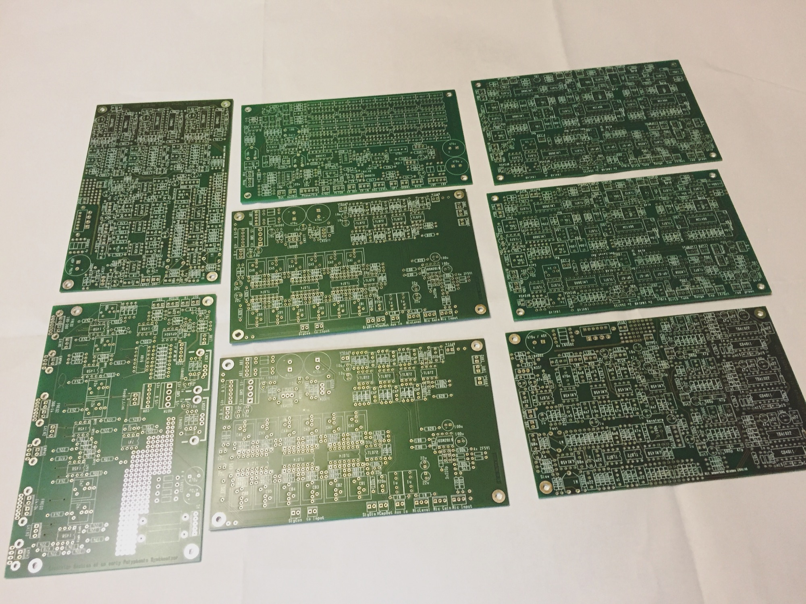

# Juergen Haible pcbs received

i received a lot of **old stock** Juergen Haible pcbs,

its planned to build 2x Frequency Shifter in 2U 19" rack with indcluded 2 LFOs for modulation [like my first build](../../../diy-synth-other/projects/juergen-haible-fs1a-frequency-shifter/index.md).

Further its planned 2x Triple Chorus in 1U 19" Rack or as desktop case [like my Haible Krautrockphaser](../2015-10-01-j-haible-krautrock-phaser-standalone/index.md).

I left a old stock Tau Pipe Phaser pcb too, its possible to add this in a 19" 1U Case with the great Triple Chorus too.

feel free to contact me

