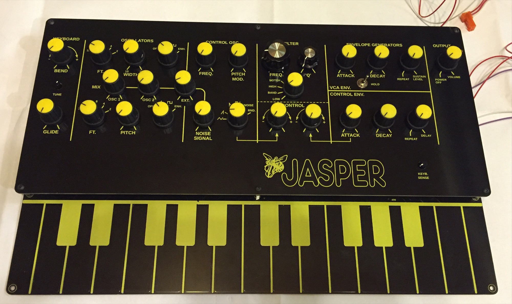

# Jasper Wasp Clone build

I finished last week the WASP Clone "Jasper"

The pcb and panel is available from [https://www.muffwiggler.com/forum/viewtopic.php?t=151625](https://www.muffwiggler.com/forum/viewtopic.php?t=151625)

The Jasper sounds very good, with nice functions like VCO Mixer, addional waveform (enhanced pcb)

total costs are around 300€ (depends on your electronic parts seller for sockets, ICs)

my build docu page:

[Jasper Wasp Clone](../../../diy-synth-other/projects/jasper-wasp-clone/index.md)

