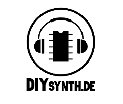

# Onlineshop online

**After 7 years in DIY I have now founded my own company, called:**

[https://www.DIYSYNTH.de](https://www.DIYSYNTH.de)

At the moment is the Steffcorp 2600 VCO PCB and Panel available.

We work on Modules from a friend called "VDD" -   DIY kits, assembled Modules, both in Eurorack and 5U Format (MU and MOTM).

New Arp Synthesizer Clones and a new Syncussion clone from Germany are in the development and for sale here later too.

Matched and rare parts are available, I still work hard to fill the shop with more parts every day.

please contact me if you want sell your own PCBs/Panels/Modules in my shop.
