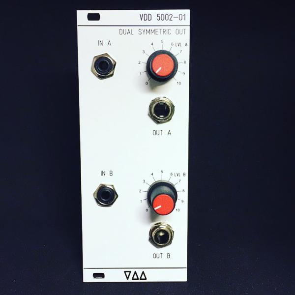

# first VDD Module on DIYSYNTH.de

VDD released his first  Eurorack Module, a DUAL SYMMETRIC Output Module on [https://www.DIYSYNTH.de](https://www.DIYSYNTH.de)

It´s available as DIY KIT,  assembled Module,  DIY-PCB only Version.

more here: [VDD 5002-01 DUAL SYMMETRIC OUTPUT Module](../../../diy-eurorack/vdd-modules/vdd-5002-01-dual-symmetric-output-module/index.md)

due to my side business closure, the pcb/panel /kit is only avaiable on request by [email](../../../impressum-info/impressum/index.md).

