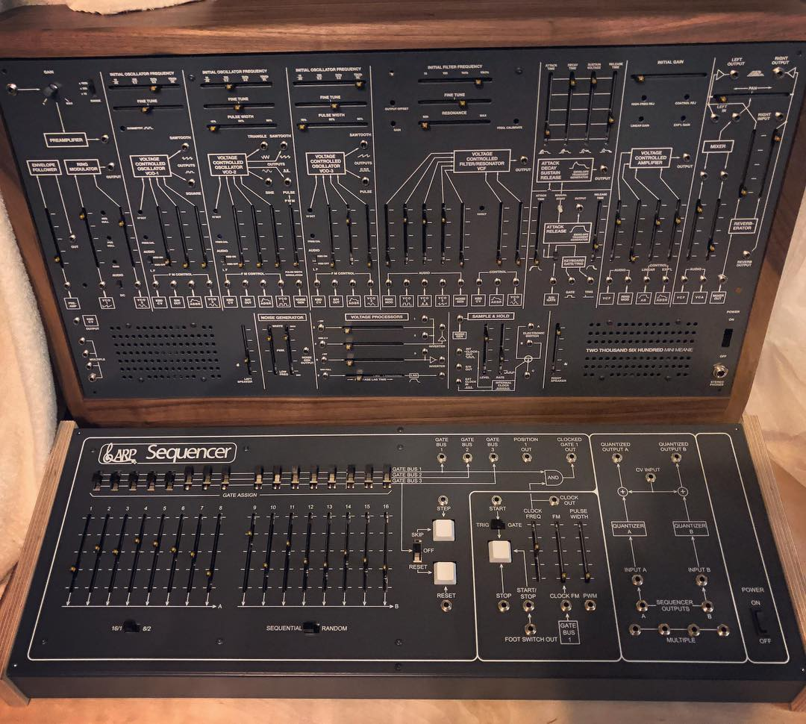

# Arp 1601 Clone Sequencer PCB-Panel-Boat

~~The new rev.5 Arp1601 Sequencer is available in my store:~~

~~[https://www.diysynth.de/pcbs-panels/arp1601-pcb-panel-boat-holzseitenteile.html](https://www.diysynth.de/pcbs-panels/arp1601-pcb-panel-boat-holzseitenteile.html)~~

sold out 04/2018

i updated the BOM and buildguide: [Arp1601](../../../ttsh-addons/arp1601/index.md)

