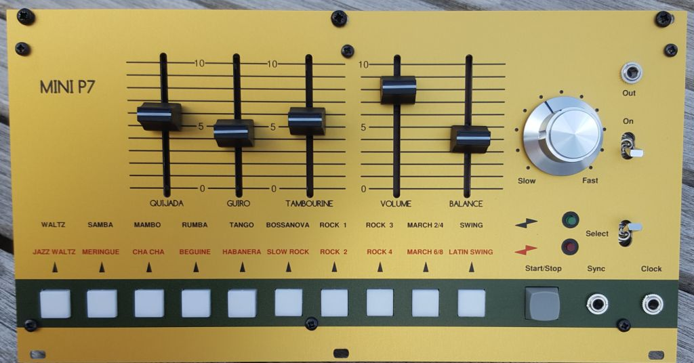
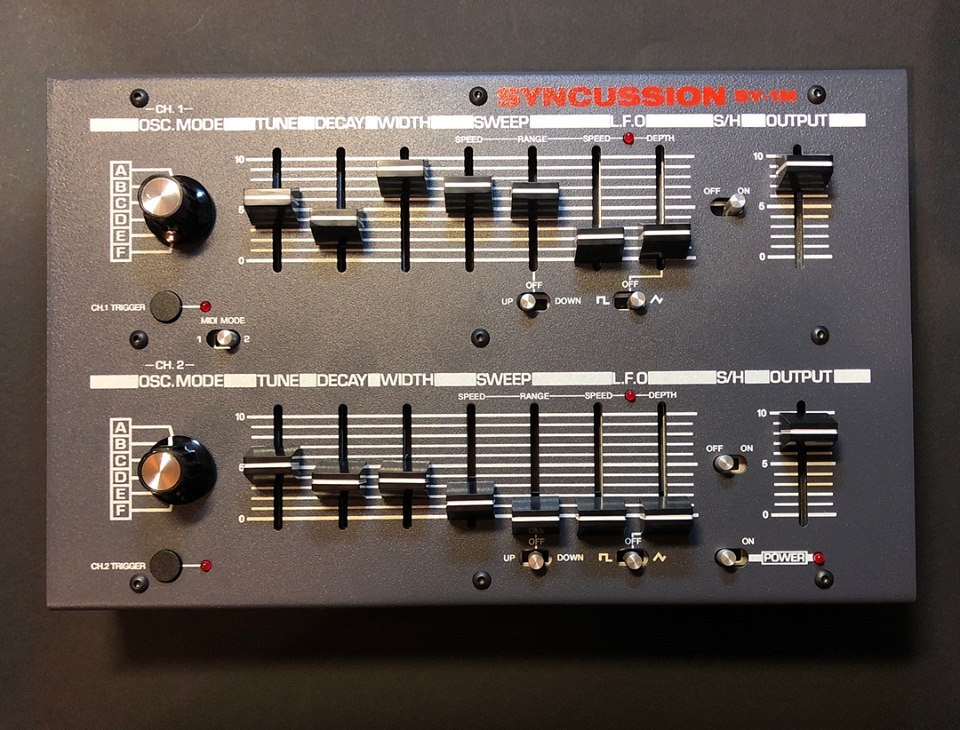

# Summer SDIY news

## Project summary:

### whats happen:

[Psycox](http://www.psycox.co.uk) (Simon) offer a syncussion clone, the **SY-1M** with Midi and improved partslist, less THT Transistors (instead of the THC SY-1), less hum/noise from powersupply

project link:  [https://www.dsl-man.de/display/DSO/Syncussion+SY-1M](../../../diy-synth-other/projects/syncussion-sy-1m/index.md)

furthermore the first **syncussion clone SY-1** is again available too for order from:

[https://shop.73-75.com/syncussion-sy-1-preorder](https://shop.73-75.com/syncussion-sy-1-preorder)

a new project is coming soon, the clone/replica of the **Elektor Vocoder**:

project documentation:

[https://www.dsl-man.de/display/DSO/Elektor+Vocoder+Clone](../../../diy-synth-other/projects/elektor-vocoder-clone/index.md)

and a further new project: the Korg Minipops 7 clone,  **MiniMP7 and MP7**

[https://www.dsl-man.de/display/DSO/Minipops+MP7+clone](../../../diy-synth-other/projects/minipops-mp7-clone/index.md)

> **Info**
>
> copyright/IP info:   i´m not the resonsible person for the "products", its just an documentation about this projects.

