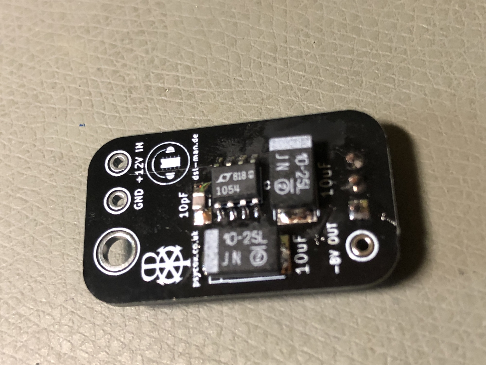
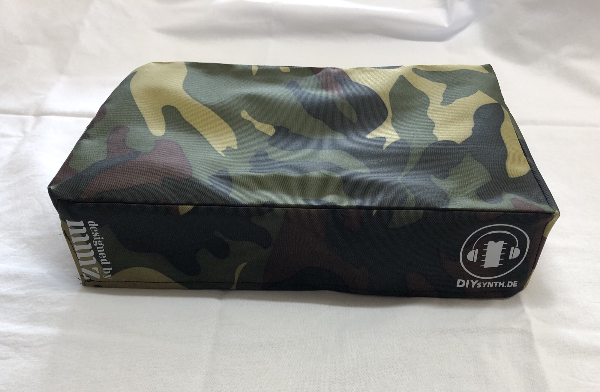
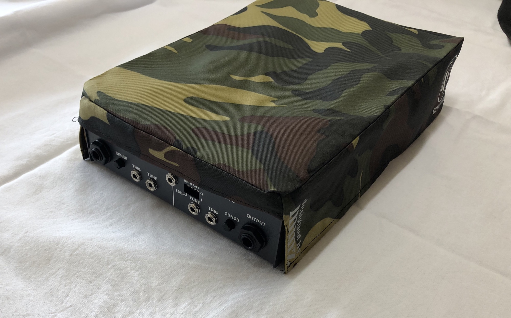
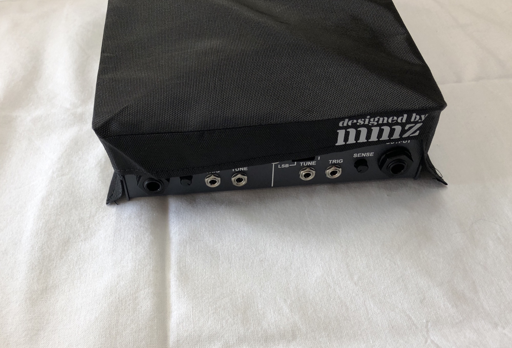
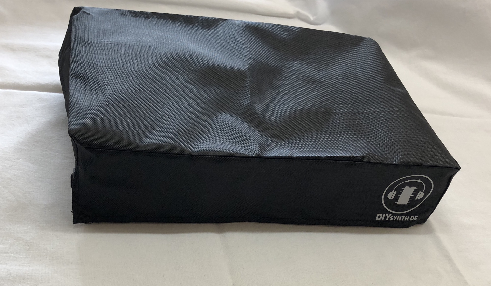

# November 2018 News

I designed with the help of Simon Cox a PCB to fix the hum problem of the THC SY-1 Syncussion, which also helps in the SY-1M in case you have a coil hiss.

A Syncussion Dust Cover is available too, this fits for the SY-1 THC Version and SY-1M Version.

Futhermore my Webshop [https://www.DIYSYNTH.de](https://www.DIYSYNTH.de) is back, all new products are exclusively available there.

