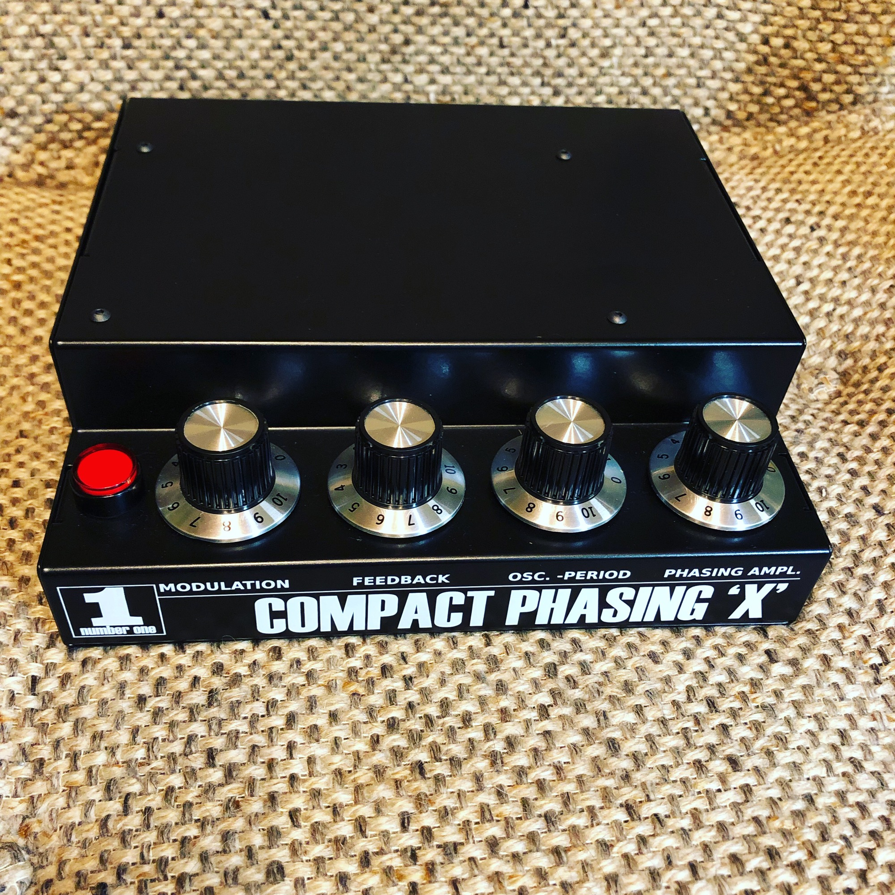
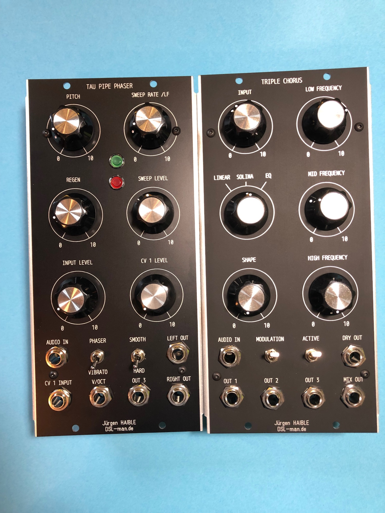
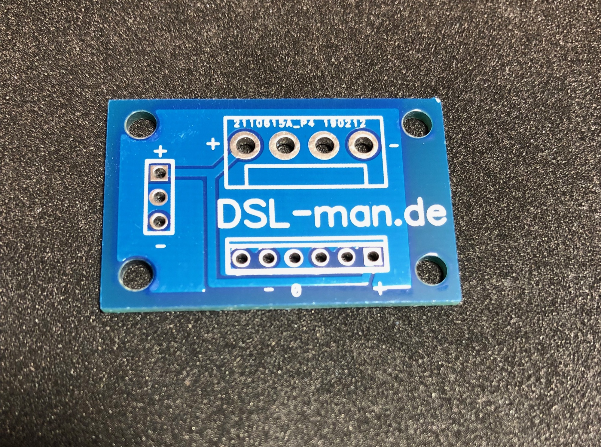

# March 2019 news

the winter season was again overloaded with a lot of projects.

I built some custom modules in MU and MOTM format - Triple Chorus in MU Format (still some available) and some Tau Pipe Phaser (available too)

, Haible Krautrock Phaser in a nice desktop case with 230V AC - i ordered today new cases and offer this for sale.

**furthermore** i designed few pcbs which are commercial available on diysynth.de

this tiny pcb helps to connect  MU and MOTM pcbs or to use 5u module pcbs in standalone cases.

and for my side job as free author:

**amazona articles:**

[Test: Din Sync RE-303, die beste TB-303 ever! - AMAZONA.dehttps://www.amazona.de/test-din-sync-re-303-die-beste-tb-303-ever/](https://www.google.com/url?sa=t&rct=j&q=&esrc=s&source=web&cd=1&cad=rja&uact=8&ved=2ahUKEwjHv82IruHgAhVHIlAKHUPrBh0QFjAAegQICRAB&url=https%3A%2F%2Fwww.amazona.de%2Ftest-din-sync-re-303-die-beste-tb-303-ever%2F&usg=AOvVaw2JNTNLLYZjkDCeidho4rfW)

[Test: MFB Tanzbär 2, Drummaschine - AMAZONA.dehttps://www.amazona.de/test-mfb-tanzbaer-2/](https://www.google.com/url?sa=t&rct=j&q=&esrc=s&source=web&cd=1&cad=rja&uact=8&ved=2ahUKEwjU-qWVruHgAhWCmbQKHZA9CpMQFjAAegQIChAB&url=https%3A%2F%2Fwww.amazona.de%2Ftest-mfb-tanzbaer-2%2F&usg=AOvVaw3IzYRJur4HT7A4WVU_m-zd)

**the most important project is ENIGMA  - a new 2600 inspired synth, I'm involved as a consultant and helps to build prototypes etc.**

**link :  [ENIGMA - the best 2600 in DIY](../../../logansoloman/enigma-the-best-2600-in-diy/index.md)**

**i have a lot of stuff for sale:**

**many MOTM Modules, Jasper wasp clone - contact me in case you are looking for this.**
