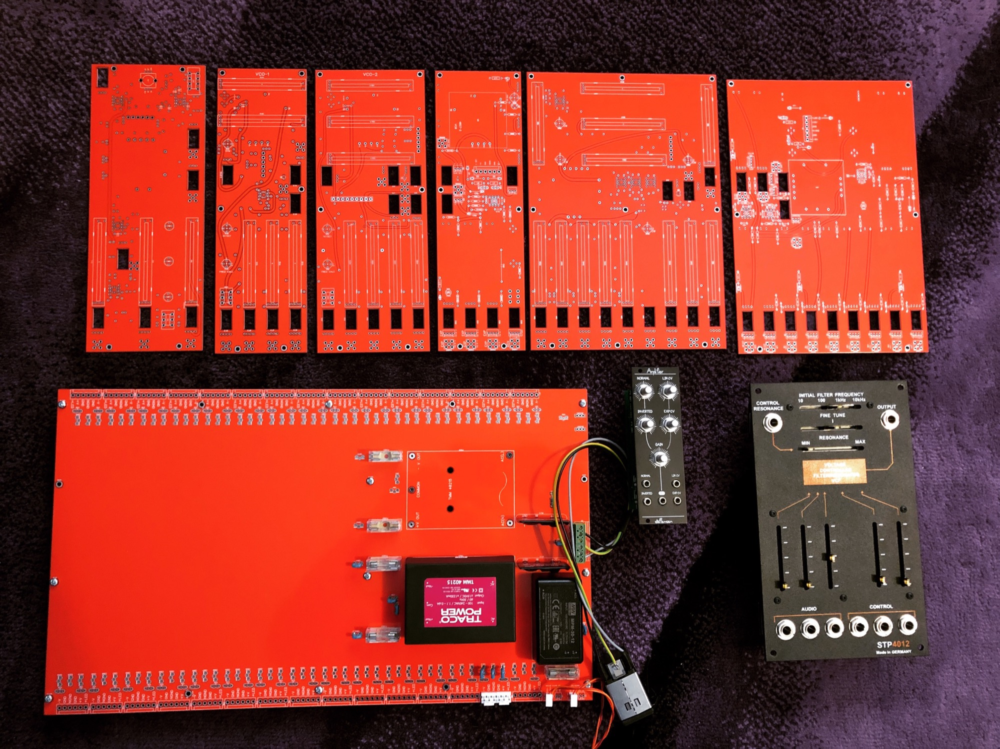
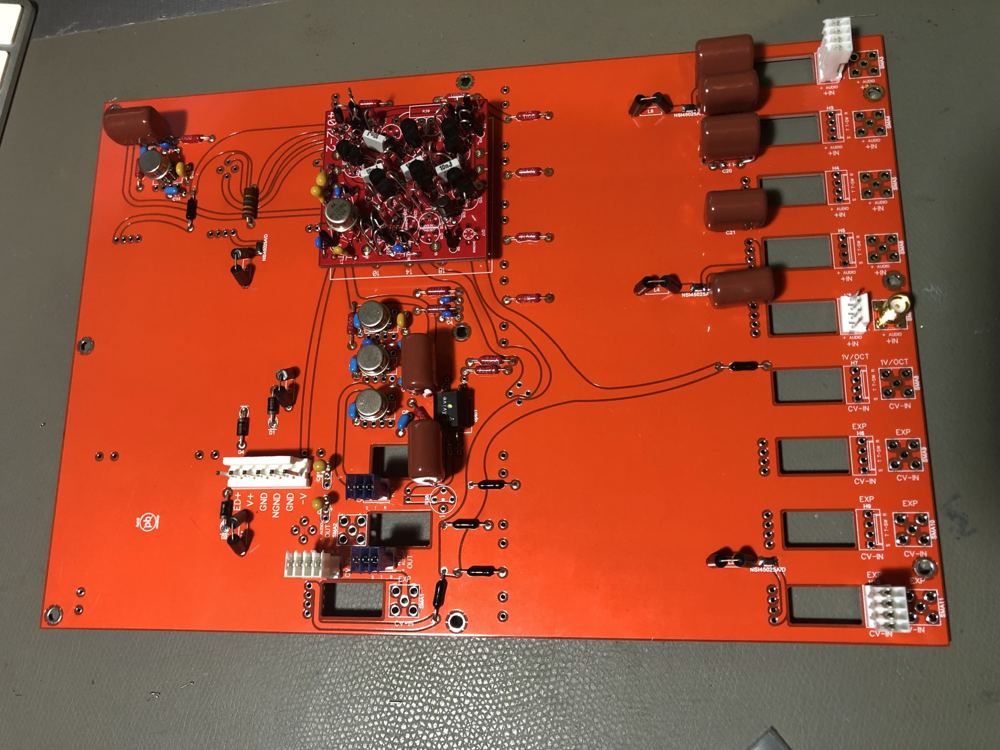

# May 2019 news

Logan Solomans ( Jim Soloman and Jamie Logan) Project [DAVID](../../../logansoloman/david/index.md) and ENIGMA - which are both great ARP2600 inspired synths are in build by me.

here few pictures of Davids  VCF and the Powersupply (and few modules).

contact me if you want build this device too or in case you want an assembled device.

