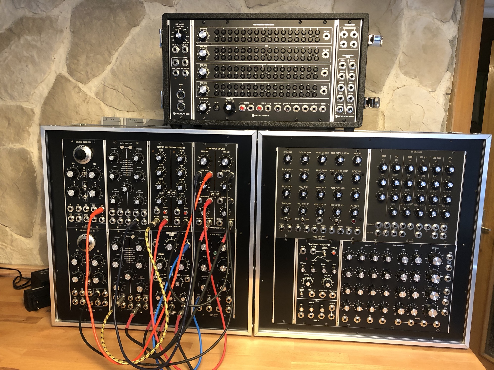
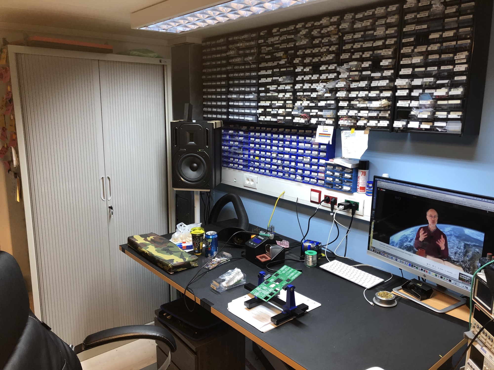
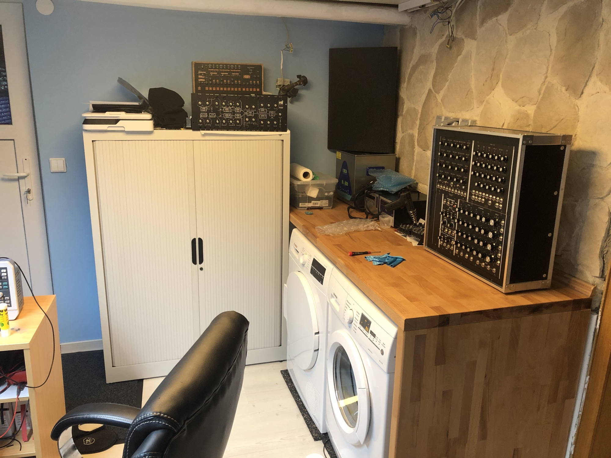
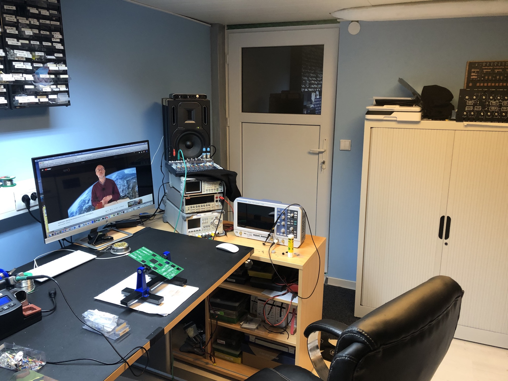

# 2019 summary

Most DIY Projects was delayed or not finished..

- ENIGMA was announced (Arp2600 inspired synth) - still in progress
- DAVID half of the system is done -still in progress
- TTSH v4 was released
- RSF KOBOL Clone 9month delayed (have to complete mine)
- Kijimi was released by Black Corp (with few month delay)
- 2019 run of Cloney VCS3 clone with 6month delay (last parts was sent to users in december19)
- RE-606 by Paul Barker was released
- Jan Martin Koehler released his PLAITS in MU and MOTM format (DIY and assembled)

I made in the meantime some MU Format modules.. and still offer this for sale in 2020 [MOTM300 in MU Format](../../modular-in-5u-projects/motm-300-vco/index.md)

Haible Triple Chorus and Haible Tau Pipe Phaser and 2 own new cases  - this cases types are planned to sell in 2020 

furthermore i renovated my basement, in a separate room is my DIY LAB yet and the studio was upgraded with some new gear.

I installed in my X32 Mixer a MADI card which is connected to the new RME fireface UFX+, all audio paths run thru 3 patchbays.

in December was the iConnectivity mioXL installed, which offer 10USB hosts and up to 12 MIDI DIN i/o connections. (click to enlarge)

  

 

 

