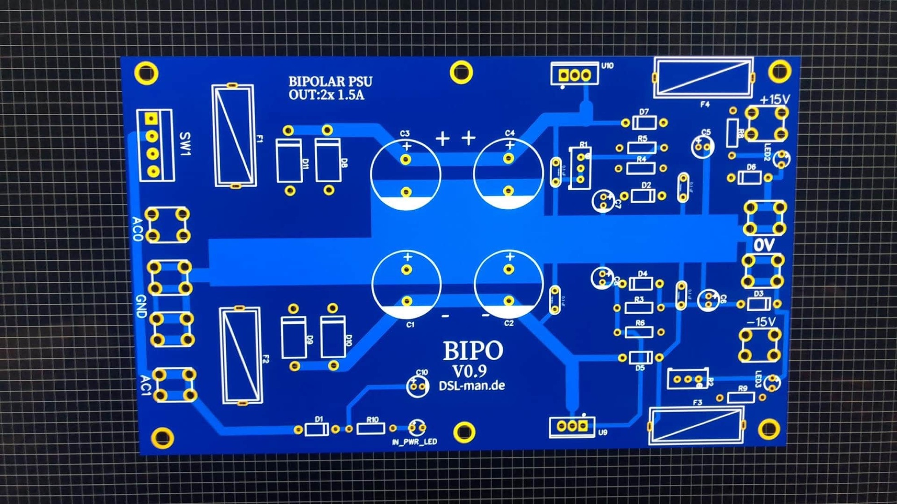
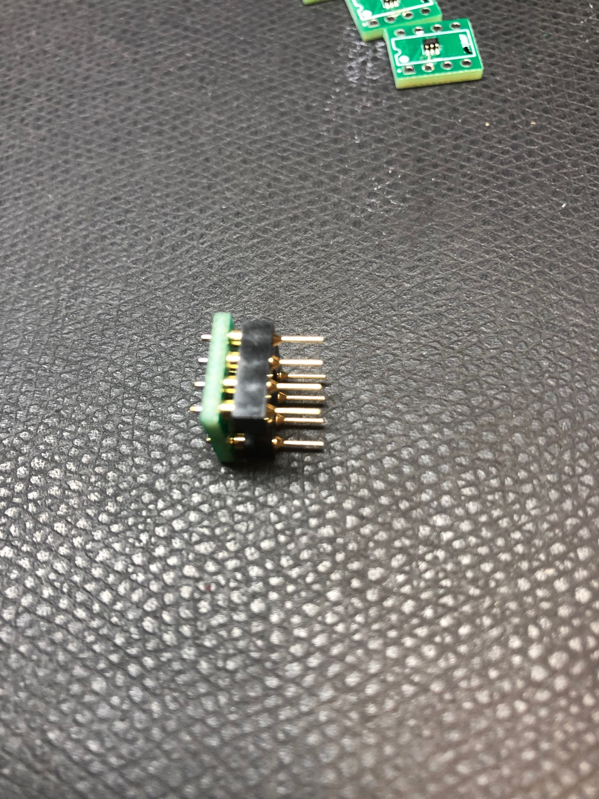
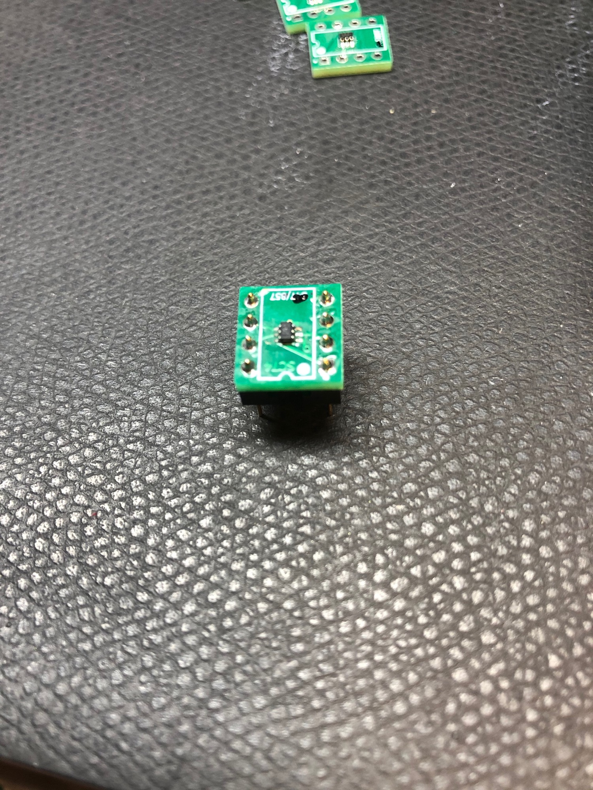

# products in 2020

I spend some time in development and testing of some products for my own projects and offer this yet in my shop on [www.DIYsynth.de](https://www.DIYsynth.de)

Bipolar Powersupply, perfect for Standalone devices like the TTSH

SSM2210 SSM2220 direct replacement:

