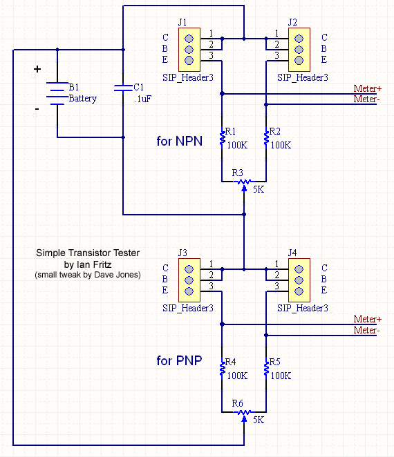
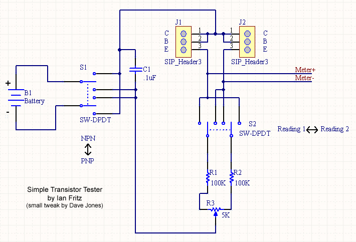
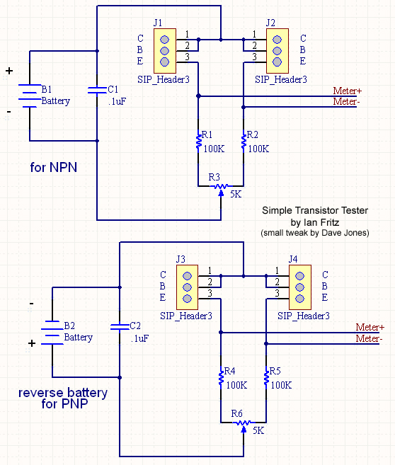

# Transistor matching

source: [http://www.muffwiggler.com/forum/viewtopic.php?t=81990&postdays=0&postorder=desc&start=160](http://www.muffwiggler.com/forum/viewtopic.php?t=81990&postdays=0&postorder=desc&start=160)

1. 

1. 

1.

> **Info**
>
>

## Related articles
