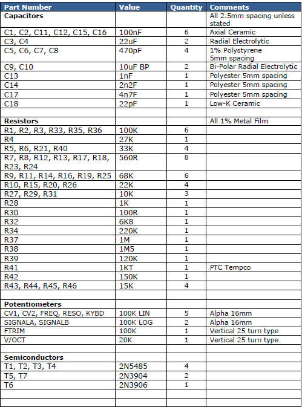
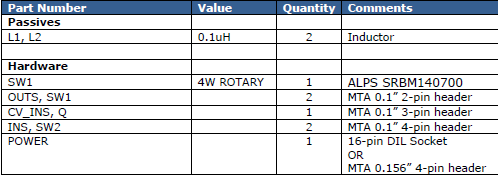
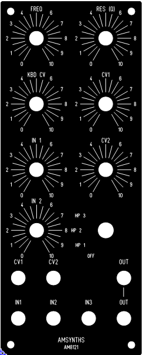
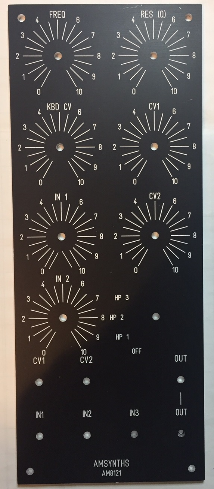
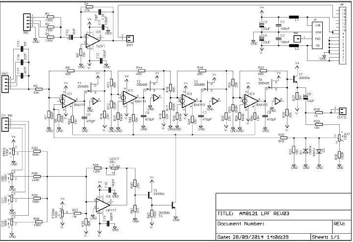

# AMSynths 8121 VCF in MOTM

> **Project**
>
> ### Projecttitel: AMSynths 8121 in MOTM Format
>
> ### Status: `in build`
>
> ### Startdate: 30 jan 2017
>
> ### Duedate: 01.april 2017
>
> ### Manufacture link: [http://www.amsynthstore.co.uk/AM8121\_VCF\_PCB/p1461448\_13649029.aspx](http://www.amsynthstore.co.uk/AM8121_VCF_PCB/p1461448_13649029.aspx)

> **Info**
>
> ### info from amsynths
>
> This is the PCB for the AM8121 Voltage Controlled Filter. This PCB can be used to build a FracRac (15v power and MOTM style 4-pin power connector) or EuroRack (10-pin 12V Doepfer Bus power connector).
>
>  The AM8121 is a replication of the Low Pass Filter from the legendary Roland 100M. This is a 4-pole OTA design that Roland first used in the Roland 700 (with CA3080's) and then the 100M (with BA662's). This is a warm sounding filter with smooth frequency control and a resonance that gradually increases up to full self oscillation. There is a 4-mode High Pass Filter which provide a bypass setting and then 3 levels of high pass filtering from a one pole design.

**BOM: (partlist)**

**changes for MOTM: SW1 4w rotary was changed to a norlen rotary switch.**

**the BOM is  missing 1x TL071 and 1x OP177**

#### Project Notes:

[AM8121-Project-Notes-V1.0.pdf](assets/AM8121-Project-Notes-V1.0.pdf)

#### Panels:

original from Rob:

[panels\_8121.zip](assets/panels_8121.zip)

**MOTM Panel:**  

(frontpanel designer v5 Schaeffer File)
[AM82121.fpd](assets/AM82121.fpd)

designed by @Autor

**Schematics:**

**Trimming:**

This module has two trimmers which need to be adjusted for accurate operation of the filter.

FTRIM This trimmer adjusts the initial cut-off frequency of the filter. Set the FREQ to minimum and connect a VCO output of around 80Hz to a filter input with the SIGNAL pot at maximum. Monitor the filter audio output and adjust FTRIM so that the FREQ pot cuts off the signal at low values, or to taste.
