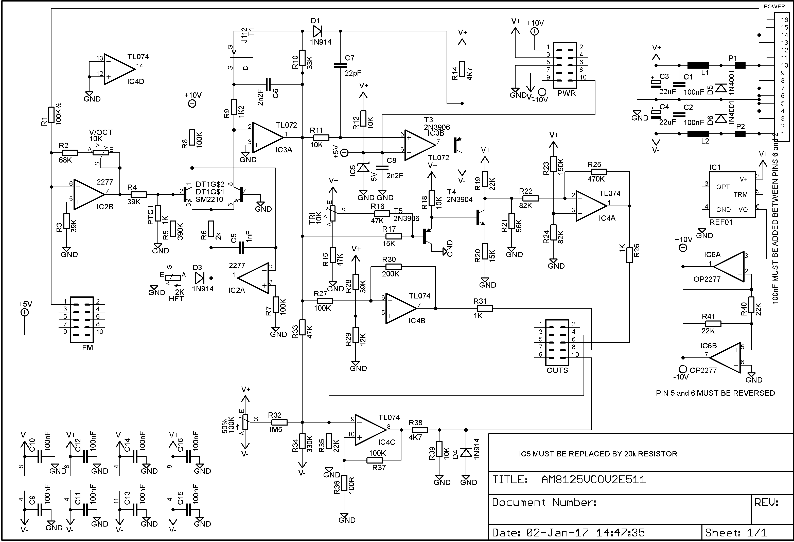
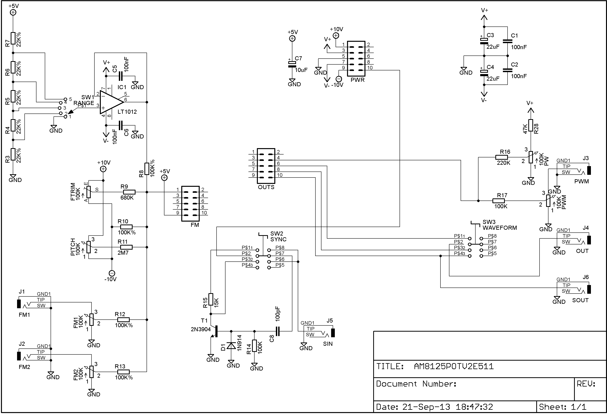
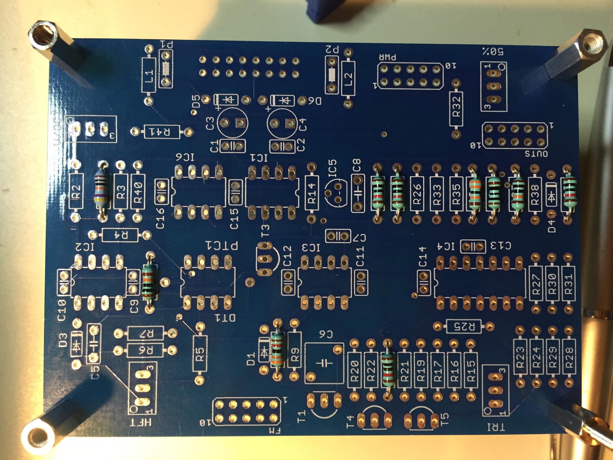
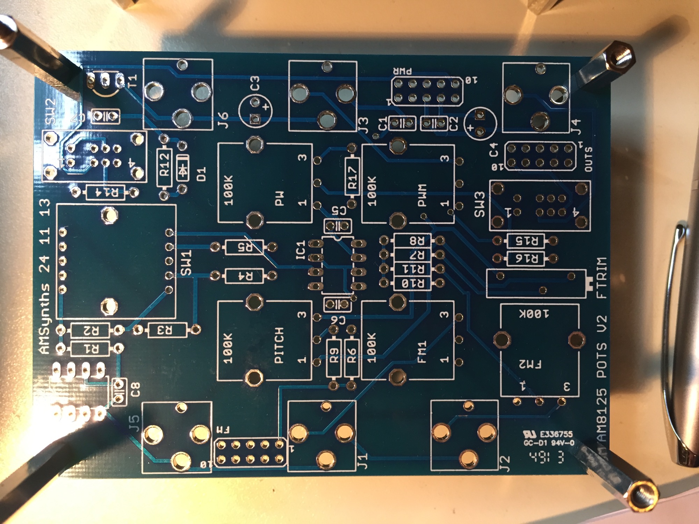

# AMSynths AM8125 VCO in MOTM

> **Project**
>
> ### Projecttitel: AMSynths 8125 VCO in MOTM
>
> ### Status: `in build`
>
> ### Startdate: 30 jan 2017
>
> ### Duedate: 30 August 2017
>
> ### Manufacture link:

> **Achtung**
>
> this product isn´t yet tested (by me) the BOM has few errors.
>
> on OPA2277  pin5 and 6 must be swapped (see schematics)
>
> on REF voltage IC add 100nf between pins 6 to ground

**Build notice:**

[AM8125 Project Notes V1.0.pdf](assets/AM8125-Project-Notes-V1.0.pdf)

**BOM: (most important parts, except caps, resistors)**

| **quantity** | **Part** |   |   |
|---|---|---|---|
| 1 | OP2277 or op177 DIP8 |   |   |
| 1 | SSM2210 |   |   |
| 1 | TL074 |   |   |
| 1-3 | 2N3906 |   |   |
| 1-3 | 2N3904 |   |   |
| ca. 5 | 1N914/1N4148 |   |   |
|   |   |   |   |
| 1 | 10V ref. voltage REF01 10V DIP8 or SOIC8 with adapter |   |   |
| 1 | 5V rev. voltage REF02 5V DIP8 or SOIC8 with adapter |   |   |
| 1 | LT1012 |   |   |
| 2 | 4pole double switch (DP4T switch) | sw2, sw3 |   |
| 1 | 1p5t rotary switch | sw1 |   |
| 2 | 100k trimmer multiturn |   |   |
| 1 | 2k2 multi |   |   |
| 1 | 100 long multi |   |   |
| 2 | 10k multi |   |   |
| 4 | 100k potis lin |   |   |

