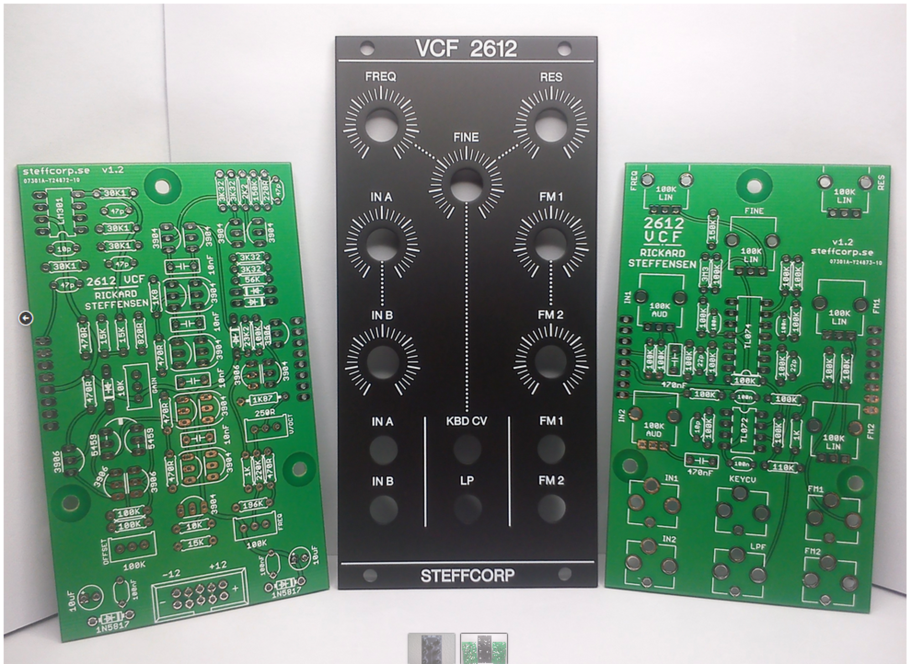
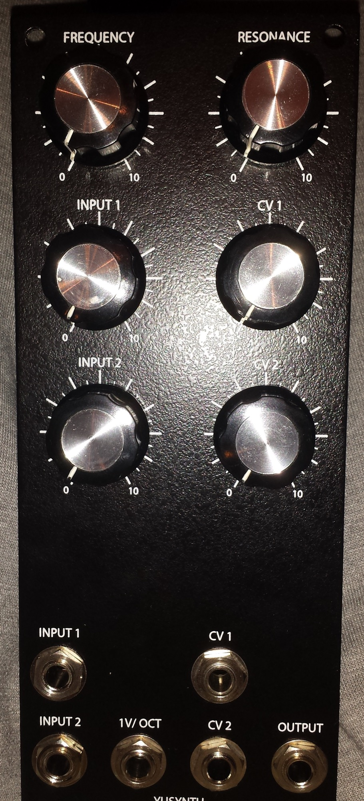
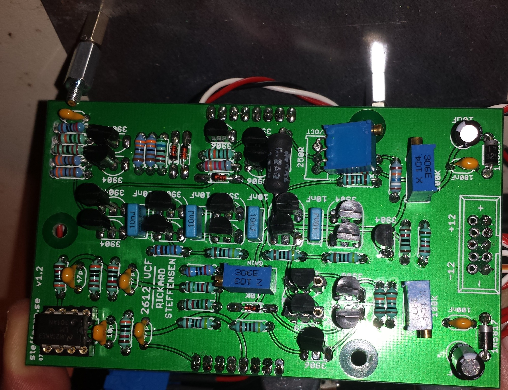
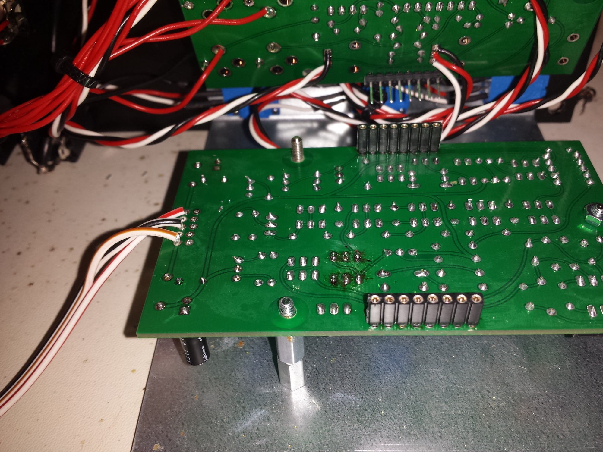
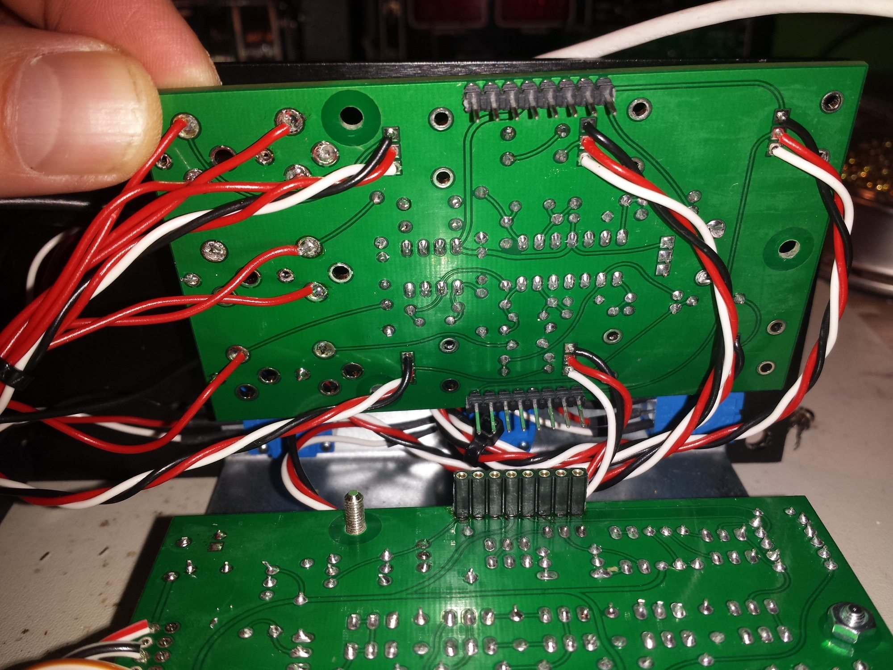
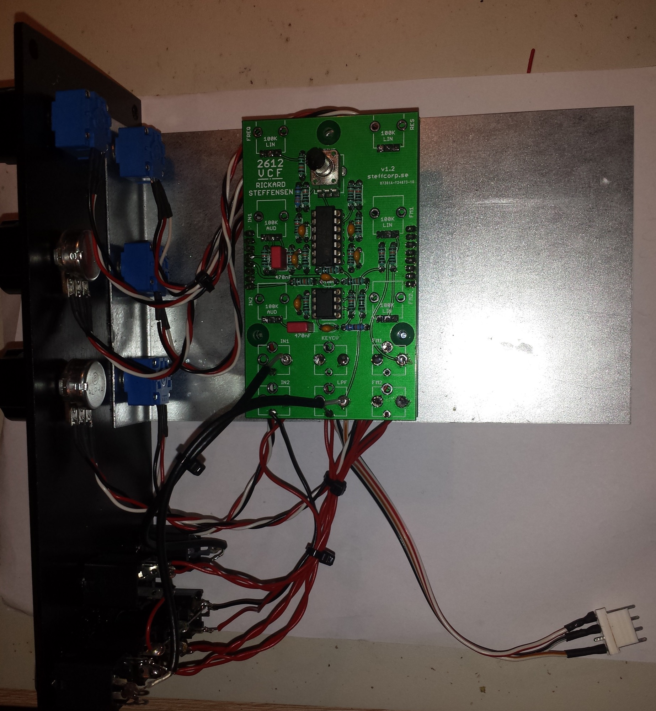

# Arp 2612 Filter in MOTM

> **Project**
>
> ### Projecttitel: Arp 2612 Filter
>
> ### Status: `Finished`
>
> ### Startdate: 21.October 2014
>
> ### Duedate: 28.October.2014
>
> ### Manufacture link: steffcorp.se

**Muffwiggler link**: [http://www.muffwiggler.com/forum/viewtopic.php?t=121124&postdays=0&postorder=desc&start=80](http://www.muffwiggler.com/forum/viewtopic.php?t=121124&postdays=0&postorder=desc&start=80)

> **Info**
>
> the Filter sounds very good - one of the best Filter i heard (MOTM440, MOTM480 too)

**Building guide:**   [2612\_BuildDoc.pdf](assets/2612_BuildDoc.pdf)

i go forward to use a 2n3958 like the original instead of 2x2n5459, in building guide " there are markings for usage of 2n3958"

**Parts**/BOM  (listed only non standard parts)

pcb (control and main pcb from steffcorp

1x tempco 1k87  (i used a 3500ppm KRL, check  thonk.co.uk and synthcube.com  )

2x 1n5817

1x LM301AN or LM301AH

4x 3k32 (3k3 works fine too)

1x 23k2  (Tip: check cermet 22k for tolerances 😉

1x 196k

2x 250R trimpot multiturn or 500R trimmer

1x 10k trimpot multiturn

1x 100k trimpot multiturn

Panel 4072 panel from Bridechamber.com, you can add the finetune on the pcb /the 4072 bridechamber panel dont have a finetune pot

2x 100k lin bourns pot (frequenncy, resonance)  - prefered due to handling

2x 100k log Bourns pot (input1, input2) usage of alpha/alps are fine too

2x 100k  pot for CV

**Building:**

**all 2N3904/2N3906 was matched by me within 1mV**

**a pair 2N5459 was matched too**

**resistors, caps, sockets, transistors was stuffed by me, pcb washed, all trimmer and ics added later,**

**for MOTM conversion: make sure you connect both pcb in correct way !!**

**wiring of jacks:   make sure you connect for CV1-CV2-v/oct  the jackswitch to the pcb.**

**i used shielded cables (RG174) for input/output jack**

**calibration: see build document and double check it , in my case was the gain and offset related to the initfrequency at beginning.**

**V/oct calibration result was not perfect but better as some other filters i have build in last years.**

## Description

**copy from** [https://steffcorp.se/product/2612/](https://steffcorp.se/product/2612/)

This is a clone of the 4012 VCF used in the ARP 2600.
 Other than some substituted parts and a “sandwich-layout” mainly adjusted for the eurorack standard, I have tried to keep all the original quirks as close to the original as possible.

The “sandwich-layout” simply means the VCF is split in 2x PCB’s mounted in parallel on top of each other.
 The Core-PCB contains the main circuit, while the Control-PCB contains the controlling elements as well as the buffers.

See the [Build-Document](https://steffcorp.se/documents/2612_BuildDoc.pdf) for more detailed info/options regarding the build.

#### *Main controls:*

- **Frequency & Fine-tune**
- **Resonance**
- **Attenuators for Audio and FM inputs**

#### *Inputs:*

- **2x Audio**
- **2x FM**
- **1V/OCT**

#### *Outputs:*

- **Lowpass output**

#### *Technical details:*

- **Width 12HP**
- **Buffered inputs & output**
- **Depth about 35mm, depending on choice of components**

