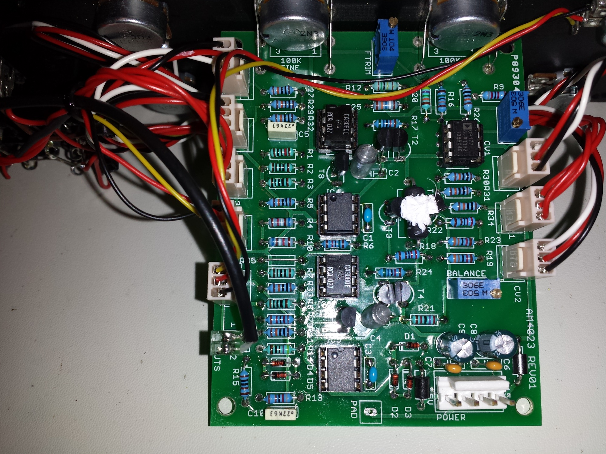
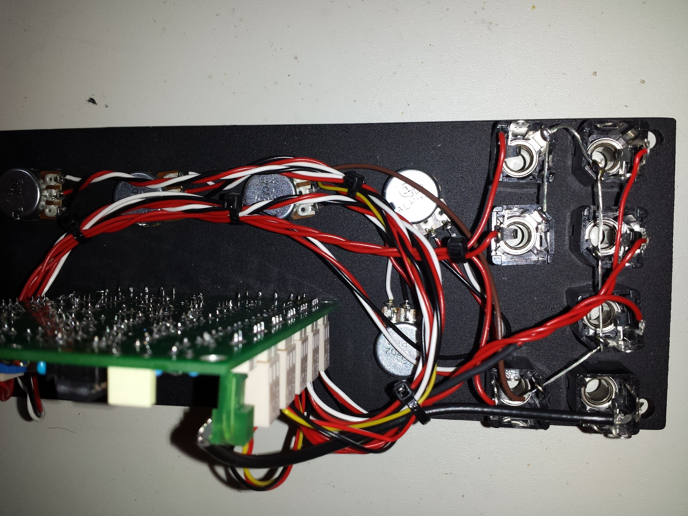
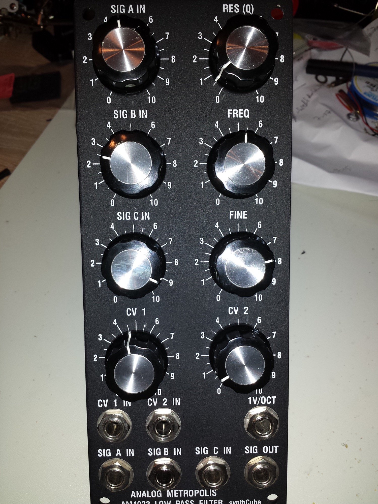
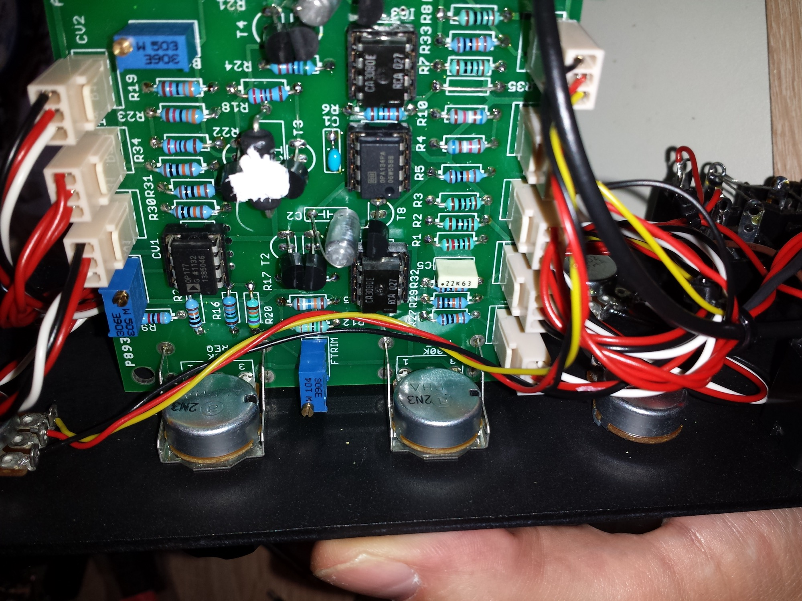

# Arp 4023 AM4023

> **Project**
>
> ### Projecttitel: ARP 4023 VCF
>
> ### Status: `finished`
>
> ### Startdate: Aug.2013
>
> ### Duedate: Juni 2014
>
> ### Manufacture link: [http://synthcube.com/cart/index.php?route=product/search&filter\_name=4023](http://synthcube.com/cart/index.php?route=product/search&filter_name=4023)

Pcb and Panel from synthcube

**Schematic:**[http://www.arptech.synth.net/pdf/4023.pdf](http://www.arptech.synth.net/pdf/4023.pdf)

**Building Guide:** [4023.pdf](assets/4023.pdf)

### rare PCB Parts

Musikding: (or ask me for sale)

|   |   |   |   |   |   |
|---|---|---|---|---|---|
|  | [2N5459](https://www.musikding.de/2N5459) [entfernen](https://www.musikding.de/warenkorb.php?dropPos=0) | Lieferzeit: **auf Lager** | 10 | 1,50 € | at Stock x |

2x   OPA134pa at ebay

or
[http://www.hifizubehoer24.de/OPA134-AP](http://www.hifizubehoer24.de/OPA134-AP)
opa177gp bei elpro.org

1,87K Tempco from thonk (UK)  or synthcube (USA)

**Frontpanel parts:**

6x 100K potis

**Manual from synthcube.com:**

[AM4023KitManualSmallFormatBasePCB.pdf](assets/AM4023KitManualSmallFormatBasePCB.pdf)

building note:   wire the jacksg round (exept output jack) to attenuator pot 3 , right pin (rear view)

