# Blacet Miniwave in 5U

> **Project**
>
> ### Projecttitel: Blacet Miniwave in 5U with CV ROM
>
> ### Status: `finished`
>
> ### Startdate: 2012
>
> ### Duedate: 2012
>
> ### Manufacture link: [http://electro-music.com/forum/forum-155.html](http://electro-music.com/forum/forum-155.html), Blacet.com

**Subpages:**

I´m finished in February 2013 my Blacet Miniwave in 5U with a Hylander Extension and CV Board for the Roms.

Installed 10 Roms – few of them are custom Roms from me.

Feel free to ask for order ROM´s (Eproms) by me.

Change: 97,6K changed to 95,3K with TP2 trimmer 5K (org,2,2K)

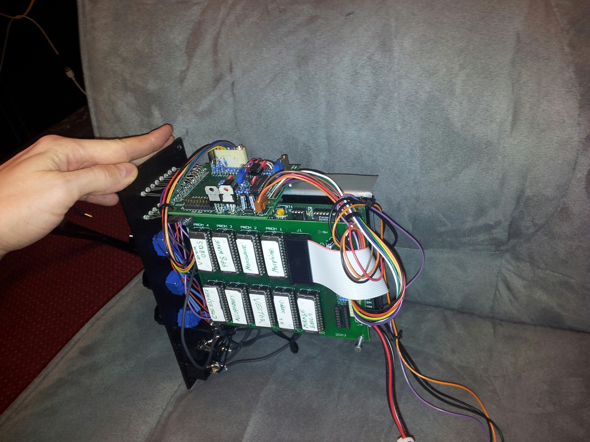

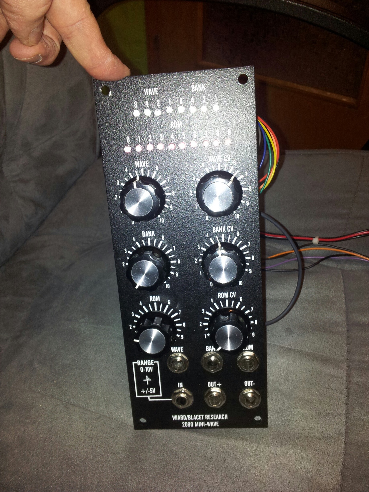

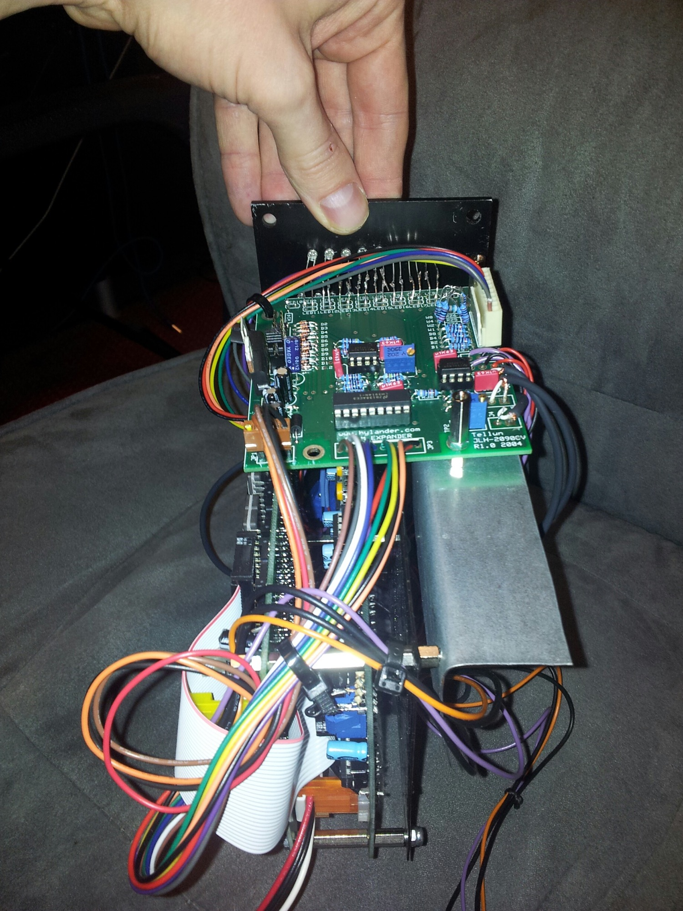

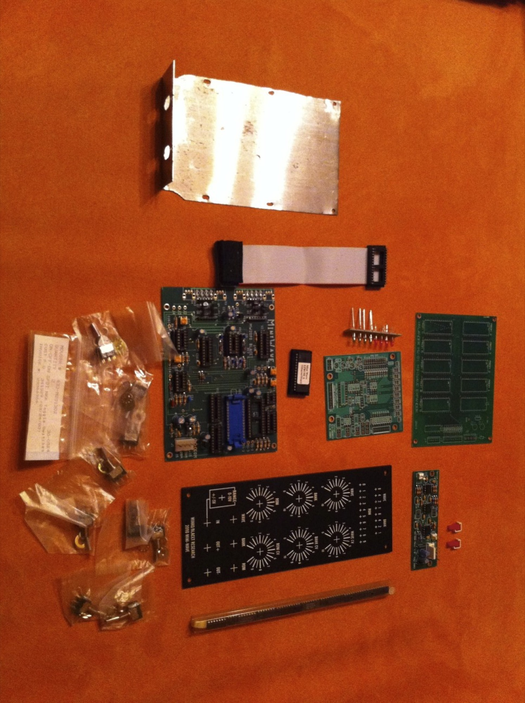

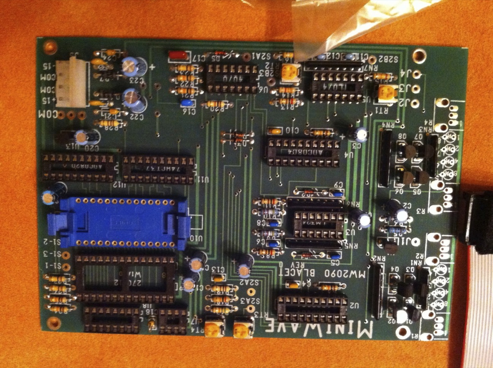

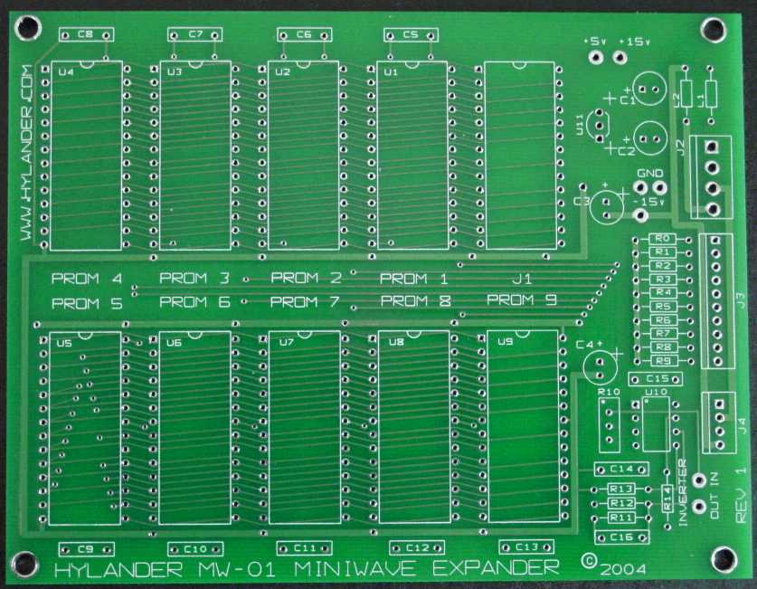

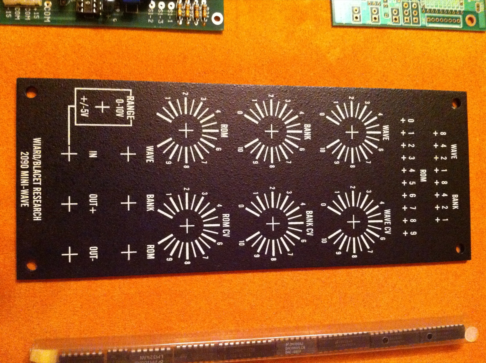

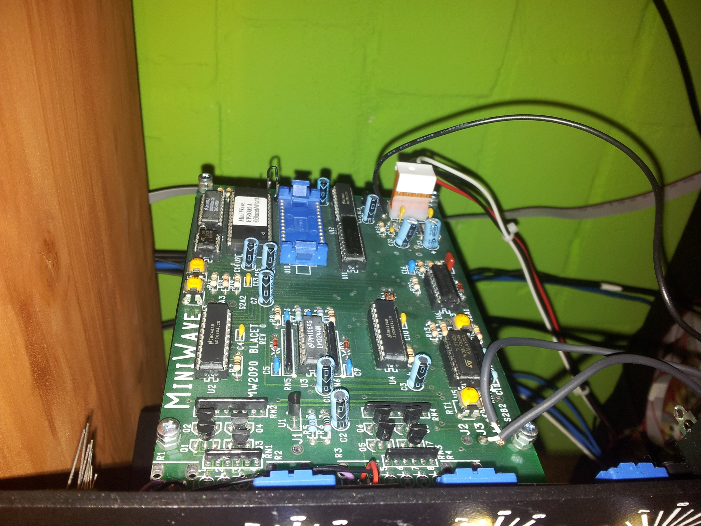

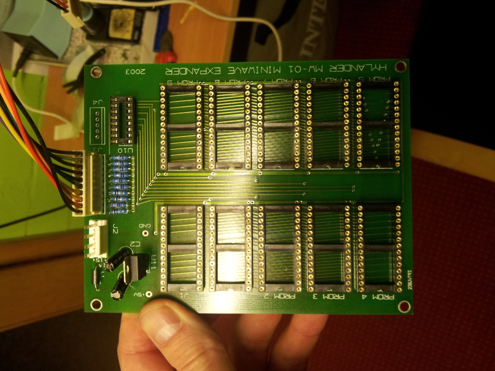

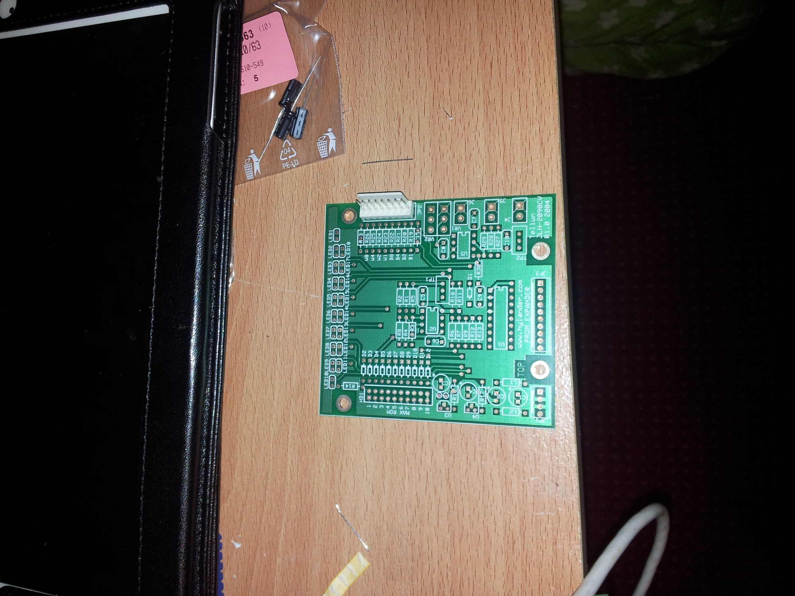

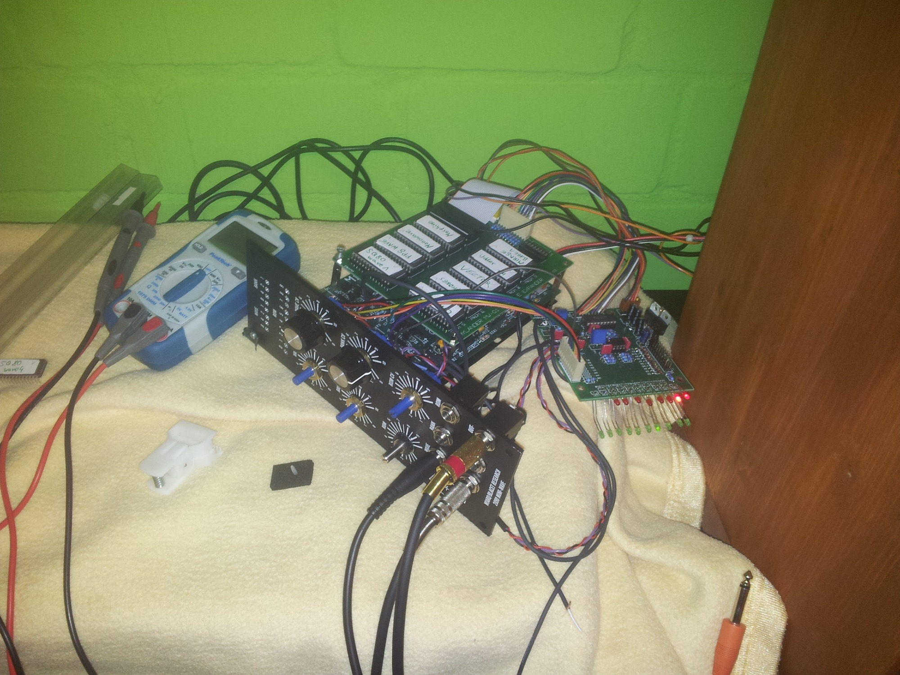

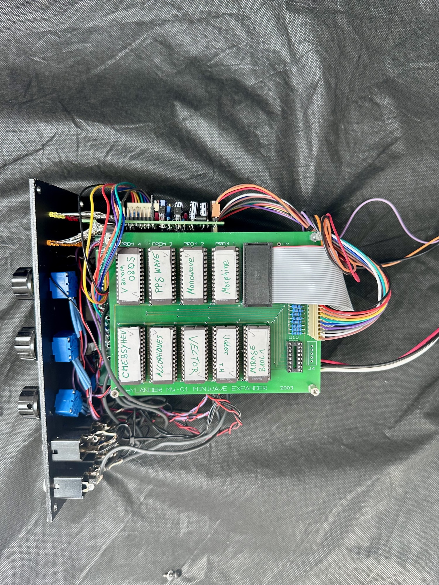

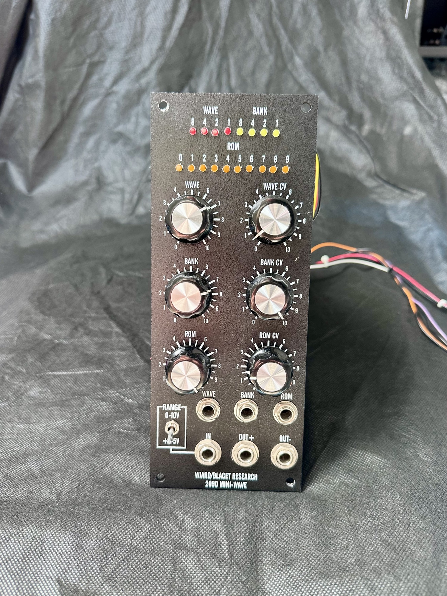

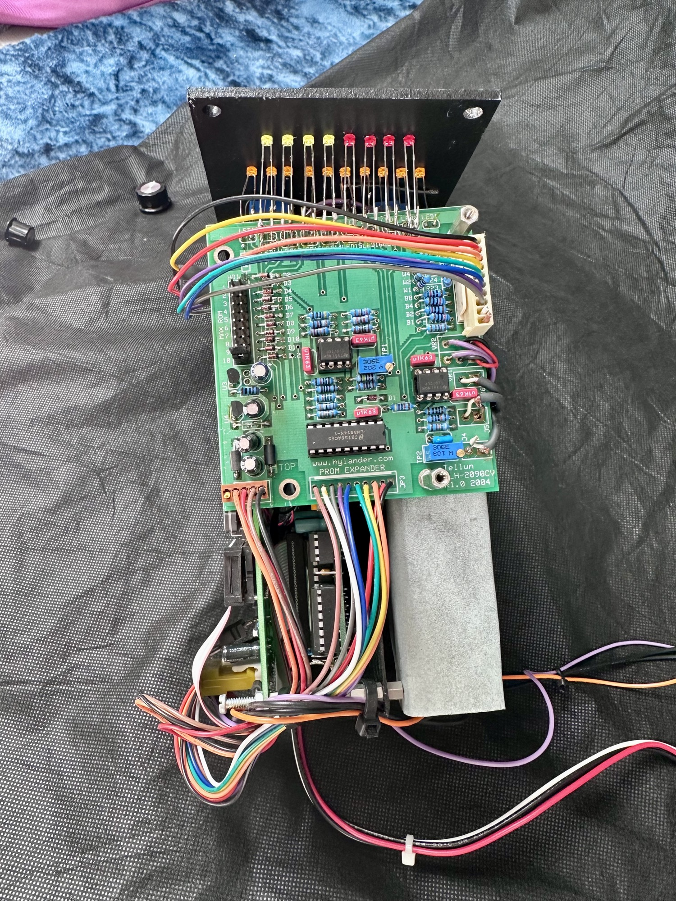

**Mods:**

R14 is the brightness LED resistor for  CV-ROM LEDs

R19-R26 is the brightness LED resistor for BANK/WAVE LEDs

