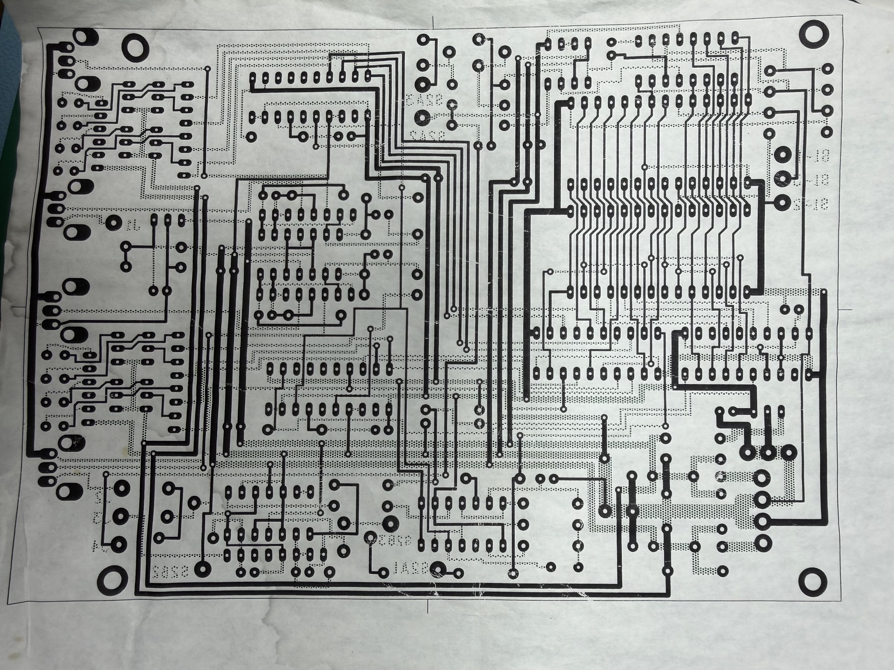
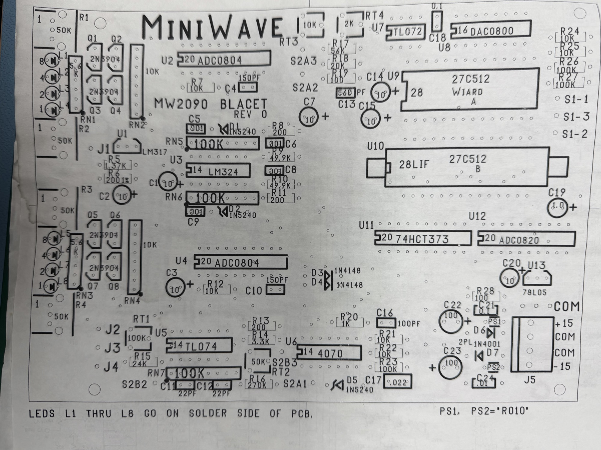
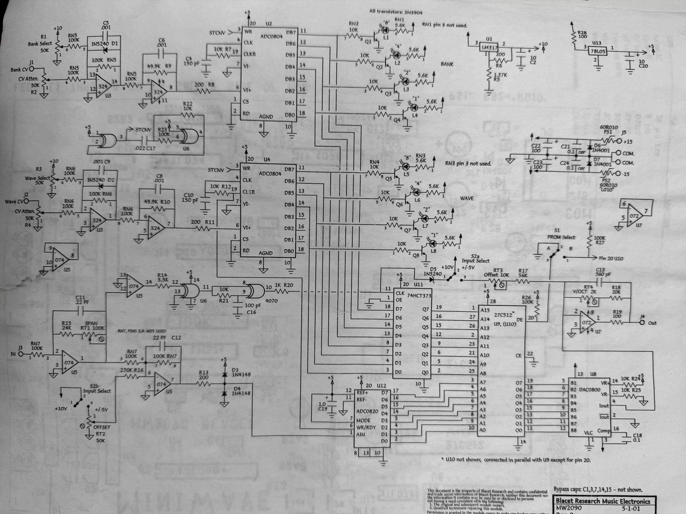

# Tech.Docs Blacet Miniwave

- [IMG_3158.jpeg](assets/IMG_3158.jpeg)
- [IMG_3157.jpeg](assets/IMG_3157.jpeg)
- [MWmanualBasic.pdf](assets/MWmanualBasic.pdf)
- [IMG_3159.jpeg](assets/IMG_3159.jpeg)
- [mwr1schematic.pdf](assets/mwr1schematic.pdf)
- [mwr1instructions.pdf](assets/mwr1instructions.pdf)
- [JLH-2090CV_Schematics.pdf](assets/JLH-2090CV_Schematics.pdf)
- [JLH-2090CV_User_Guide.pdf](assets/JLH-2090CV_User_Guide.pdf)
- [miniwaveinstructions.pdf](assets/miniwaveinstructions.pdf)

[miniwaveinstructions.pdf](assets/miniwaveinstructions.pdf)

[JLH-2090CV\_User\_Guide.pdf](assets/JLH-2090CV_User_Guide.pdf)

[JLH-2090CV\_Schematics.pdf](assets/JLH-2090CV_Schematics.pdf)

[mwr1schematic.pdf](assets/mwr1schematic.pdf)

[JLH-2090CV\_Schematics.pdf](assets/JLH-2090CV_Schematics.pdf)

User Manual

[miniwaveinstructions.pdf](assets/miniwaveinstructions.pdf)

