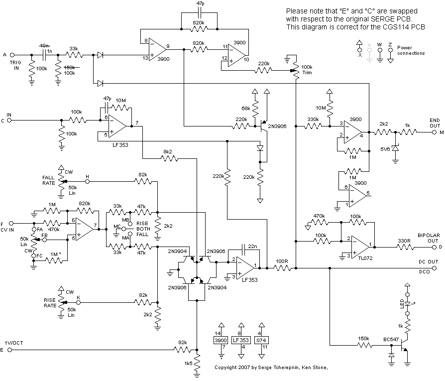
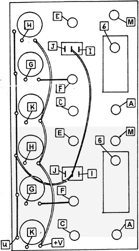
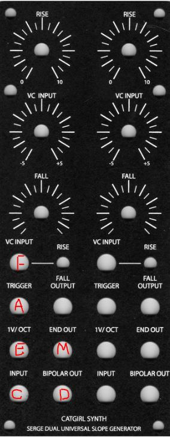
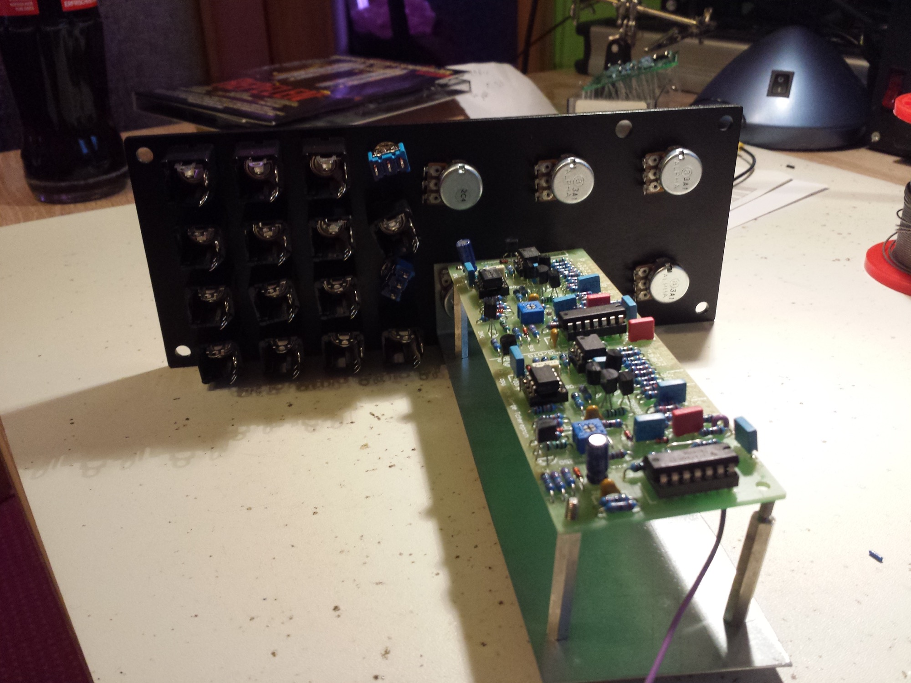
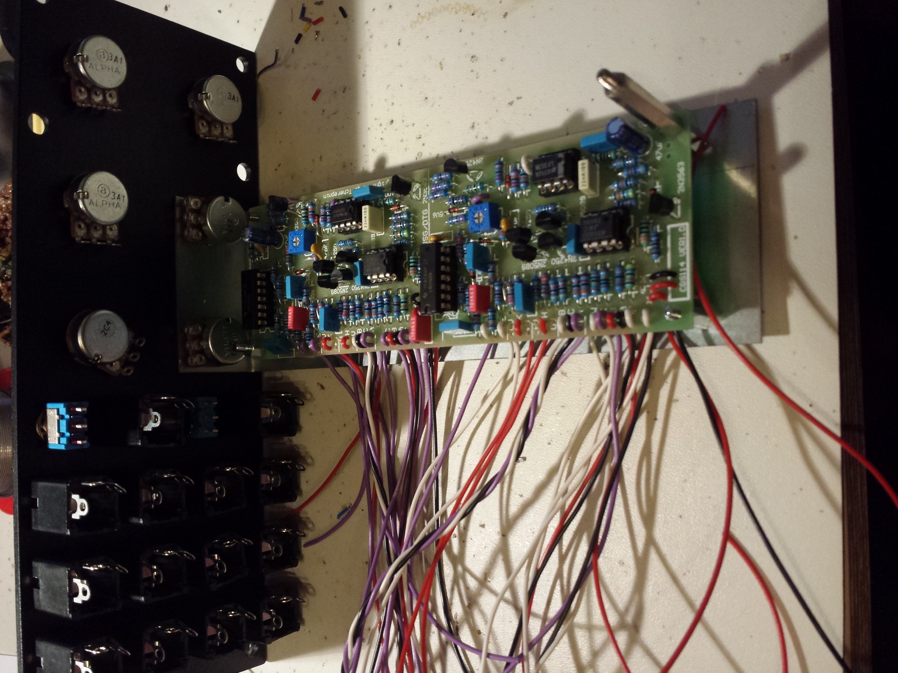
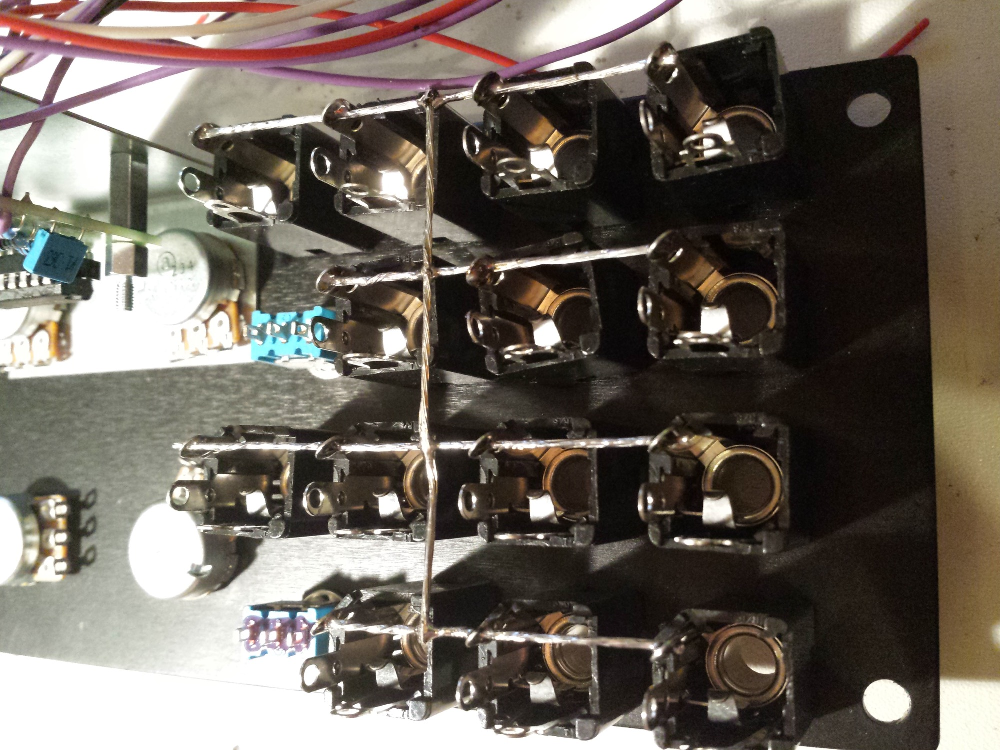

# cgs114 Serge Dual Universal Slope Generator

> **Project**
>
> ### Projecttitel:cgs114 Serge Dual Universal Slope Generator
>
> ### Status: `Finished`
>
> ### Startdate: 28.02.2014
>
> ### Duedate: 21.12.2014
>
> ### Manufacture link: [http://cgs.synth.net/](http://cgs.synth.net/)

CatGirl Synth Serge Dual Universal Slope Generator

**BOM:**

|   |   |
|---|---|
| Part | Quantity |
| **Capacitors** |   |
| 47pF | 4 |
| 1n | 2 |
| 10n | 1 |
| 22n | 2 |
| 100n | 10 |
| 100n SMT1206 (optional) | 2 |
| 47uF 25V | 2 |
| **Resistors** |   |
| 100R | 2 |
| 330R | 2 |
| 1k | 4 |
| 1k5 | 2 |
| 2k2 | 6 |
| 8k2 | 2 |
| 33k | 6 |
| 47k | 6 |
| 68k | 2 |
| 82k | 6 |
| 100k | 12 |
| 220k | 8 |
| 330k | 2 |
| 470k | 4 |
| 820k | 6 |
| 1M | 10 |
| 10M | 4 |
| 100k trimmer | 2 |
| 50k lin pot | 6 |
| **Semi's** |   |
| 5V6 400mW zener | 2 |
| LED | 2 |
| 1N4148 | 8 |
| 2N3904 (2N3563) | 2 |
| 2N3904 (2N5089) | 4 |
| 2N3906 (2N4250) | 6 |
| 4558 or TL072 | 2 |
| LF353 or TL072 | 2 |
| LM3900 | 2 |
| **Misc.** |   |
| SPDT Switch | 2 |
| CGS114 PCB | 1 |
| Panel MOTM- Bridechamber | 1 |
| Potbracket - own | 1 |
| sockets, cable, jacks | 1 |

**if 1V/OCT dont work as designed (source:**[**http://electro-music.com/forum/topic-50674.html**](http://electro-music.com/forum/topic-50674.html)**)**

**Regarding the 1V/Oct tuning, Stephen Richards pointed me to a thread on the muffwiggler forum that addresses the problem.**

**The short answer is replace the 1k8 with a 1K fixed resistor and a 2k trimmer.**

**Building**

Unmarked diodes are 1N4148 or similar.

TL072 can be used in place of either op-amp.

For improved triggering at higher frequencies, it is recommended that the parts in the trigger circuit be updated to the values shown in red.

There is provision on the rear of the board for two 1206 100n decoupling capacitors. These are the pairs of hole-less rectangle pads. Install or ignore at your discression.

It is a good idea to match the transistors of the same type in the core with each other. At least use transistors from the same batch.

2N3906 can be substituted for the 2N4250 and 2N3904 substituted for the 2N5089. Note that the pinouts of these transistors will differ.

2N3563 can be any general purpose NPN such as 2N3904. Note that the pinouts of these transistors will differ.

The unit WILL run on +/-15 volts with no modification.

**copy from cgs.synth.net:**

Patch the END pulse to the TRIG IN jack. Turn the RISE and FALL knobs fully CW. Patch the OUTPUT into an audio mixer or Output Module to monitor the output. There should be a 5000 Hz triangle wave present which can be changed to a sawtooth wave of lower frequency by turning down either the RISE or FALL knob. The frequency and timbre will depend upon the settings and the shape as set by the relationship between the Rise and Fall times.

Patch the OUTPUT of the DSG into the control voltage input of an oscillator and listen for the proper shape as the RISE and FALL knobs are turned down to longer times.

Check for proper VC action by patching a control voltage from a processor or other source into the VC In jack. Note the effect on the Rise, the Fall, and the Rise+Fall times with the position of the switch. Check that a voltage into the IV/oct IN will produce a doubling of frequency (halving of the Rise and Fall times) for each volt applied.

The DSG may not track as well as the NTO's and PCO's when used as an oscillator.

Remove the patch from the END and TRIG IN jacks, and apply a control voltage from a keyboard, Stopped Function, or Stapped Random Voltage Generator. Turn the RISE and FALL knobs all the way up (clockwise, and apply the output to the control input of an oscillator. The signal should be the same as the input. As the RISE and FALL knobs are turned down, there should be a portamento or slowing Effect on the changing stepped voltage.

The DSG can be used as a simple envelope generator, a low frequency oscillator, pulse generator, or in a variety of other applications. As an envelope generator, the unit can be triggered in two different ways:

1. Connect a trigger pulse to the TRIG IN jack. When a pulse is applied here, an envelope defined by the RISE and FALL knobs will be produced which goes from 0 to +5 volts. If a second trigger is received before the envelope has finished, it will not re-initiate the envelope. Using a pulse train into this input, the DSG can be used as a frequency divider, or sub-harmonic generator. A waveshape and a pulse from the END jack will, be produced for each pulse applied to the TRIG IN jack as long as the total envelope time is thorter than the pulse period.
  If the envelope time is slightly longer than the pulse period, then the DSG wil I only be triggered on alternate pulses, producing a division of two. If the envelope is slightly longer than two pulse periods, then it will only be triggered on every third pulse, producing a division by three, and so on.
2. With a gate signal into the IN jack, an envelope will be produced which begins to rise at a rate set by the RISE knob to a level equal to the gate level. The level will remain at this level as long as the gate is present: an envelope with sustain.
  When the gate level drops back to zero at its end, the envelope will fall at the rate set by the FALL knob. If the gate level rises before the end of the FALL cycle, the output will rise again, rising toward the gate level, at a rate set by the RATE knob. Multiple gate signals will re-initiate the envelope, even if the envelope has not completed its cycle back to zero volts.
  A positive signal applied to the IN jack will always over-ride any trigger at the TRIG IN jack.

The DSG can be used as a slew limiting processor to change discrete voltage steps into gliding voltages (portamento). Voltages from a keyboard, sequencer, or other sources can be applied to the IN jack, and the RISE and FALL knobs will now determine the rate of glide in the positive and negative direction, independently.

The slopes from the DSG are linear (equal voltages per unit of time), but they can be altered using feedback. If the OUTPUT is patched to the VC IN jack, then the slope can be given an exponential or a logarithmic shape determined by the amount of feedback set by the processing knob. Since both the RISE and FALL can be switched to be controlled separately or together, the slope of either or both can be shaped using this technique. This is useful for producing slow, gradual amplitude changes with the Equal Power VCA modules.

If the TRIG IN jack is connected to the TRIG OUT jack, the DSG will oscillate with a waveform and frequency set by the RISE and FALL knobs. A series of pulses will appear at the TRIG OUT jack, and the duty cycle (the time the pulse is high compared to when it is low in each cycle) is set by the RISE and FALL knobs. The FALL knob determine how long the pulse is low. When the DSG is in the RISE part of the cycle or when the output is zero or less, the output of the TRIG OUT will be high. In some applications, a pulse with a very long duty cycle will cause erratic triggering in other modules. If such a symptom occurs, try increasing the FALL time and decreasing the RISE time to get the same pulse rate.

The DSG may be used as a positive peak follower by setting the RISE time to minimum (full CW) and applying an audio signal to the IN jack. Adjust the FALL knob for a compromise between response time and the best filtering of the audio component at the DSG output. If the FALL time is turned to minimum, and the RISE knob adjusted for optimum response time and filtering, then the unit will function as an envelope, follower-producing a negative envelope corresponding to the negative peaks ofthe input audio signal.

Adjustments on the DSG board are set to obtain a 0 to +5 volt level when the unit is cycling, producing a 100Hz triangle wave. An oscilloscope is required for this adjustment. This should not need to be adjusted unless components are replaced.

**Wiring**

|   |   |
|---|---|
| PAD ID | Function |
| A | Trig In |
| BPO | AC coupled output |
| C | Signal In |
| DCO | Main (DC) output. DCO on PCB. "6" in panel diagram above |
| D | optional "bipolar" output |
| E | exp CV input. So called "1V/oct" |
| F | CV input "VC IN" |
| FA | CCW end of "VC IN" pot |
| FB | WIPER of "VC IN" pot (G and T on the wiring diagram) |
| FC | CW end of "VC IN" pot |
| H | WIPER of FALL pot |
| K | WIPER of RISE pot |
| M | END or GATE (output) |
| MA | RISE/FALL/BOTH switch Rise contact (I and 2 on the wiring diagram) |
| MB | RISE/FALL/BOTH switch Fall contact (J and 3 on the wiring diagram) |
| MC | RISE/FALL/BOTH switch common (or use the common 0V wire as per the diagram) |
| LA | LED anode |
| LK | LED cathode |
| "U" | U connection on the panel wiring diagram connects to 0V. There is no U on the PCB. Use one of the pads marked "0V" instead. |
| W | 0V power connection |
| X | +12V power connection |
| Z | -12V power connection |

