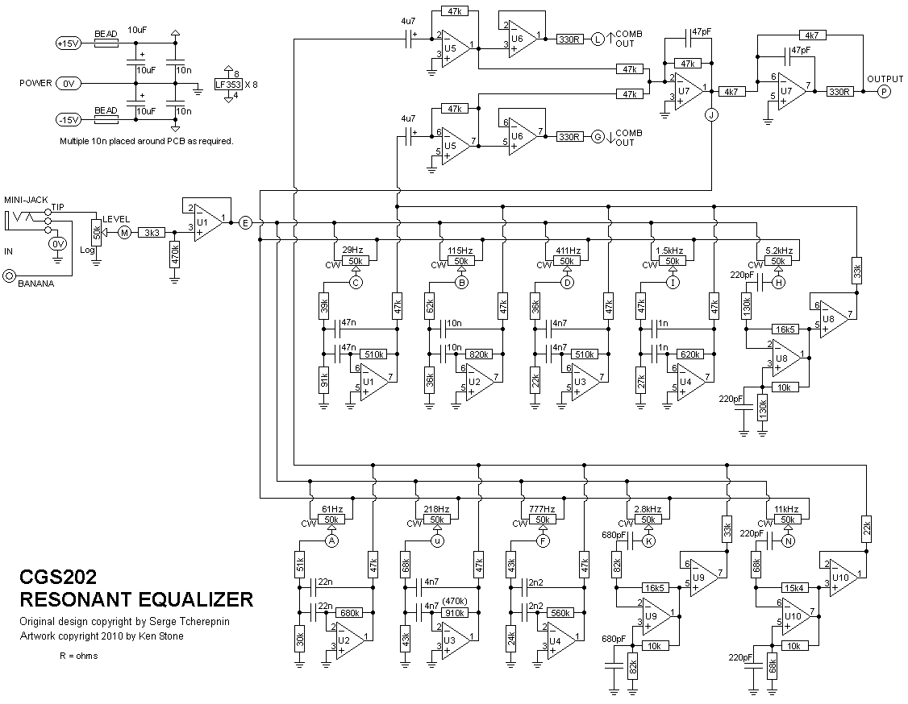
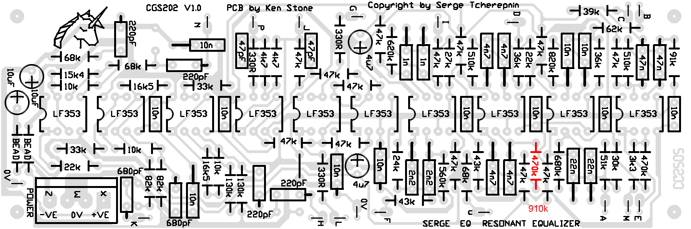
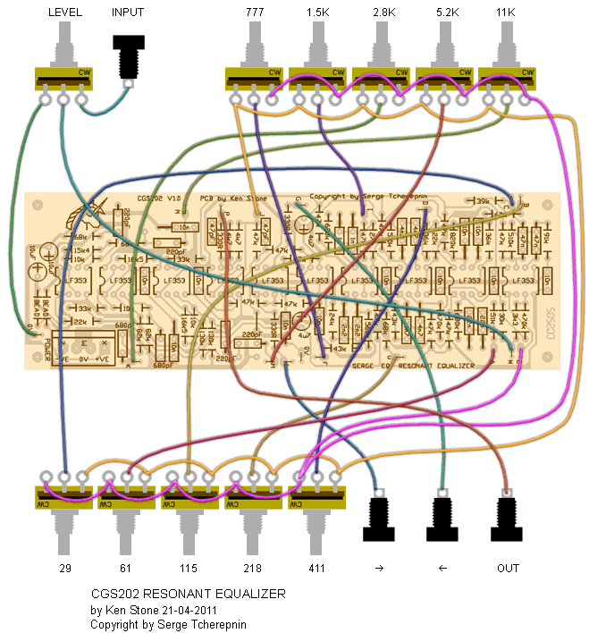
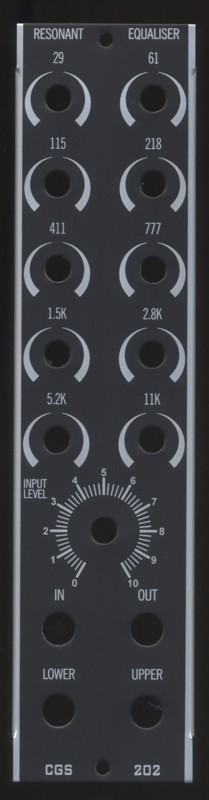
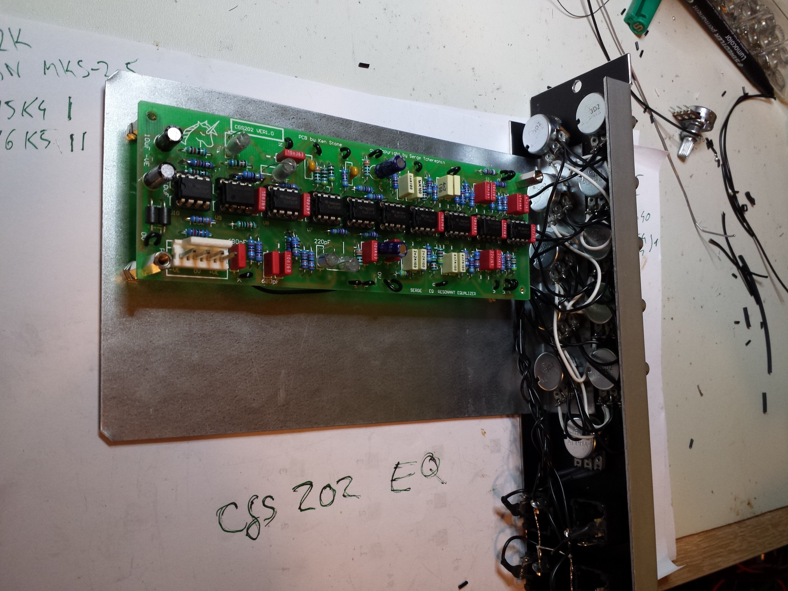
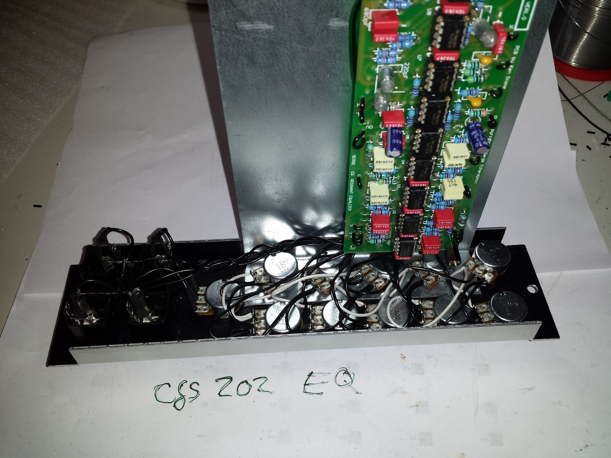
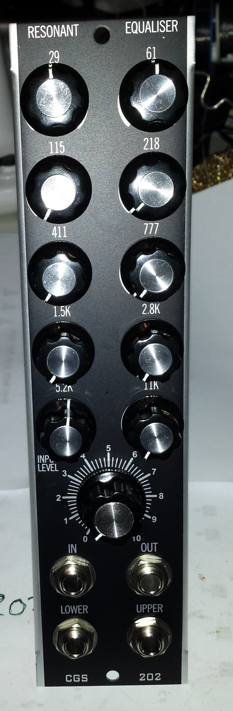
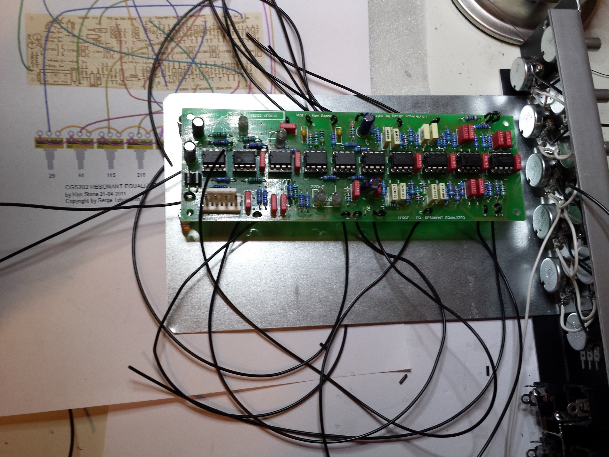
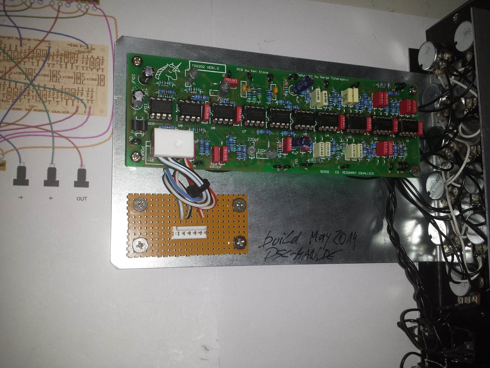

# cgs202 Serge Resonant Equalizer

> **Project**
>
> ### Projecttitel: cgs202 Serge Resonant Equalizer
>
> ### Status: `finished`
>
> ### Startdate: 08.05.2014
>
> ### Duedate: 01.10.2014
>
> ### Manufacture link: [http://cgs.synth.net/](http://cgs.synth.net/)

**Documentation (copy from cgs.synth.net to build this device)**

This module is based on the Serge Resonant Equalizer.

To quote the 1982 catalog:

> The RESONANT EQUALIZER (EQ) is a unique ten-band filter designed specifically for electronic sound synthesis and processing. Except for the top and bottom frequency bands, all other bands are spaced at an interval of a major seventh. This non-standard spacing avoids the very common effect of an accentuated resonance in one key, as will be the effect from graphic equalizers with octave or third-octave spacing between bands. Spacing by octaves will reinforce a regular overtone structure for one musical key, thereby producing regularly spaced formants accenting a particular tonality. The Resonant Equalizer's band spacing are much more interesting, producing formant peaks and valleys that are similar to those in acoustic instument sounds.
>
> There are three equalized outputs, two which mix the alternate filter bands, and one which is a mix of all filter bands. The upper (up arrow COMB) lets pass the outputs of frequency bands at 61 Hz, 218 Hz, 777 Hz, 2.8 kHz, and 11 kHz. The lower (down arrow COMB) mixes the other bands (29 Hz, 115 Hz, 411 Hz, 1.5 kHz, 5.2 kHz). This equalizer is different from other equalizers in that the bands can be set to be resonant. When the knobs are in the middle position, the response at the main EQ Output is flat. When the knobs are positioned between the 9 and 3 o'clock position, up to 12 db of boost or cut is set at the band. If the knob is set beyond the 3 o'clock position, the band will become resonant, simulating the natural resonance of acoustic instrument formant structures. Below the 9 o'clock position, increased band rejection is achieved.

It will work on either +/- 12 volts or +/-15 volts without modification, though in the case of the latter, all input voltage sensitivities, and output voltages are proportionally increased.

Note the change of one value of resistor in the 218Hz filter. A 910k has been substituted for the original 470k.

|   |
|---|
| *The component overlay for the VER1.0 PCB. [Click here for an enlarged, printable version. Print at 300dpi.](assets/schem_cgs202_res_eq.gif) Note the change of one value of resistor in the 218Hz filter. A 910k has been substituted for the original 470k.* |

Before you start assembly, check the board for etching faults. Look for any shorts between tracks, or open circuits due to over etching. Take this opportunity to sand the edges of the board if needed, removing any splinters or rough edges.

When you are happy with the printed circuit board, construction can proceed as normal, starting with the resistors first, followed by the IC sockets if used, then moving onto the taller components.

Take particular care with the orientation of the polarized components, such as electrolytics, diodes, transistors and ICs.

When inserting the ICs in their sockets, take care not to accidentally bend any of the pins under the chip. Also, make sure the notch on the chip is aligned with the notch marked on the PCB overlay.

Traditionally, polystyrene capacitors are used for all of the smaller value capacitors in this module. I have not tried using other types an cannot say whether using the polystyrene capacitors makes any audible difference.

**Note:** Apparently some time in ancient history, an incorrect value has crept into the REsonant Equalizer in the 218Hz filter network. I have not seen enough examples of the module to make a general statement, but the info I have hints that this network may have been wrong for a long time. To get this filter back to how is should be, replace the 470k in the 218h filter with a 910k resistor. This will correct center frequency and gain. (Thanks Michael for spotting the problem.)

#### Pad identification

|   |   |
|---|---|
| A | 61 Hz pot Wiper |
| B | 115 Hz pot Wiper |
| C | 29 Hz pot Wiper |
| D | 411 Hz pot Wiper |
| E | to CW end of all filter pots |
| F | 777 Hz pot Wiper |
| G | lower comb out |
| H | 5.2 kHz pot Wiper |
| I | 1.5 kHz pot Wiper |
| j | to CCW end of all filter pots |
| K | 2.8 kHz pot Wiper |
| L | upper Comb out |
| M | input (to wiper of level pot) |
| N | 11 kHz pot Wiper |
| P | output |
| u | 218 Hz pot Wiper |
| X | +VE in |
| W | 0V in |
| Z | -VE in |
| 0V | 0V/GND connection for 3.5 or 6.5mm jacks and CCW end of level pot. |

#### Set Up

There is no setup required.

**Notes:**

- [Original Serge kit instructions.](http://www.serge.synth.net/documents/kit/res_eq.html)
- 330R refers to 330 ohms. 100n = 0.1 uF.
- The module will work on +/-12 volts or +/-15 volts.
- Current consumption of the prototype running on +/-12 volts was 43 mA on each rail.
- **PCB info:**6" x 2" with 3mm mounting holes 0.15" in from the edges.
- Please [email me](mailto:sasami@hotkey.net.au) if you find any errors.

|   |   |   |
|---|---|---|
| Part | Quantity | price |
| Capacitors                                                    10,9€ |   |   |
| 47pF | 2 | 0,3€ |
| 220pF | 4 | 1,2€ |
| 680pF | 2 | 1€ |
| 1n | 2 | 0,60 |
| 2n2 | 2 | 0,60 |
| 4n7 | 4 | 1,2€ |
| 10n | 12 | 3,60€ |
| 22n | 2 | 0,60 |
| 47n | 2 | 0,60 |
| 4u7 | 2 | 0,60€ |
| 10uF | 2 | 0,60€ |
| Resistors (1% metal film)                 55x 0,025€ = 1,4€ |   |   |
| 330R (330 Ohms) | 3 |   |
| 3k3 | 1 |   |
| 4k7 | 2 |   |
| 10k | 3 |   |
| 15k4 | 1 |   |
| 16k5 | 2 |   |
| 22k | 2 |   |
| 24k | 1 |   |
| 27k | 1 |   |
| 30k | 1 |   |
| 33k | 2 |   |
| 36k | 2 |   |
| 39k | 1 |   |
| 43k | 2 |   |
| 47k | 13 |   |
| 51k | 1 |   |
| 62k | 1 |   |
| 68k | 3 |   |
| 82k | 2 |   |
| 91k | 1 |   |
| 130k | 2 |   |
| 470k | 1 |   |
| 510k | 2 |   |
| 560k | 1 |   |
| 620k | 1 |   |
| 680k | 1 |   |
| 820k | 1 |   |
| 910k | 1 |   |
| 50k or 100k lin pot | 10 | 11,5€ |
| 50k or 100k log pot | 1 | 1,15€ |
| Semi's |   |   |
| LF353 (TL072) | 10 | 2,60€ |
| Misc. |   |   |
| Jacks | 4 | 6€ |
| Ferrite Bead (or 10R resistor) | 2 | 0,50€ |
| 0.156 4 pin connector | 1 | 0,50€ |
| [CGS202 VER1.0 PCB](http://cgs.synth.net/pcb/index.html) | 1 |   |
| ic sockets | 10 | 3,50€ |
| Panel from resynthesis | 1 |   |
| shipping parts w.o panel,pcb | 1 | 5€ |
| bracket | 1 | 10€ |
| cables, shrink | 1 | 3€ |
| knobs - small | 11 | 8,80€ |
| shipping diff. | 1 | 6 |
| spacer 5-10mm | 4 | 1.20€ |

**SUMME = ca.70**€

**building time planned:**

parts ordering 0,5h

solder components on pcb and cleanning pcb 2,5h

bracket to frontpanel 0,25h

pcb mounting 0,25h

frontpanel wiring 1,5h

testing 0,5h (initial function 0,25h, longtesting burn in test 0,25h)

*sum = arround 6h*

