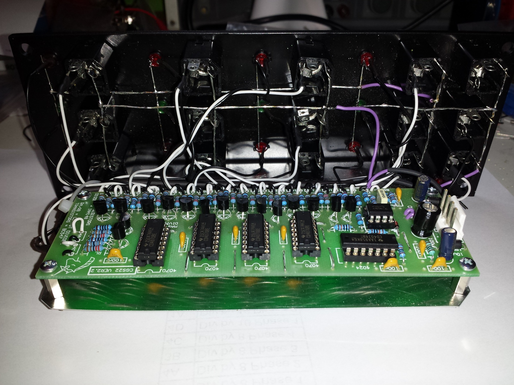
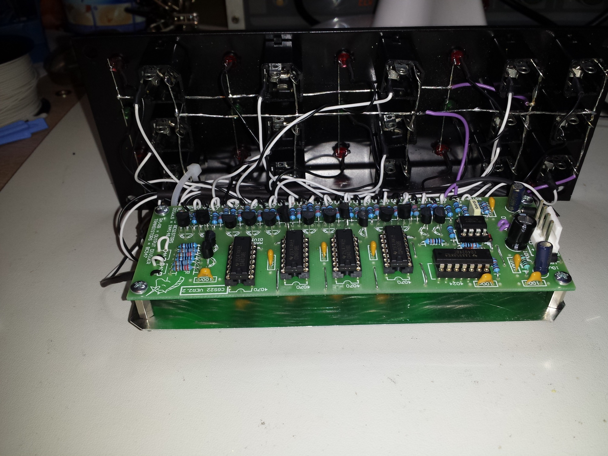
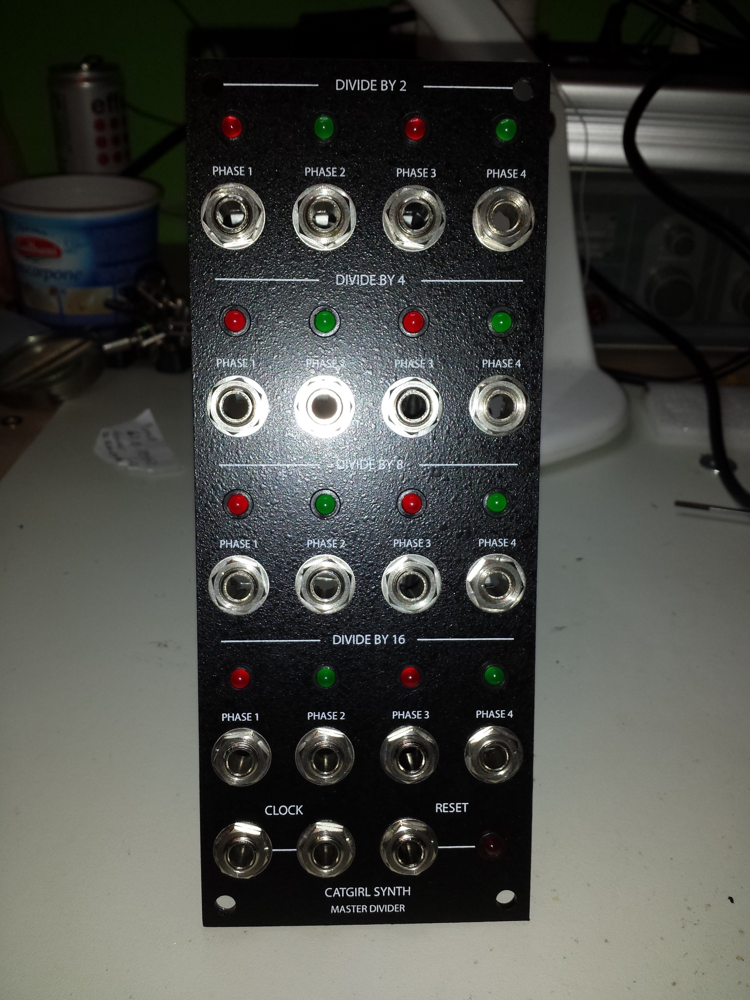
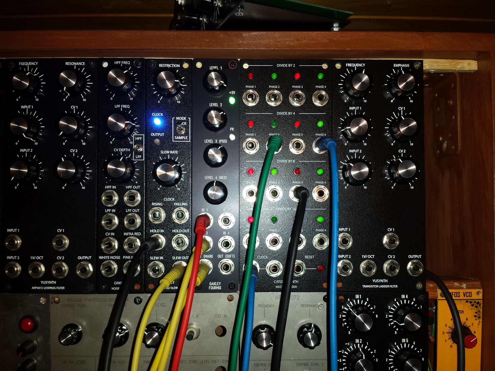

# cgs22 Master Divider in MOTM

> **Project**
>
> ### Projecttitel: cgs22 Master Divider in MOTM
>
> ### Status: `finished`
>
> ### Startdate: 15.01.2014
>
> ### Duedate: 17.01.2014
>
> ### Manufacture link: [http://www.cgs.synth.net/modules/cgs22v2\_master\_divider.html](http://www.cgs.synth.net/modules/cgs22v2_master_divider.html)

### i´ve finished a cgs22 Masterdivider in Rev.2.2 with a bridechamber MOTM Panel.

**Tips:**

you can replace the BC547 with equl. parts like bc548..

ground all jacks and LED´s together.

by using standard green/red LED´s you can use the default resistor values, clear lense leds needs higher values but seems to be a Lightshow.. (not needed for a MOTM cabinet)

RA = 1k8

RB = 1k

RL = 2k2

|   |   |   |
|---|---|---|
| **Wiring:** \|   \|   \| \|---\|---\| \| Des. \| Function \| \| 1D \| Div by 2 Phase 1 \| \| 2A \| Div by 2 Phase 2 \| \| 1B \| Div by 2 Phase 3 \| \| 2C \| Div by 2 Phase 4 \| \| 2D \| Div by 4 Phase 1 \| \| 3A \| Div by 4 Phase 2 \| \| 2B \| Div by 4 Phase 3 \| \| 3C \| Div by 4 Phase 4 \| \| 3D \| Div by 8 Phase 1 \| \| 4A \| Div by 8 Phase 2 \| \| 3B \| Div by 8 Phase 3 \| \| 4C \| Div by 8 Phase 4 \| \| 4D \| Div by 16 Phase 1 \| \| 1A \| Div by 16 Phase 2 \| \| 4B \| Div by 16 Phase 3 \| \| 1C \| Div by 16 Phase 4 \| |   |   |
| Des. | Function |   |
| 1D | Div by 2 Phase 1 |   |
| 2A | Div by 2 Phase 2 |   |
| 1B | Div by 2 Phase 3 |   |
| 2C | Div by 2 Phase 4 |   |
| 2D | Div by 4 Phase 1 |   |
| 3A | Div by 4 Phase 2 |   |
| 2B | Div by 4 Phase 3 |   |
| 3C | Div by 4 Phase 4 |   |
| 3D | Div by 8 Phase 1 |   |
| 4A | Div by 8 Phase 2 |   |
| 3B | Div by 8 Phase 3 |   |
| 4C | Div by 8 Phase 4 |   |
| 4D | Div by 16 Phase 1 |   |
| 1A | Div by 16 Phase 2 |   |
| 4B | Div by 16 Phase 3 |   |
| 1C | Div by 16 Phase 4 |   |

*

*
