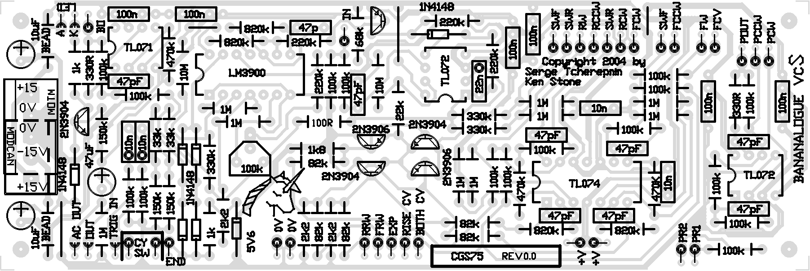
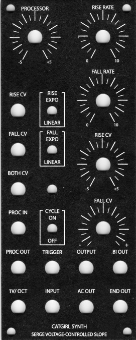
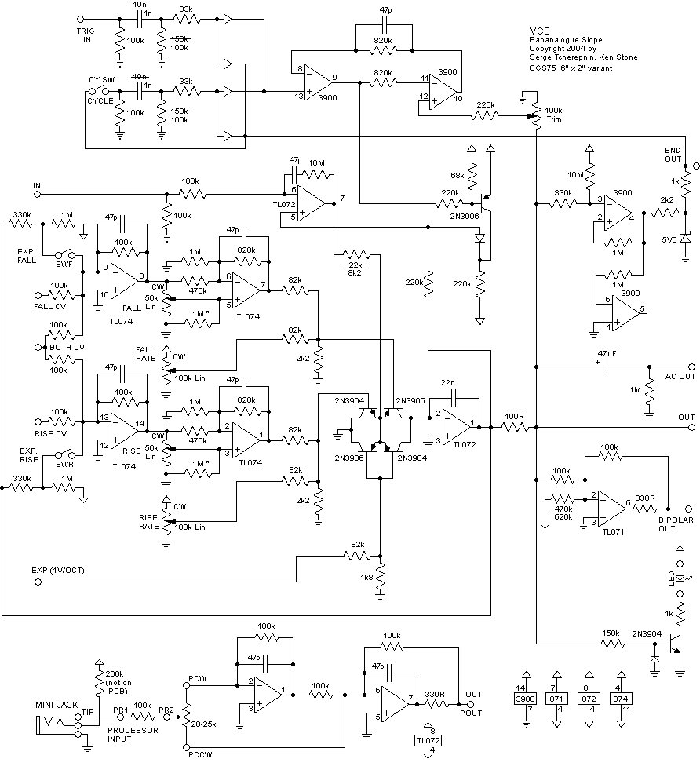
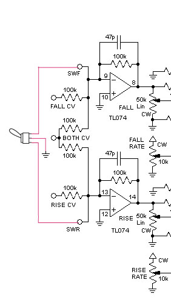
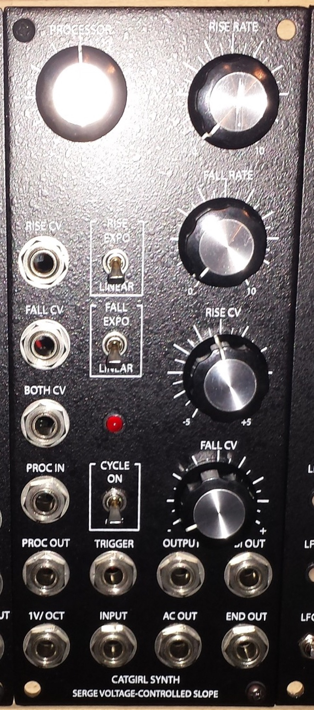
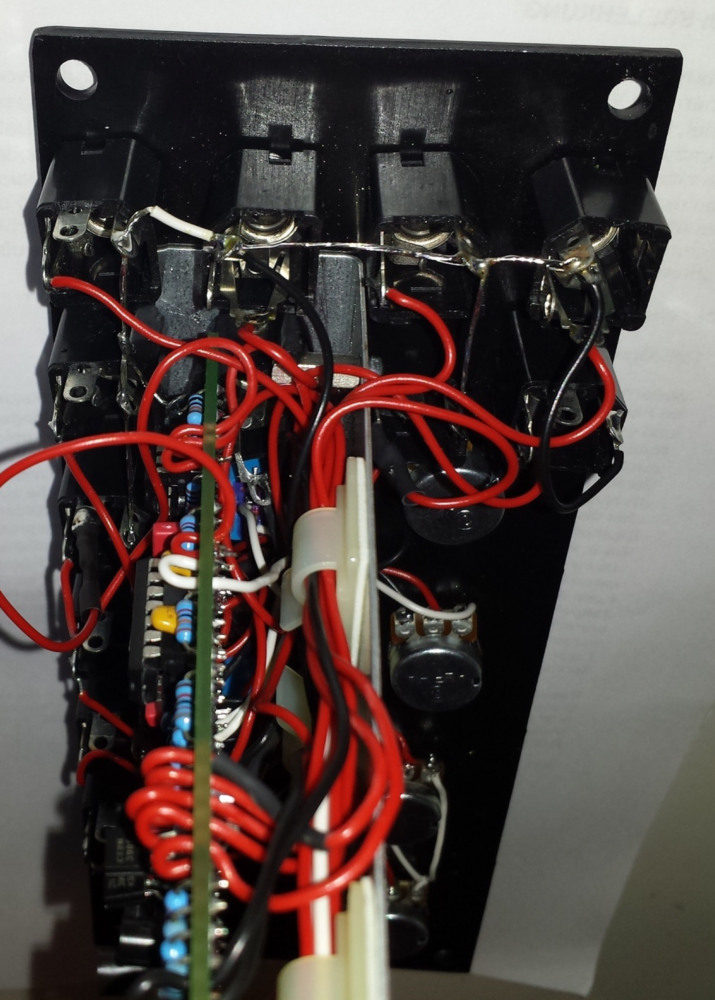
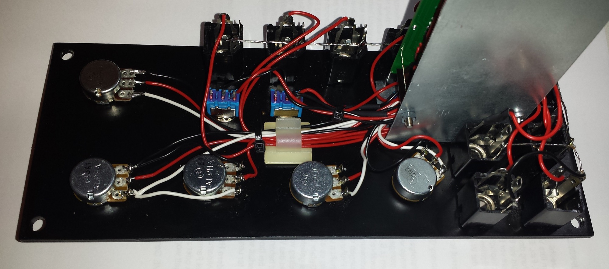
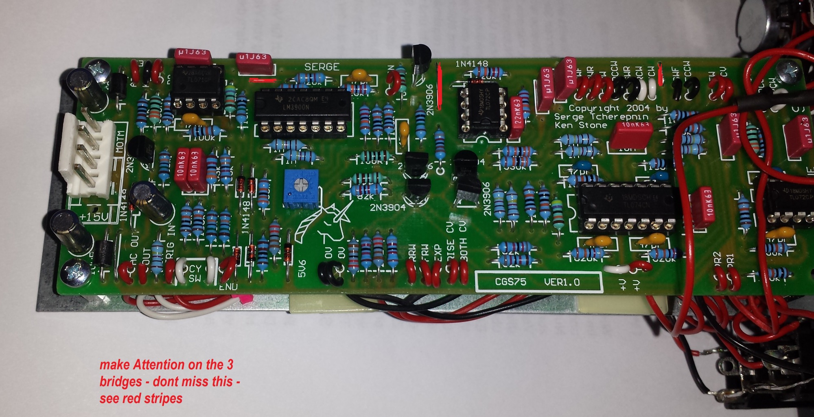
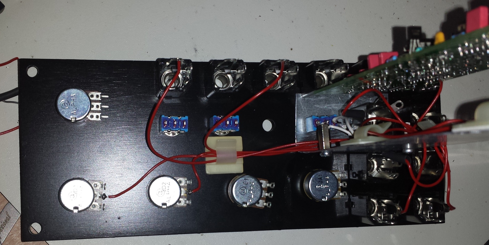
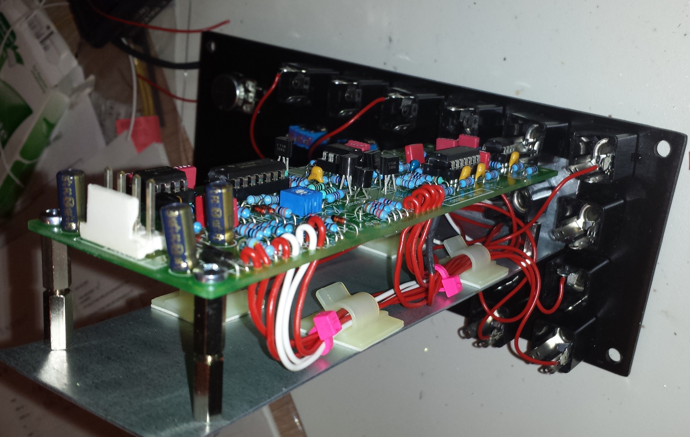

# cgs75 Serge VCS in MOTM

> **Project**
>
> ### Projecttitel:cgs75 Serge VCS in MOTM
>
> ### Status:`finished`
>
> ### Startdate: 28.02.2014
>
> ### Duedate: 02. July 2014
>
> ### Manufacture link: [http://cgs.synth.net/](http://cgs.synth.net/)

**related articles:**

[http://electro-music.com/forum/post-281432.html](http://electro-music.com/forum/post-281432.html)

**BOM:**

|   |   |   |
|---|---|---|
| **Part** | **Quantity** | **my info** |
| **Capacitors** |   |   |
| 47pF | 9 | mlcc |
| 1n | 2 | wima mks |
| 10n | 2 | wima mks |
| 22n | 1 | wima mks |
| 100n | 6 | wima mks |
| 10uF 25V | 2 |   |
| 47uF 25V | 1 |   |
| **Resistors 1% Metallfilm** |   |   |
| 100R | 1 |   |
| 330R | 2 |   |
| 1k | 2 |   |
| 1k8 | 1 |   |
| 2k2 | 3 |   |
| 8k2 | 1 |   |
| 33k | 2 |   |
| 68k | 1 |   |
| 82k | 5 |   |
| 100k | 18 |   |
| 150k | 1 |   |
| 200k | 1 |   |
| 220k | 4 |   |
| 330k | 3 |   |
| 470k | 2 |   |
| 600k | 1 |   |
| 820k | 4 |   |
| 1M | 9 |   |
| 10M | 2 |   |
| 100k trimmer | 1 |   |
| 50k lin pot (FALL,RISE POT ✅ | 2 |   |
| 20k lin pot for processor ✅ | 1 |   |
| 100k lin pot (CV-pots) ✅ | 2 |   |
| **Semi's** |   |   |
| LED | 1 |   |
| 1N4148 | 6 |   |
| 2N3904 | 3 |   |
| 2N3906 | 3 |   |
| 5V6 400mW Zener | 1 |   |
| TL071 | 1 |   |
| TL072 | 2 |   |
| TL074 | 1 |   |
| LM3900 | 1 |   |
| **Misc.** |   |   |
| Ferrite Bead | 2 |   |
| SPST switch | 3 |   |
| 0.156 4 pin connector | 1 |   |
| [CGS75 PCB](http://cgs.synth.net/pcb/index.html) | 1 |   |
| Panel Bridechamber | 1 |   |
| PotBracket - own | 1 |   |

**Wiring:**

|   |   |
|---|---|
| ac out | ac out jack |
| bo | bi-polar output jack |
| out | out jack |
| trig in | trigger in jack |
| cy sw | (x 2) cycle switch. Switch connects these together for cycle mode |
| end | end out jack |
| rrw | rise rate wiper |
|   | CW end of rise rate pot connects to +ve |
|   | CCW end of rise rate pot connects to 0V |
| frw | fall rate wiper |
|   | CW end of fall rate pot connects to +ve |
|   | CCW end of fall rate pot connects to 0V |
| exp | exponential cv jack |
| rise cv | rise cv jack |
| both cv | both cv jack |
| in | input jack |
| swf | (x 2) fall switch. Switch connects these together for exp. response. |
| swr | (x 2) rise switch, Switch connects these together for exp. response. |
| rw | rise pot wiper |
| rccw | rise pot counter-clockwise |
| rcw | rise pot clockwise |
| fcw | fall pot clockwise |
| fccw | fall pot counter-clockwise |
| fw | fall pot wiper |
| fcv | fall cv jack |
| pout | processor output jack |
| pccw | processor pot ccw |
| pcw | processor pot cw |
| pr1 | processor input |
| pr2 | processor pot wiper |

#### **Setting up - Calibration**

Adjustments on the VCS board are set to obtain a 0 to +5 volt level when the unit is cycling, producing a 100Hz triangle wave. An oscilloscope is required for this adjustment. In an oscilloscope is not available, adjust for the least distorted sounding waveshape.

**Schematics:**

keep attention on the Processori input jack with 200K resistor at the jack switch to +V.

also make sure you have all 3  "bridges" correctly filled with a piece of wire or rest from a resistor leg, otherwise the module dont work correct.

