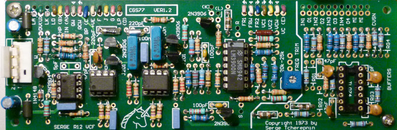
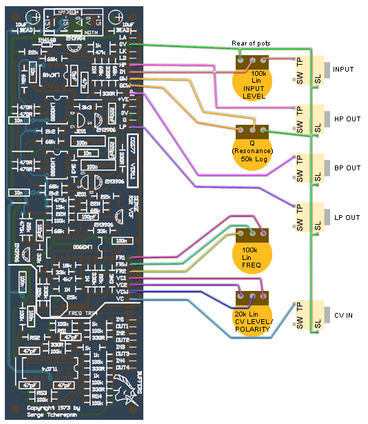

# cgs77 Serge VCF in MOTM

> **Project**
>
> ### Projecttitel:cgs77 Serge VCF in MOTM
>
> ### Status:`finished`
>
> ### Startdate: 01.03.2014
>
> ### Duedate: 07.04.2014
>
> ### Manufacture link: [http://cgs.synth.net/](http://cgs.synth.net/)

**State variable, 2 pole, 12dB/oct LP & HP, 6dB slopes on the BP**

**BOM**

|   |   |
|---|---|
| Part | Quantity |
| **Capacitors** |   |
| 5pF (omit for TL071) | 1 |
| 47pF | 5 |
| 100pF | 2 |
| 220pF (Styrene) | 2 |
| 10n | 4 |
| 100n (monoblock) | 3 |
| 100n MKT or better | 2 |
| 10uF 25V | 2 |
| **Resistors** |   |
| 330R | 7 |
| 470R | 4 |
| 1k | 5 |
| 2k2 | 2 |
| 3k3 | 2 |
| 4k7 | 1 |
| 15k | 1 |
| 18k | 1 |
| 22k | 5 |
| 33k | 3 |
| 47k | 1 |
| 68k | 8 |
| 100k | 11 |
| 330k | 2 |
| 470k | 2 |
| 1M | 2 |
| 3M3 | 1 |
| 11M | 1 |
| 22M | 2 |
| RG1-4 see text | 4 |
| 22k (25k) trimmer | 1 |
| 50k log pot (Resonance) | 1 |
| 100k lin pot | 3 |
| **Semi's** |   |
| LED | 1 |
| 1N4148 | 1 |
| 2N3904 | 1 |
| 2N3906 | 4 |
| J201 | 2 |
| LM748 or TL071 | 1 |
| CA3080 or LM3080 | 2 |
| LM3900 | 1 |
| TL074 | 1 |
| **Misc.** |   |
| Ferrite Bead | 2 |
| 0.156 4 pin connector | 1 |
| [cgs77 PCB](http://cgs.synth.net/pcb/index.html) | 1 |
| panel - bridechamber MOTM | 1 |
| bracket - own | 1 |
| ic sockets |   |
| jacks |   |

**Building:**

#### Modifications and notes.

- The resistor specified as 11M was actually a 15M on the original. It was hard to determine due to the condition of the original resistor. None the less, there is no notable audio difference between using a 10M or a 15M in the position. I have seen other values in this position on other instruments. As such, I recommend just using a 10M.
- The bias for the LM3080 OTAs was omitted in some later builds. As such, if you don't have any 22M resistors, simply omit them. Again casual testing was unable to determine any difference in response to them being included or not. The associated 100k and 15k could also be omitted if you omit the 22M resistors.
- If you wish the filter to **self oscillate** at high Q settings, the 68k resistor between pins 2 and 6 of the single op-amp (LM748 on the PCB) can be reduced to 27k. This 68k is physically between the 11M and the 330R resistors. This will also drop the output levels significantly. To recover the levels, feed the LP, BP and HP outputs through three of the onboard buffers, with 39k resistors used in positions marked RG.
- A TL071 can be substituted for the ancient LM748. If you do this, leave out the 5pF capacitor.
- The resistors marked RG1-4 are for setting the gains of the optional buffers. It is unlikely you will need to install them, and then only if you are using the buffers as gain stages for something other than this filter.
- All parts surrounding the TL074, as indicated by the heavy line marking of the area of the PCB, can be omitted if the buffers are not required.
- 100k linear pots can be used instead of the 20k or 25k pots. The parts list now reflects this.
- Possible use for the buffers include buffering the input and CV input to compensate for their lower-than-usual input impedance, or buffering the outputs after they have been fed though a level pot, as per the panel in the photo.
- **A DPDT switch can be added to short points F and G to 0V (J on ver 1.2 PCB). Doing this will switch the filter into low-frequency mode,** as per the VCFX (for CV filtering etc.). While the original Serge boards had this function, it is doubtful it was ever brought out to the panel. Some later builds omitted the 100n capacitors, replacing them with links.
- The LD connection can be connected to one of the outputs to give a visible indication of an output signal. The LED, the associated transistor and resistors can be omitted. The LED resistor is marked 1kLR on the later versions of the board, to help identifying it if you need to adjust its value to compensate for an overly bright LED.
- Even though the panel says "Cynthia" on it, it does NOT mean that this is a module she is offering for sale!
- [Offsite link](http://www.sdiy.org/pinky/tracks/73vcf.mp3) to an mp3 example of how this filter sounds.
- Will run on +/- 12 volts or +/-15 volts.

*On the VER1.0 board, the two FET markings are incorrect for the J201 packages. You need to install these "backwards" with respect to the overlay. This has been corrected for the VER1.1 and later boards.*

**Wiring:**

