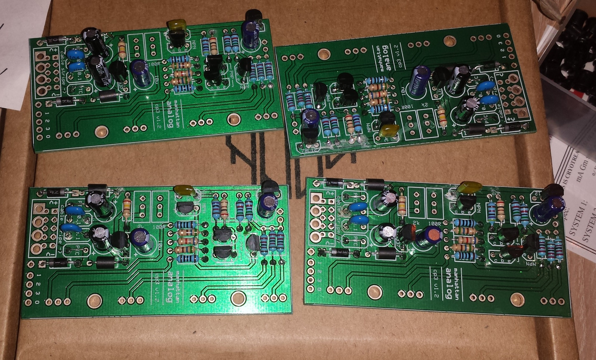
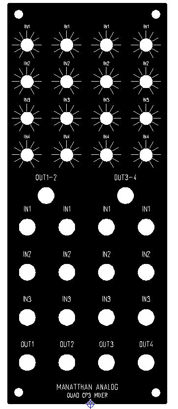
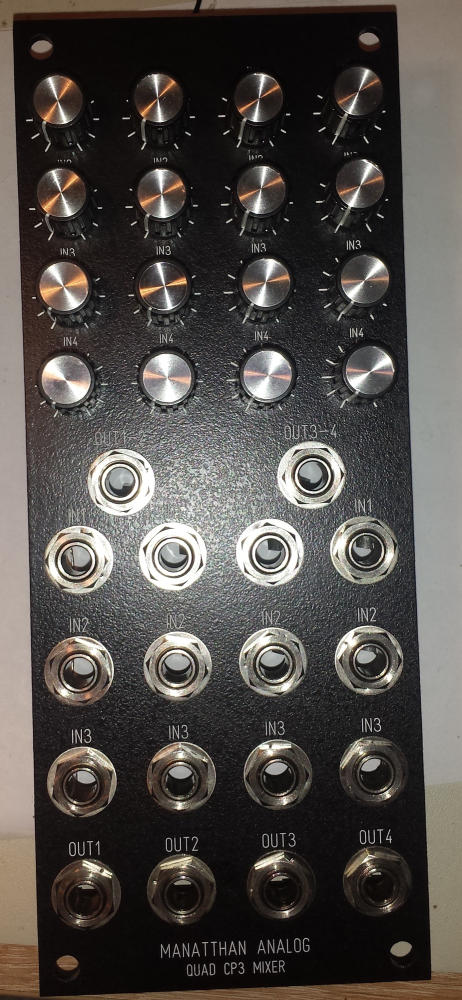
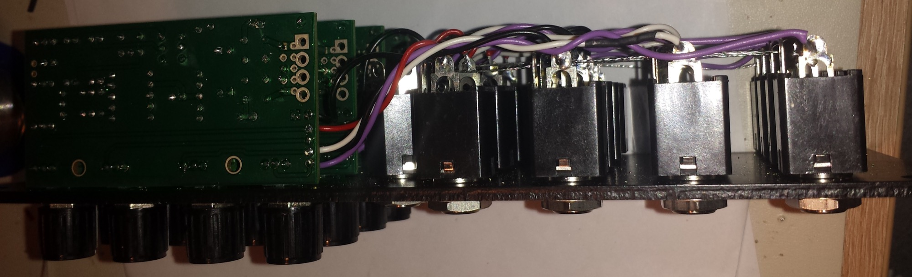
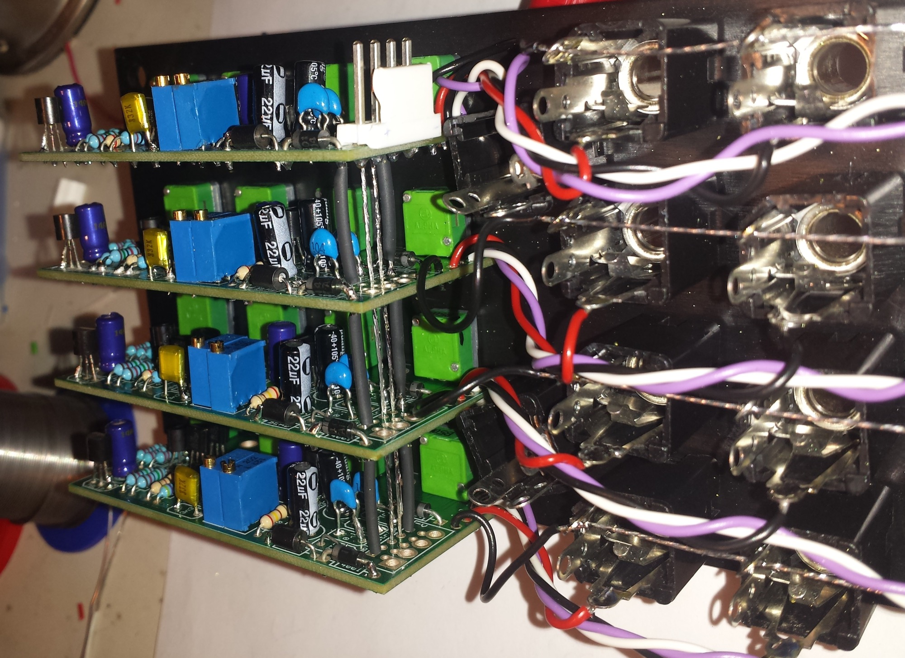
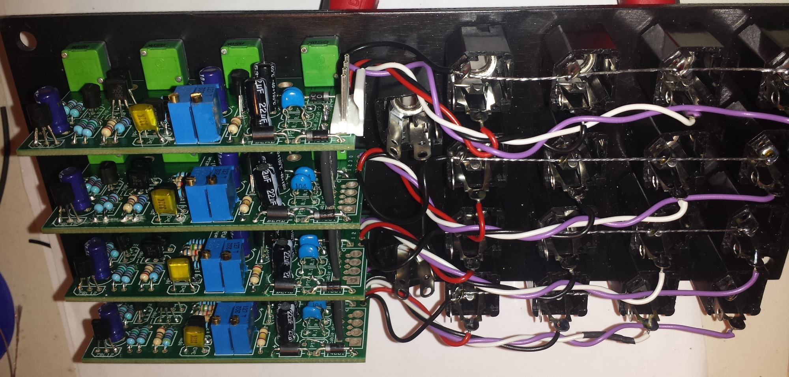
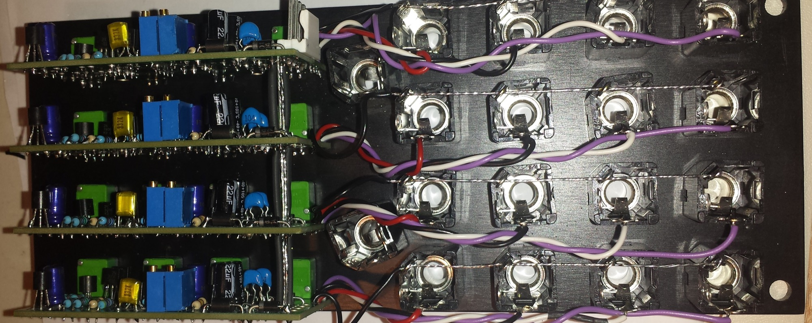

# CP3 Mixer - Quad CP3 Mixer in MOTM

> **Project**
>
> ### Projecttitel: CP3 Mixer - Quad CP3 Mixer in MOTM
>
> ### Status: `Finished`
>
> ### Startdate: October 2014
>
> ### Duedate: December 2014
>
> ### Manufacture link: --

## Here comes a Quad CP3 Mixer with 16 Mixer Channels in MOTM Format.

**Pcb design** from Manhatten analog, designed for Eurorack for 12V and 15V

**Pcbs** :  Fullkit from synthcube

**Panel**: custom Panel, ordered by Schaeffer

[FPD  File:   quad\_cp3\_october.fpd](assets/quad_cp3_october.fpd)

**BOM/building guide**:

 **Resistors:**
 \[2\] 100R
 \[1\] 200R
 \[1\] 240R
 \[2\] 560R
 \[1\] 6.8k
 \[2\] 15k
 \[3\] 22k
 \[1\] 47k

 **Capacitors:**
 \[2\] 10/22/47uF electrolytic   (i used for power 22uF, for others 10uF)
 \[2\] 0.1uF ceramic
 \[1\] 3.3nF poly
 \[1\] 10uF electrolytic
 \[1\] 10uF electro; optional for +12V regulator

 **Pots:**
 \[3\] 10-50k audio, 9mm Alpha or similar
 \[1\] 25-50k linear, 9mm Alpha or similar
 \[1\] 2k multiturn trim
 \[1\] 100R multiturn trim

 **Transistors/ICs:**
 \[1\] LM78L12; optional for +/-15V supplies ONLY
 \[1\] LM337LZ - be sure to get the one in the TO-92 package
 \[2\] 2N3904 (or similar NPN) - Matched pair
 \[2\] 2N3906 (or similar PNP) - Matched pair

 Misc:
 \[1\] 10-pin .100 header, male (Euro power) OR 4-pin MTA-156 header (MOTM power)
 \[2\] Ferrite bead (can substitute 10R resistor)
 \[2\] PTC resettable fuse (.050 hold, .100 trip) - can replace with wire link
 \[2\] 1N4001 diode
 \[4\] 3.5mm jack, 16PJ138 or Erthenvar/Thonk style
 \[4\] Davies 1900H-style knob, or any other ~12.5mm-diameter knobs you prefer.

 TRIMMING
 1) For use with +/-12V supplies, jumper pins 1 and 3 of the 78L12 and omit the adjacent cap.
 2) Adjust the 2k trimpot until the output of the LM337 is -6.0V.
 3) Adjust the 100R trimpot until the output has no DC offset.

> **Tipp**
>
> **Building note:** for 15V use a additional LM337

