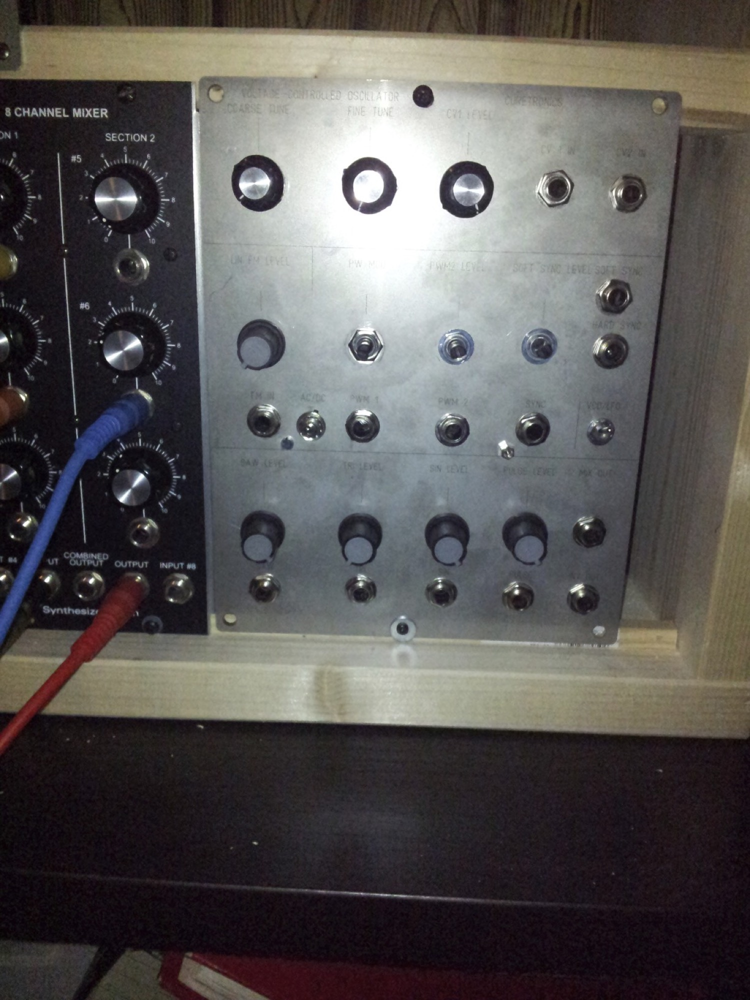
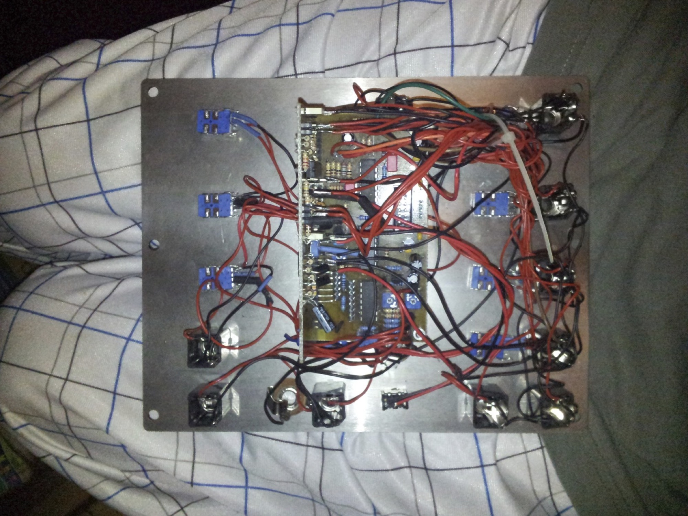
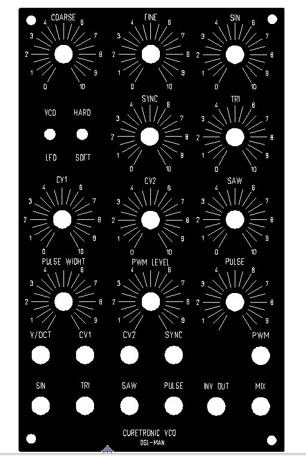
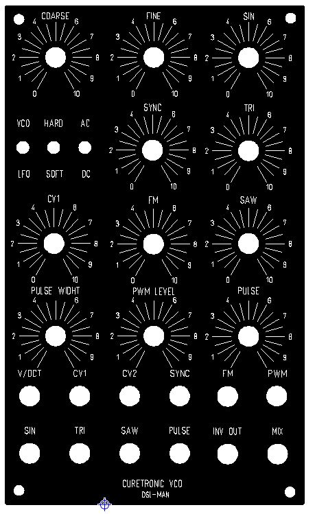
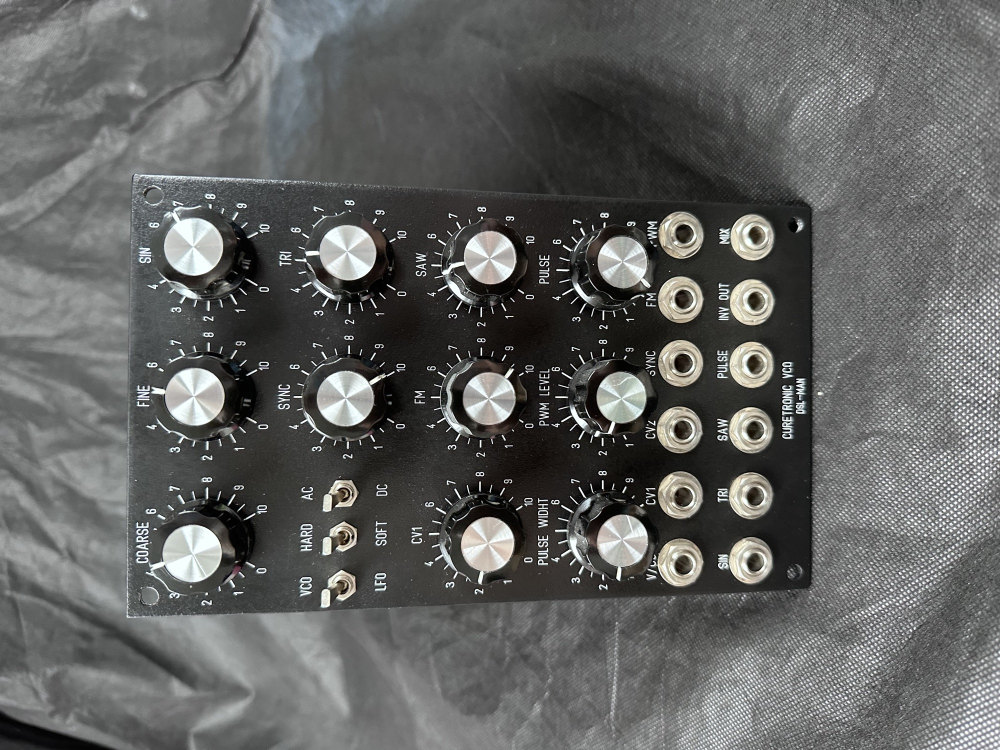
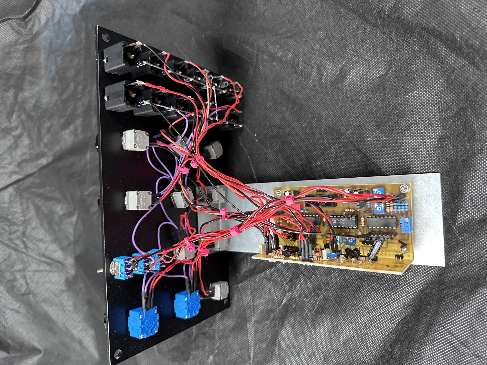
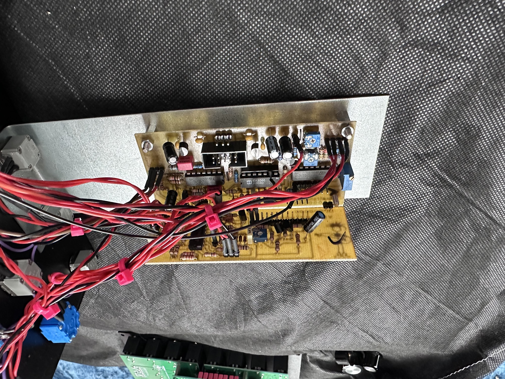

# Curetronic VCO

> **Project**
>
> ### Curetronic - Curetronic VCO
>
> ### `Status` : finished
>
> ### Startdate: 24.November.2011
>
> ### Duedate: 08.December.2013
>
> update 2014: new Panel in planning
>
> ### Manufacture link:[http://www.bild-schall.com/product/digi-eins](http://www.bild-schall.com/product/digi-eins)[http://www.bild-schall.com/product/curetronic-vco-basic](http://www.bild-schall.com/product/curetronic-vco-basic) plus [http://www.bild-schall.com/product/curetronic-vco-extension](http://www.bild-schall.com/product/curetronic-vco-extension)

# **THIS WAS MY VERY FIRST MODUL !**

**it sounds great**

Curetronic VCO with extension for more waveforms

this was my first DIY Modular Build in end of 2011, it was hard to link the cables from the curetronics pcbs, because the VCO daughterboard pinheader are to close with the main pcb.

maybe in 2014 i change the frontpanel and wiring..

Curetronic VCO with expansion (waveshaper)

**Building documents:**

[**Assembly\_Instructions\_VCO\_Basic\_2013-06-14.pdf**](assets/Assembly_Instructions_VCO_Basic_2013-06-14.pdf)

[Assembly\_Instructions\_VCO\_Extension\_2011-12-22.pdf](assets/Assembly_Instructions_VCO_Extension_2011-12-22.pdf)

Lasercutted Panel - the knobs are yet changed to bigger one´s

the wiring needs a update by repaneling

**NEW Panel in 2014**

**Schaeffer fpd file:**

[**Curetonic\_VCO.fpd**](assets/Curetonic_VCO.fpd)**without FM without AC/DC but with CV2   -&gt;  carefully   one typo in Pulse width**

[**Curetonic\_VCOwithFM.fpd**](assets/Curetonic_VCOwithFM.fpd)**with FM without CV2  -  carefully   one typo in Pulse width**

