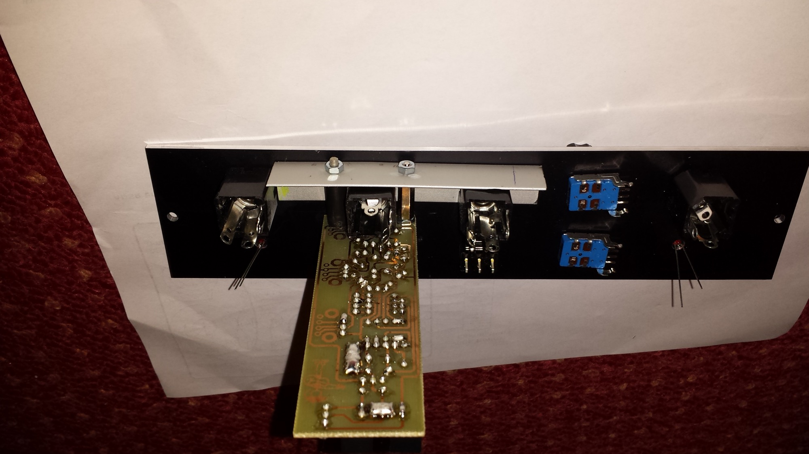
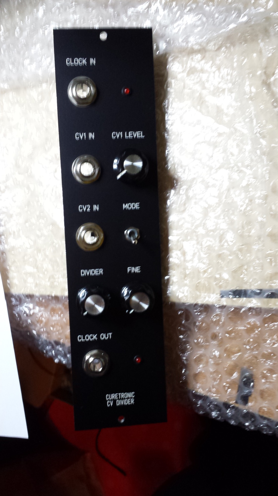
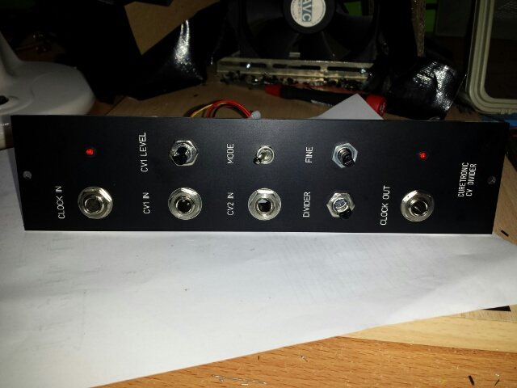
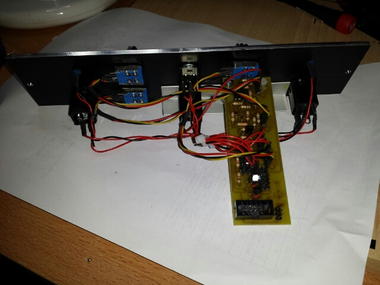

# Curetronics Digi eins - Clock Divider

> **Project**
>
> ### Curetronic Digi eins - Clock Divider
>
> ### `Status` : finished
>
> ### Startdate: 24.11.2013
>
> ### Duedate: 08.12.2013
>
> ### Manufacture link:[http://www.bild-schall.com/product/digi-eins](http://www.bild-schall.com/product/digi-eins)

---

