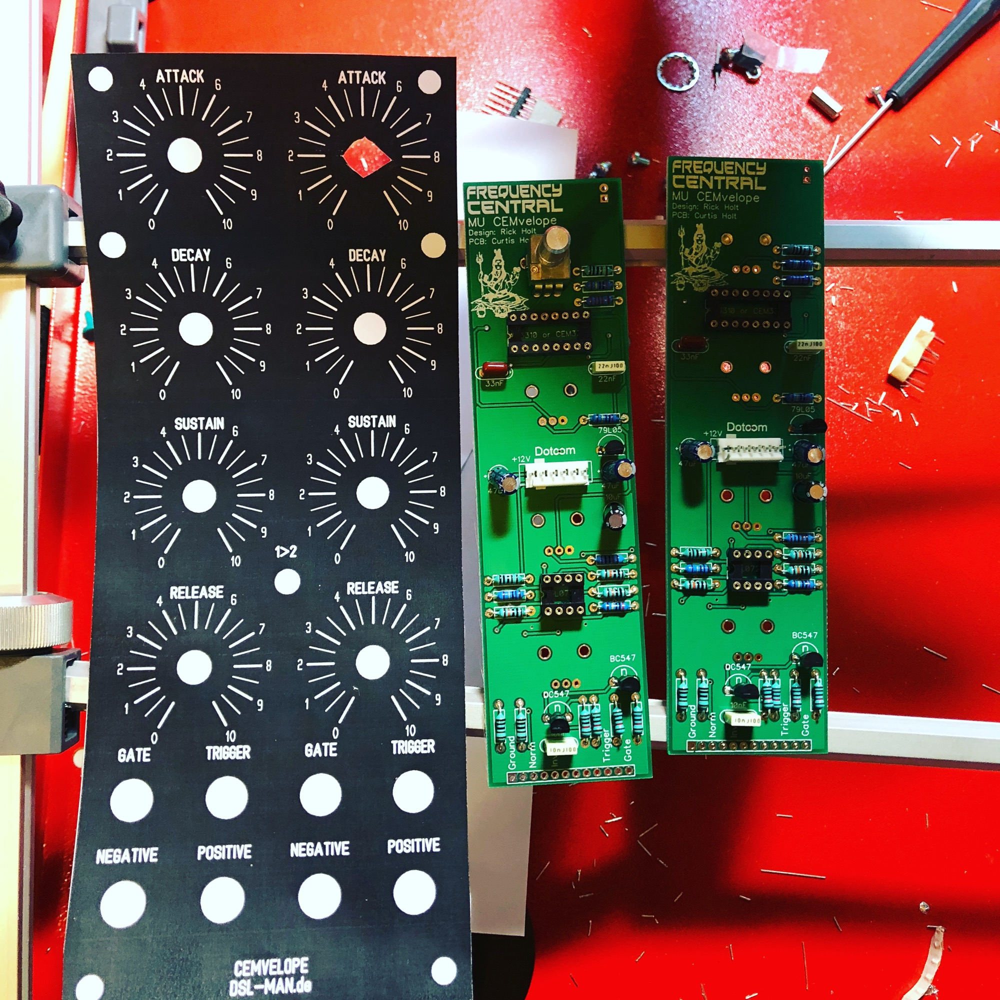
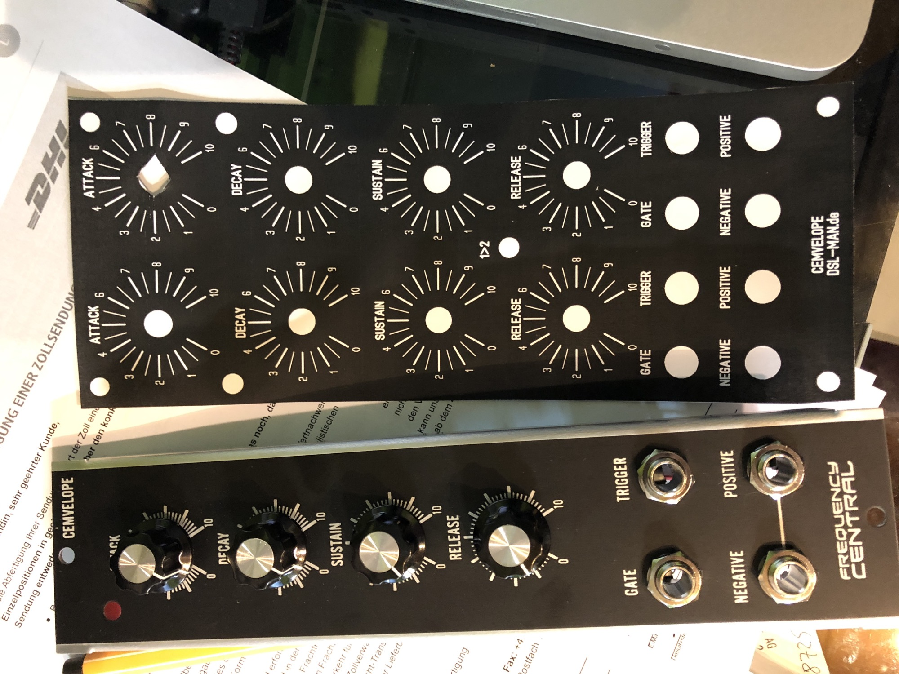
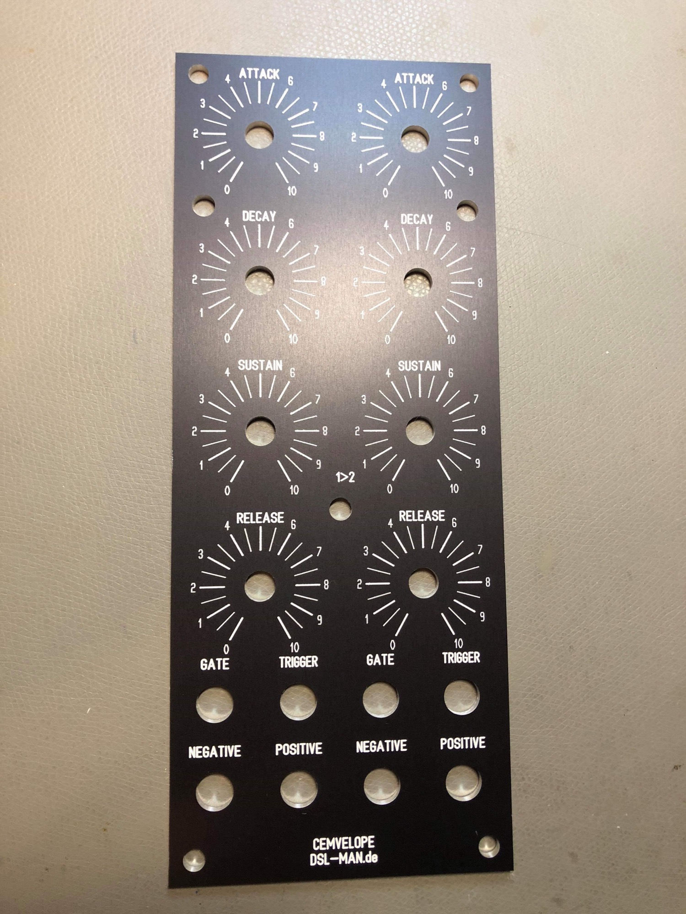
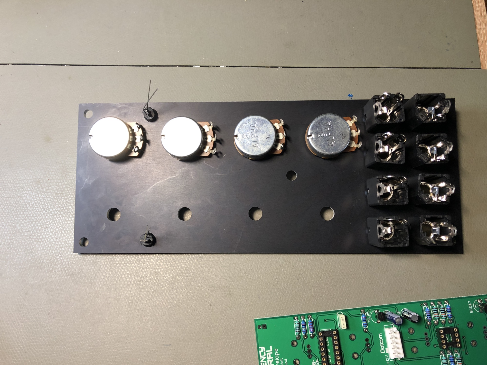

# DUAL FC CEMvelope in MOTM

> **Project**
>
> ### Projecttitel: DUAL FC CEMvelope in MOTM
>
> ### Status:`done`
>
> ### Startdate: 11/2018
>
> ### Duedate: 12/2018
>
> ### Manufacture link:

## the Frequency Central MU Version have to be converted to a DUAL MOTM Version.

### Panelfile:

[cemvelope.fpd](assets/cemvelope.fpd)

### Picture:

[cemvelope.pdf](assets/cemvelope.pdf)

Parts: 4x 100KB 24mm linear Alpha Pots.

8x Amphenol Jacks

2x AS3310 

some resistors (standard) and capacitors, nothing special.

MTA HEADER 6pin (power)

some cables for pots and jacks

2x LEDS (check my page: [MOTM style parts](../../../shopping-tipps/40-diy-synth-all-you-need-for-diy/40-5-motm-style-parts/index.md))

