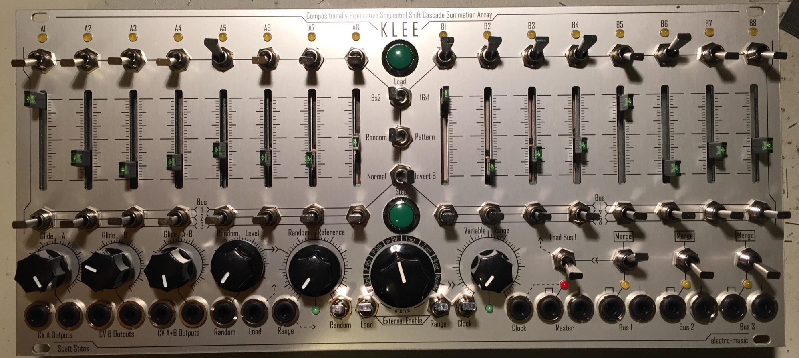
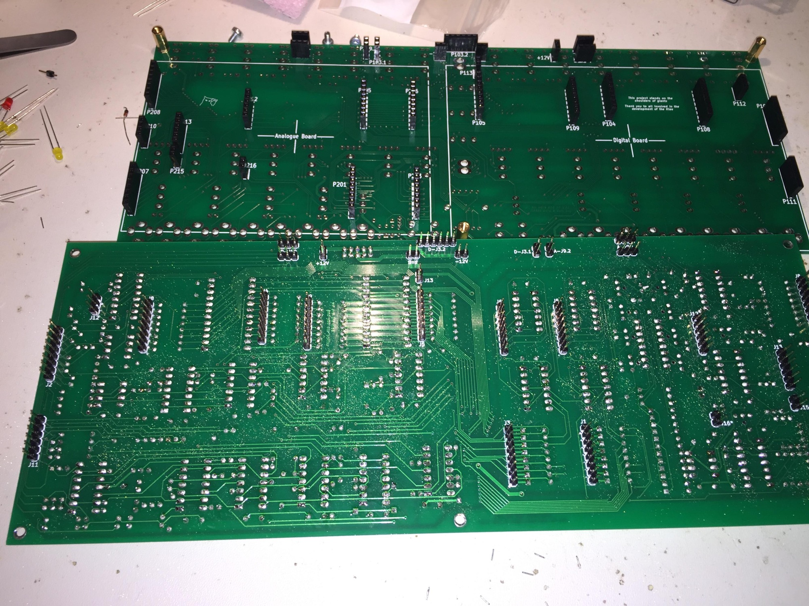
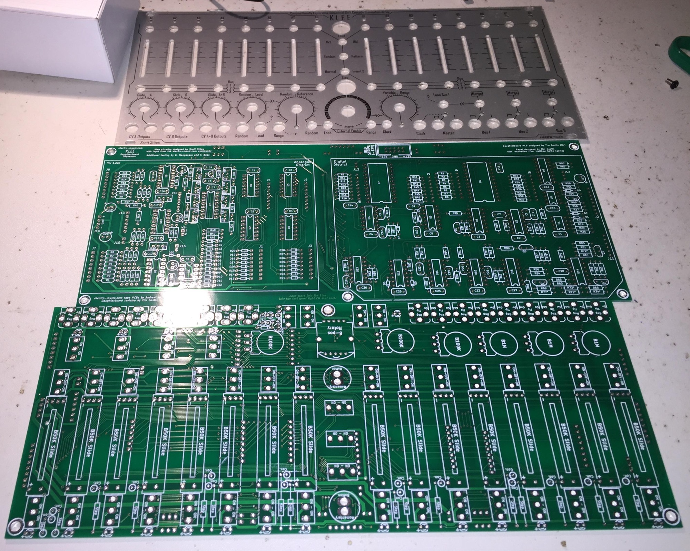
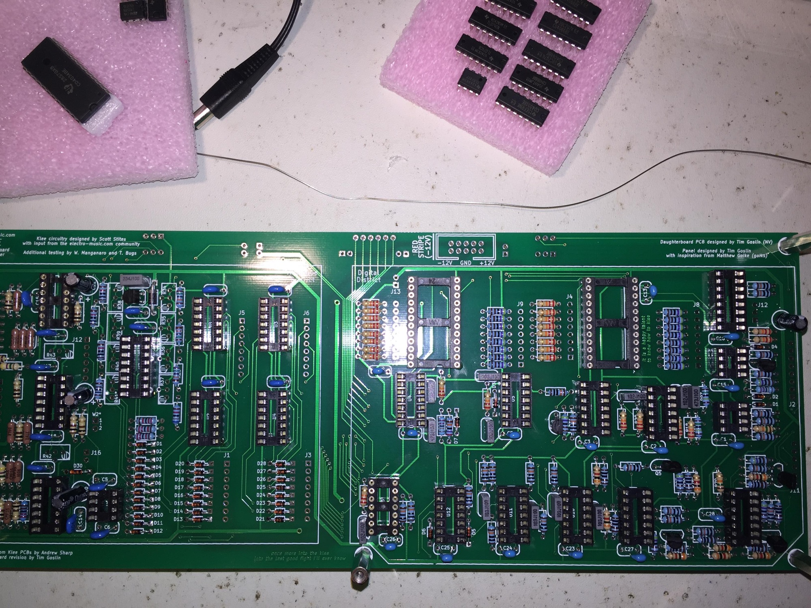
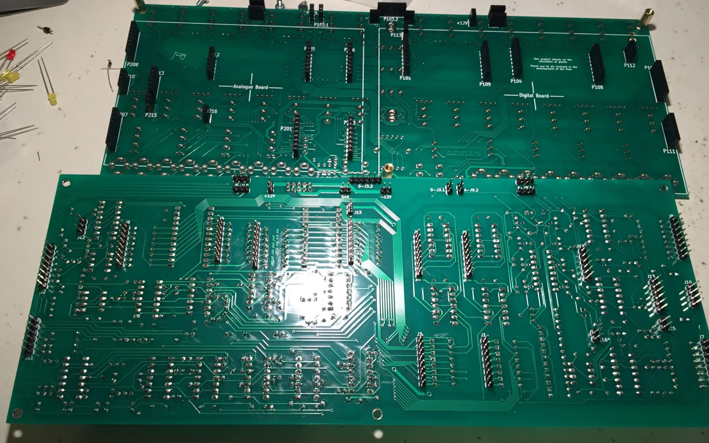

# Eurorack Klee Sequencer

> **Project**
>
> ### Projecttitel: Eurorack Klee Sequencer
>
> ### Status: `finished`
>
> ### Startdate: Oct.2015
>
> ### Duedate: Oct.2015
>
> ### Manufacture link:

This Sequencer was build from a fullkit.

The analog and digital board is a single pcb (analog and digital board on one pcb)

