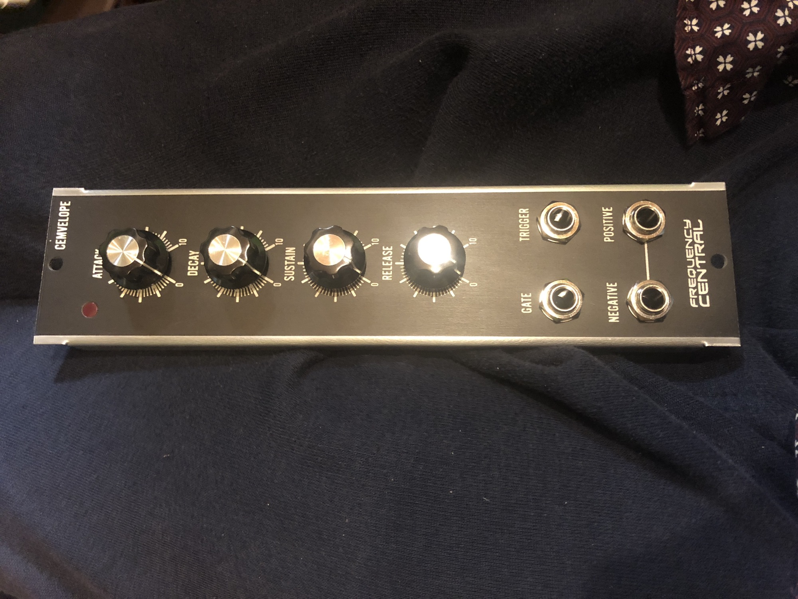
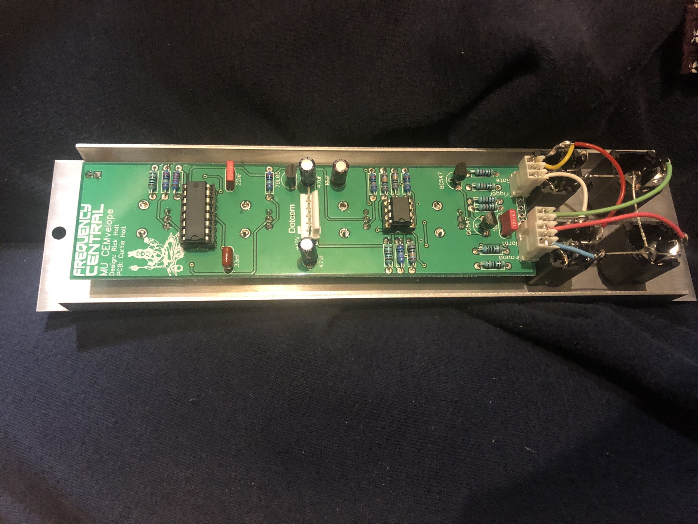

# FC CEMvelope MU Format

> **Project**
>
> ### Projecttitel: CEMvelope
>
> ### Status:`finished`
>
> ### Startdate: 10/2018
>
> ### Duedate: 10/2018
>
> ### Manufacture link:

easy build - too easy.. build time less 1h

Parts: 4x 100KB 9mm linear Alpha Pots.

2x AS3310  instead of CEM3310

some resistors (standard) and capacitors, nothing special.

MTA HEADER 6pin (power)

some cables for pots and jacks

2x LEDS 5mm

