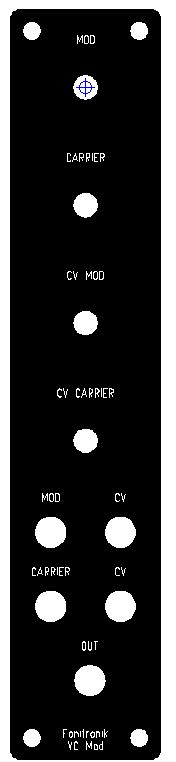
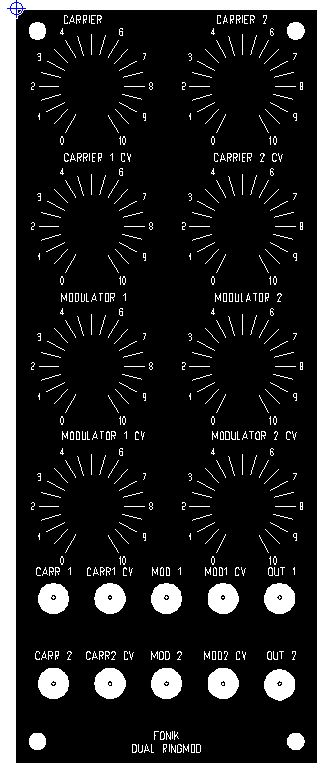
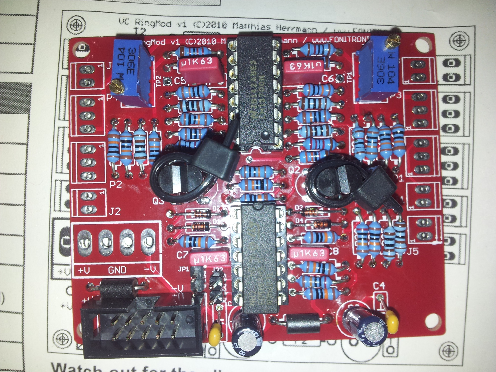
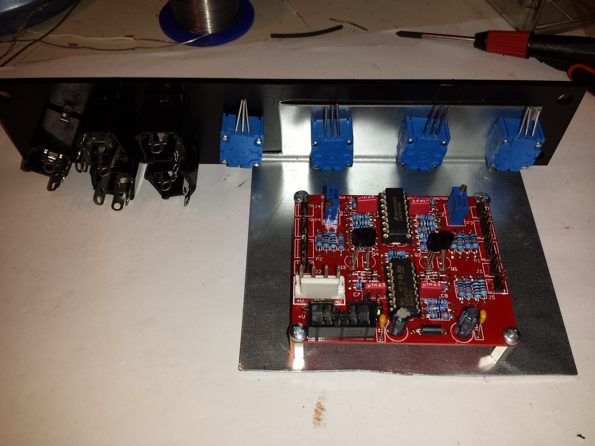
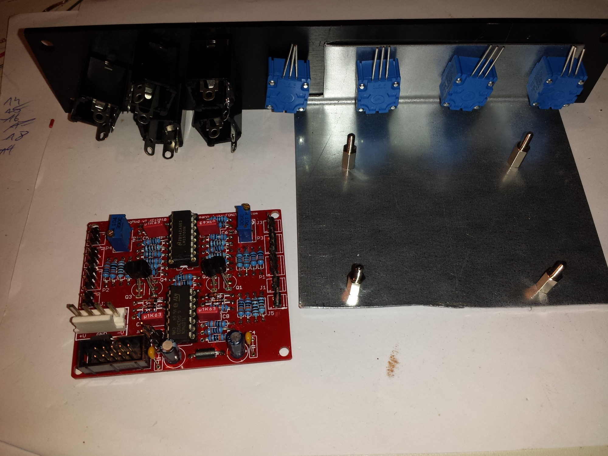

# Fonik CV Ringmodulator

> **Project**
>
> ### Projecttitel: Fonik CV Ringmodulator
>
> ### Status `finished`
>
> ### Startdate: 2011
>
> ### Duedate: end of 2014
>
> ### Manufacture link: [http://www.modular.fonik.de/Page49.html](http://www.modular.fonik.de/Page49.html)

**Frontpanel:**

**2U Panel (Dual)**[**fonik\_2u\_ringmod\_141\_bohrungen\_fertig.fpd**](assets/fonik_2u_ringmod_141_bohrungen_fertig.fpd)

**1U Panel (single)**[**RINGMOD-fertig.fpd**](assets/RINGMOD-fertig.fpd)**-&gt; mod and Carrier was changed - MOD on top instead of Carrier!**

## Fonik CV Ringmodulator

Schematics:

[VCModulatorSCH.pdf](assets/VCModulatorSCH.pdf)

cable tie was replaced by shrink (not in picture)

added MOTM mta156 powerheader

Attachments and Docs

- [VCRingMod.pdf](assets/VCRingMod.pdf)
- [VCRingMod.jpg](assets/VCRingMod.jpg)
- [fonik_2u_ringmod_141_bohrungen_fertig.fpd](assets/fonik_2u_ringmod_141_bohrungen_fertig.fpd)
- [20130507_215842.jpg](assets/20130507_215842.jpg)
- [ringmod.JPG](assets/ringmod.jpg)
- [RINGMOD-fertig.fpd](assets/RINGMOD-fertig.fpd)
- [2u-ringmod.JPG](assets/2u-ringmod.jpg)
- [VCModulatorSCH.pdf](assets/VCModulatorSCH.pdf)
- [20141210_223718.jpg](assets/20141210_223718.jpg)
- [20141210_224300.jpg](assets/20141210_224300.jpg)
