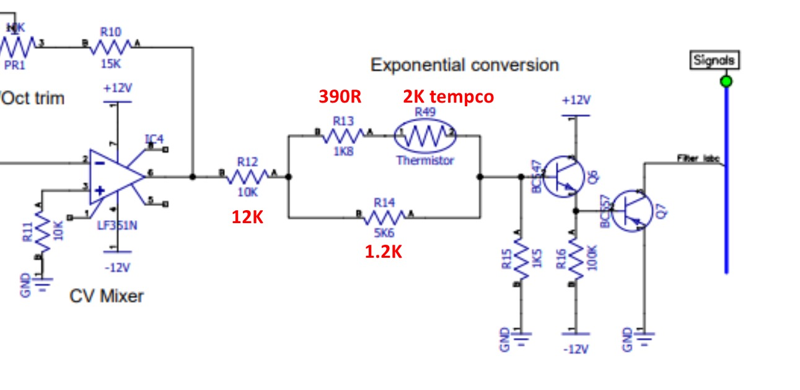

# Frequency Central  System X Lowpas VCF

> **Project**
>
> ### Projecttitel:
>
> ### Status: in build
>
> ### Startdate: 08/2019
>
> ### Duedate: 09/2019
>
> ### Manufacture link:

Change for 2K Tempco instead of 10K NTC !!

