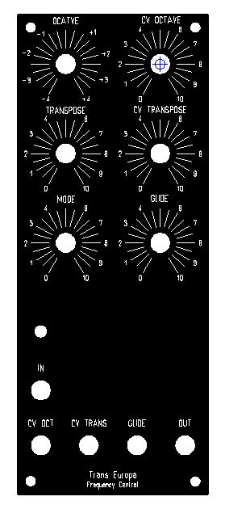

# Frequency Central Trans Europa in MOTM

> **Project**
>
> ### Projecttitel: Frequency Central Trans Europa in MOTM
>
> ### Status: `finished`
>
> ### Startdate: 17.September 2014
>
> ### Duedate: 11. Dec.2014
>
> ### Manufacture link: [http://www.frequencycentral.co.uk/?page\_id=1332](http://www.frequencycentral.co.uk/?page_id=1332)

# Trans Europa DIY

**Trans Europa** is a CV processor/generator module with a number of unique features:

- Octave switching over 9 octaves
- Voltage controlled octave switching, CV input is bipolar +/-5V
- Semitone transposition over 1 octave
- Voltage controlled semitone transposition, CV input is bipolar +/-5V
- 8 Modes (see below)
- Glide feature, which can be applied either manually or by external gate.
- CV thru, you can patch a 1V/oct voltage source in Trans Europa’s Input, it will be replicated at the Output, with the benefit that all Trans Europa’s features can be applied.

Although both CV inputs are bipolar +/-5V, they will also operate well from 0V to 5V CV sources, courtesy of the cunning way in which the input data is interpreted by Trans Europa. CV inputs are not 1V/oct, as Trans Europa was designed as a transposer rather than a quantiser (see ‘Backstory’). For example, in Mode 1 (Semitones), 0V to +5V CV input will allow transpositions over 13 semitones, -5V to +5V will allow transpositions over 25 semitones, in both cases 0V corresponds to no transposition.

By applying control voltages to the Transpose CV input, arpeggios and tuned pseudo-random sequences can be achieved based upon the Mode selected, further enhancements can then be made by modulating the Octave CV input. Suitable input devices are wheels, joysticks, touch pads, FSRs, ribbons, LFOs, ADSRs, S/H etc.

Trans Europa can be used in a number of different ways:

1. As a simple CV source for quick on-the-fly octave and semitone transposition, using the Octave and Transpose knobs only.
2. As a complex CV source for octave and semitone transposition by applying CVs to the Octave and Transpose CV inputs, in this way many interesting pseudo sequences and arpeggios can be created.
3. In conjunction with 1V/oct source, using Trans Europa to transpose the octave and semitone of the 1V/oct source. Additionally, the 1V/oct source can be used to transpose pseudo sequences and arpeggios set up in point #2 (above).

**Builders Guide:**

[Trans-Europa-Rev2-Build-Doc.pdf](assets/Trans-Europa-Rev2-Build-Doc.pdf)

**MOTM Panel**

[Transeuropa.fpd](assets/Transeuropa.fpd) (from 2u template with hpgl)

