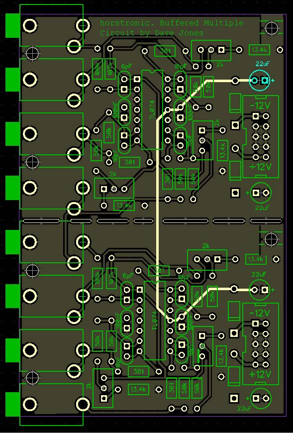
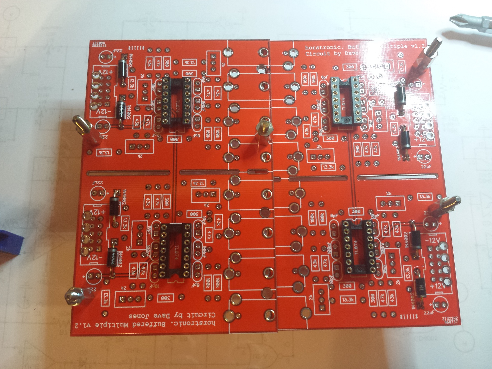
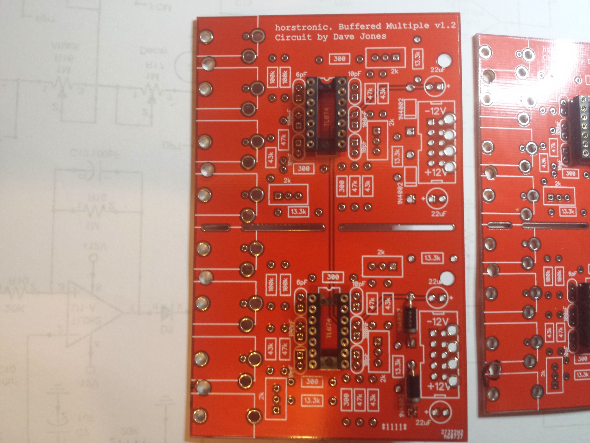
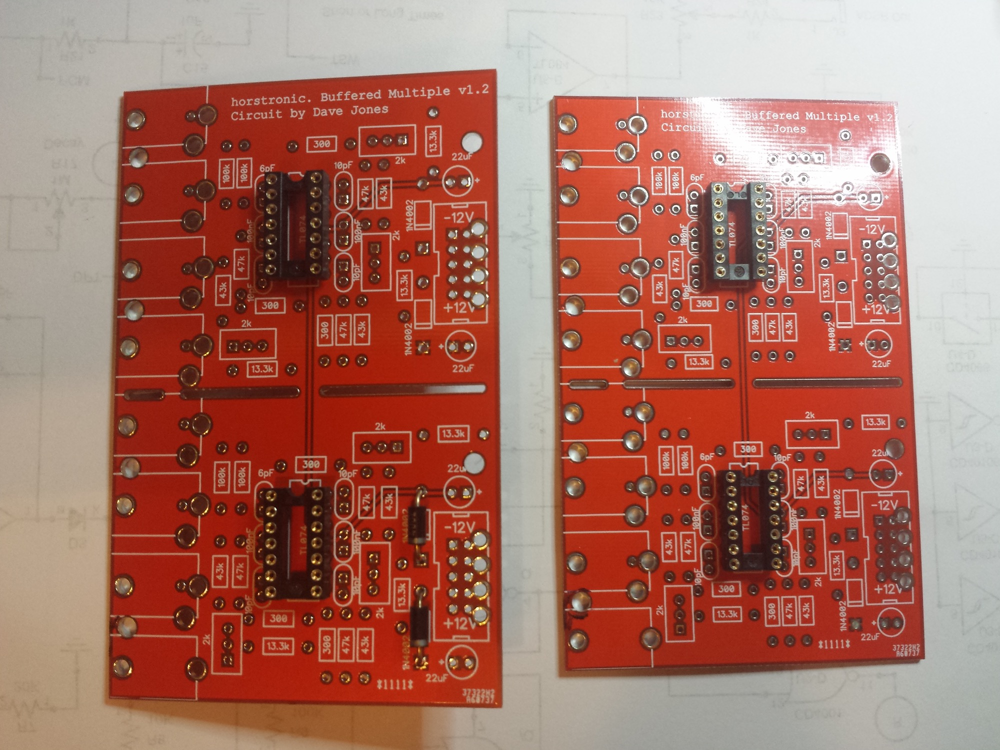
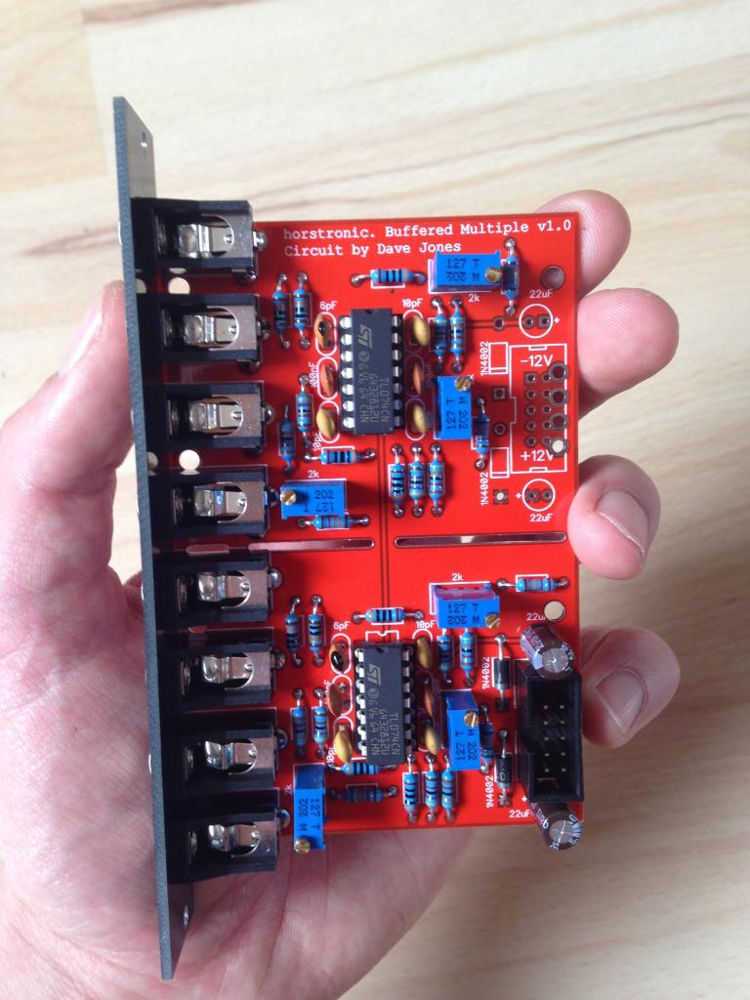

# Horstronic Buffered Multiple

> **Project**
>
> ### Projecttitel: Horstronic Buffered Multiple
>
> ### Status: `in progress`
>
> ### Startdate: October 2014
>
> ### Duedate: December 2014
>
> ### Manufacture link:

I´ll try to change the eurorack designed to MOTM

its needed to have a MOTM Multiple and mount the 2 buffered multiples to a bracket, to have 4 inputs and 12outputs

**Muffwiggler:** [http://www.muffwiggler.com/forum/viewtopic.php?t=116810&start=30&postdays=0&postorder=asc&highlight=&sid=a09619bcea4a7f7c5ee01e9ec8828748](http://www.muffwiggler.com/forum/viewtopic.php?t=116810&start=30&postdays=0&postorder=asc&highlight=&sid=a09619bcea4a7f7c5ee01e9ec8828748)

