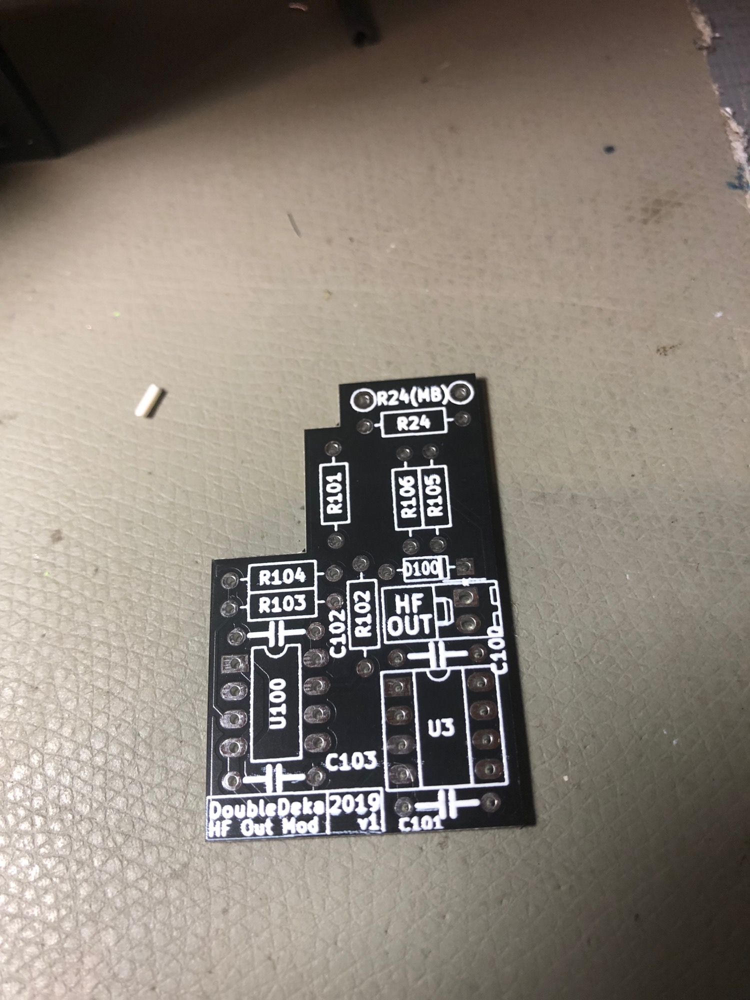

# Ian Fritz Double Deka

> **Project**
>
> ### Projecttitel:
>
> ### Status: finished
>
> ### Startdate:
>
> ### Duedate: 2015/2019
>
> ### Manufacture link:

## Schematics

[DD\_web.pdf](assets/DD_web.pdf)

## HF Mod:

