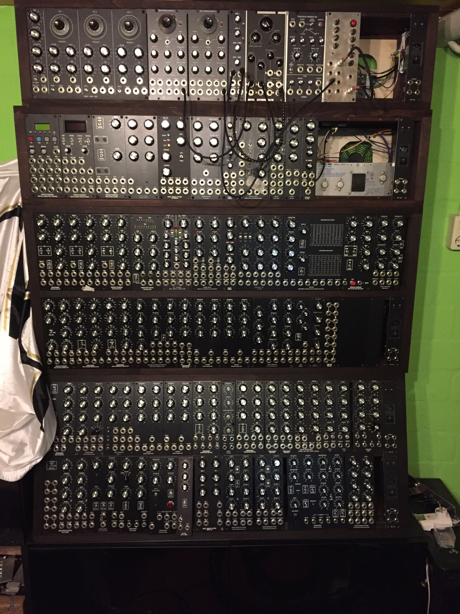

# Modular in 5U projects

You find here are some DIY Module Projects in 5U Format  (check the Eurorack Space for 3U Modules)

I built hundreds of MOTM/5U Modules in last years .. here are all build infos.

In case you need a custom made Module, feel free to contact me

**Please use the search function, which is exclusive for this space - 5U Modules.**

**Subpages:**

**Recently Updated**
