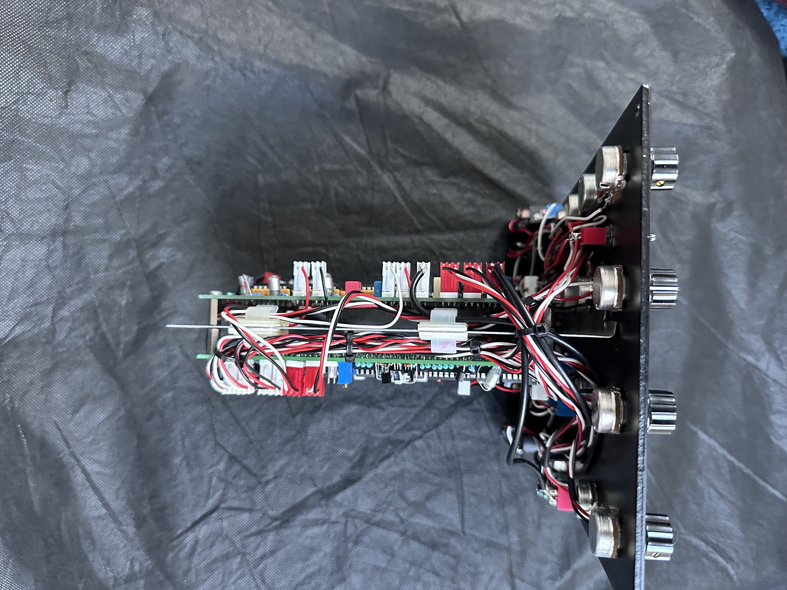
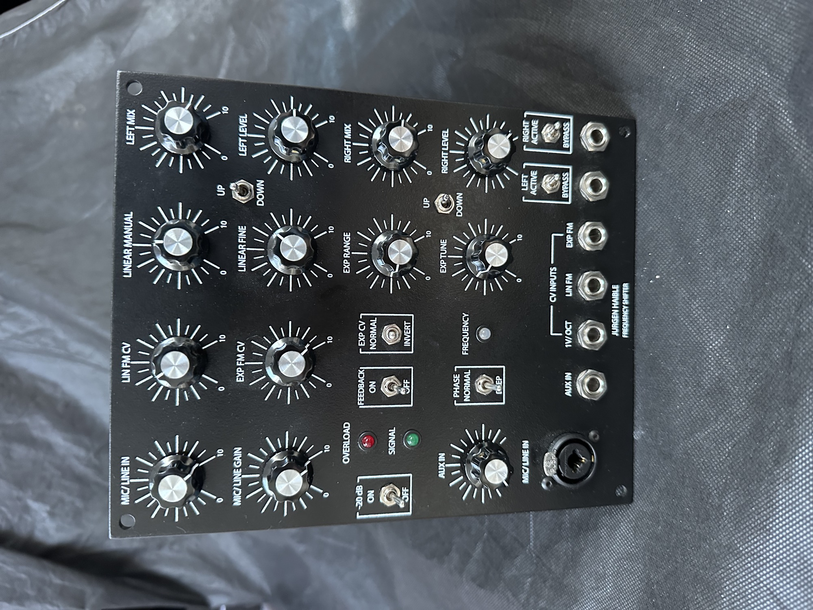
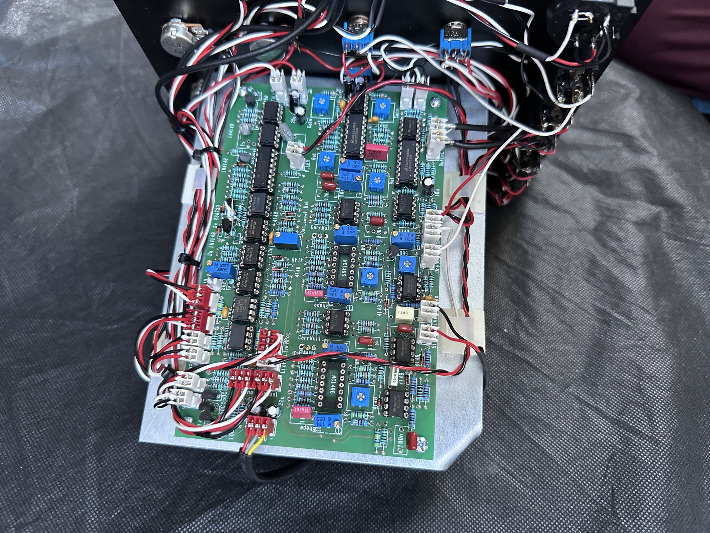
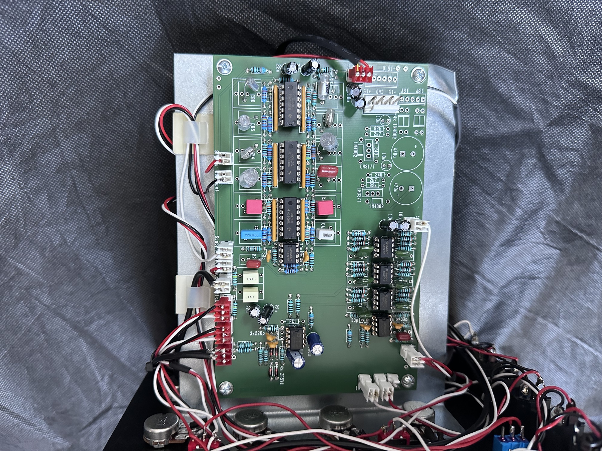

# Juergen Haible FS1A in MOTM

I built few FS1A in 5U.

the documentation/schematics are in my FS1A standalone version [link](../../../diy-synth-other/projects/juergen-haible-fs1a-frequency-shifter/index.md) and subpages.

Its a very complex build.

Build notes Patrick: read this complete PAGE , to understand the device. otherwise you can't calibrate it.

install the Direction LED - to get a feeling when and how the direction changes (at which potentiometer setting)

Linear Manual must be around 0 and middle (12 o clock), everything above stops the modulation.

make sure to use a audio signal with enough gain - the overload LED should start glowing.

known issues in my build: the gain between original(bypass) and modulated signal has different gain.

LM13600 and LM13700 are working.

## Few build notes from Modularsynthesis:

**Parts List and Calibration Notes:**

1. The unmarked radial mounted resistor between the SigCos and Input connectors is R95, 1M.
2. You must slightly bend the 100K and 4.7M resistors leads if using MTA 0.100 for Tune and Exp connectors.
3. Most of the polyester film capacitors in my part number list have 5 mm spacing.  These need to be bent to fit the 7.5 mm PCB footprint on several of the capacitors.
4. The 22 µF capacitors in my part number list are slightly large and need to have the leads bent to fit the back-to-back locations on the PCB.
5. I changed C3 and C4 from 10 µF tantalum to 22 µF electrolytic to use with the DC power connector.  C1, C3 and C7 are in parallel (as are C2, C4, and C8) and loads the DC power connector with 54 µF.  I would recommend leaving C3 and C4 off to lower the capacitance to 32 µF on the DC power connector.
6. There are *thirty-seven* 100 nF SMT capacitors, *not thirty-five*.
7. **The last sentence in the 5th step of calibration should be to adjust*****R119*****to get approx 5V pk on DiffOut,*****not R110*****. (you have to set your front panel Potis in a range where the FS1A basically works, (linear manual and expo range, tune, bypass mix)**
8. Power consumption: ~~111 mA +15, 106 mA -15~~ on Patricks build 80-90mA per Rail maximum.

**Modification Notes: (from Modularsynthesis which require his frontpaneldesign - except for Nr.5 and Nr.6 )**

1. I eliminated the exp polarity switch and modified the expo cv attenuator to a reversing style. On board1 I changed R2 from 51K to 36K, added an additional 36K resistor to pin 6 of U1, and wired the attenuator similar to the linear cv control circuit.
2. I added a separate feedback attenuation control to pins 1 and 2 of the Mic\_Level connector.  The bypass switches route the input to the respective outputs but they do not affect the feedback control so the output may still be shifted.
3. I changed R96 to 68K on board1 and  R20 and R21 to 100K on board2 to reduce the input gain.
4. I added an output which adds SumOut and DiffOut by using U8A on board2.  I changed R51 to 51K on board2, connected Inv1 to SumOut, Inv2 to DiffOut, and InvOut to the Out jack.
5. **I changed R46 to 510R on board1 to make the freq LED brighter. →**✅ **confirmed by Patrick - I used 560R**
6. The jumpers on board1 above R49 and R80 by the CarrNull text are not used and can be omitted. ✅ **confirmed and used by Patrick**

**good to know:**

[https://electro-music.com/forum/viewtopic.php?t=18587&postorder=asc&start=75](https://electro-music.com/forum/viewtopic.php?t=18587&postorder=asc&start=75)

|   |
|---|
| A reversible attenuator is already part of the circuit for linear modulation. 12 o'clock position means no modulation, cw means upshift for positive CV (and downshift for negative CV), ccw means downshift for positive CV. In addition to this, you have a dedicated switch for upshift or downshift for each of the two output channels. It's important to quickly invert the shift direction for one stereo channel for some dramatic effects, so you have switches here, *in addition* to the reversible attenuator. The expo CV input has no reversible attenuator so far; so it may be a good idea to add a "free" inverting amp on the 2nd board. Speaking of lin and expo control: There is no either-or for this in my frequency shifter; you always have them *both*. There are two pots for manual **linear** control: "Manual" and "Fine" which will do the coarse/fine tuning of the frequency shift in a bipolar fashion (12 o'clock position means zero shift). And there are two pots for manual **expo** control: "Range" and "Tune", which will do the coarse and fine tuning in an exponential fashion. All 4 of these pots are always working together to create the final amount (and direction) of frequency shift, so you have comfortable control of both, extremely wide sweeps, and extremely narrow sweeps (fractions of Hertz; important for "Barberpole Phasing"). In addition to these manual controls, there are a linear and an expo CV input: Linear CV with reversible attenuator, Expo CV with logarithmic potentiometer for attenuation. Plus a dedicated 1V/Oct input (also exponential in nature); don't expect accurate tracking on more than 2 or 3 octaves, though. |

from J.H:

Personally I find the 4 potentiometers very comfortable.

You can set your maximum range (for a manual sweep) with the exponential pot, and then use the full rotation of the linear pot to perform this sweep, with zero shift at 12 o'clock position.

The linear fine tuning knob helps to set very precise sweeps near the zero point (for "infinite phasing"), even when a rather large range is set with the exponential pot.
The exponential fine tuning helps tuning the oscillator when you want your frequency shift amount to be in a precise musical relation to your input signal. ("Tracking Shift")

You certainly can omit some of this, and find a (smaller) configuration that fills your needs. What I recommend is the 4-pot solution - what I provide is linear and expo CV inputs at the same time, which allows you any other way to control it that you like.

You could replace each coarse/fine pot pair with a vernier dial and a single pot, of course. Or a set of concentric pots. Or substitude some of it with a rotary switch + resistor divider. Or connect a joystick.
