# Juergen Haible Living VCOs in MOTM

> **Project**
>
> ### Projecttitel: Juergen Haible Living VCOs in MOTM
>
> ### Status: `in progress`
>
> ### Startdate: September 2014
>
> ### Duedate: December 2018
>
> update:  January 2017 addional pcb for separate outputs
>
> ### Manufacture link: check the legacy page: [http://www.jhaible.info/wsdindex.html](http://www.jhaible.info/wsdindex.html)

**update:** for my MOTM Panel version its needed to use a separate triple Amplifier for the SAW outs or pulse outs. check this out [LVCO addon](lvco-addon/index.md)

**check the legacy page:** [http://www.jhaible.info/wsdindex.html](http://www.jhaible.info/wsdindex.html)

**Build thread on muffwiggler: for Eurorack pcb version**

[http://www.muffwiggler.com/forum/viewtopic.php?t=117137&highlight=living+vco](http://www.muffwiggler.com/forum/viewtopic.php?t=117137&highlight=living+vco)

**general lvco thread**

[http://www.muffwiggler.com/forum/viewtopic.php?t=93892&postdays=0&postorder=desc&start=130](http://www.muffwiggler.com/forum/viewtopic.php?t=93892&postdays=0&postorder=desc&start=130)

**further build thread:**

[http://www.reredredsynth.com/ladbrokeGroveVCOarray-implmt.htm](http://www.reredredsynth.com/ladbrokeGroveVCOarray-implmt.htm)

**known Issues for Eurorack pcb version from muffwiggler (my pcb as shown here is the original pcb from J.H)**

R39 use socket and try 820K to 1M

cut the socket on left side for using the tempco

for c7/c8 are film caps fine or bipolar electrolyte caps

**BOM Core PCB:**

[Living VCO Core BoM.pdf](assets/Living-VCO-Core-BoM.pdf)

10K Poti for Frontpanel with vernier dials [http://www.reichelt.de/534-10K/3/index.html?&ACTION=3&LA=446&ARTICLE=2543&artnr=534-10K&SEARCH=+53+4-10k](http://www.reichelt.de/534-10K/3/index.html?&ACTION=3&LA=446&ARTICLE=2543&artnr=534-10K&SEARCH=+53+4-10k)

**BOM Driver PCB:**

[**Living-VCO-Driver-BoM-v1.1.pdf**](assets/Living-VCO-Driver-BoM-v1.1.pdf)

> **Info**
>
> Randomsource Version files: (with addional wave shaper and VCA)
>
> [LVCO\_2015\_addons.pdf](assets/LVCO_2015_addons.pdf)

## Wiring:

[living\_vcos\_wiring\_opt1.pdf](assets/living_vcos_wiring_opt1.pdf)

[living\_vcos\_wiring\_opt2.pdf](assets/living_vcos_wiring_opt2.pdf)

[living\_vcos\_wiring\_opt3.pdf](assets/living_vcos_wiring_opt3.pdf)

Calibration

Calibration is quite similar to what you have on other VCOs.
S - Scale. Here you adjust the 1V/Oct tracking. Apply a CV from your Keyboard or Midi-&gt;CV Converter. Connect a guitar tuner or frequency counter to the VCO output and adjust "S" until 1 octave on the keyboard is exactly 1 octave of VCO frequency.
F - Frequency. Here you can adjust the absolute frequency (not the scale). You can set it to something like 16Hz (or whatever else you prefer) for the ccw end position of the 10-Turn front panel "Frequency" control.
H - High frequency tracking. Honestly: i didn't even adjust this in my prototype - I just left it in mid position. If you need to, you can fine tune the octave tracking for higher frequencies here.
PW1(2)(3)Adj - Pulse width adjust. With the front panel Pulse Width knob in 12 o'clock position, adjust the trimmer for 50% pulse width.

## Schematics:

[living\_vcos\_sch\_4of4.pdf](assets/living_vcos_sch_4of4.pdf)

[living\_vcos\_sch\_2of4.pdf](assets/living_vcos_sch_2of4.pdf)

[living\_vcos\_sch\_3of4.pdf](assets/living_vcos_sch_3of4.pdf)

[living\_vcos\_sch\_1of4.pdf](assets/living_vcos_sch_1of4.pdf)

## Build notice:

add 3 Amps for usage with the Panel with separeted Puls and saw output.

## Optiponal

**Waveshaper adds SIN, TRI:**

**from:**[**http://electro-music.com/forum/topic-30749-275.html**](http://electro-music.com/forum/topic-30749-275.html)

[**living\_vco\_waveshaper\_stripboard\_211.pdf**](assets/living_vco_waveshaper_stripboard_211.pdf)

**please add 22uF electrolyt caps and 100nF decoupling caps**

[living\_vco\_waveshaper\_stripboard\_211.pdf](assets/living_vco_waveshaper_stripboard_211.pdf)

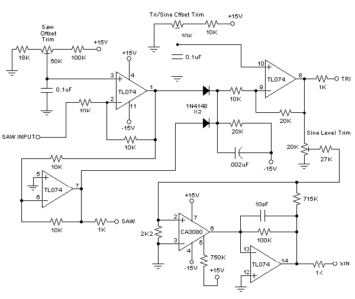

# Frontpanel:

[JHLivingVCO1.fpd](assets/JHLivingVCO1.fpd) in MOTMwith RED circles (shown on picture)

[JHLivingVCO1\_wo\_red\_wo\_square.fpd](assets/JHLivingVCO1_wo_red_wo_square.fpd)   without SQUARE, without RED circle, without switch

[JHLivingVCO1\_wo\_red.fpd](assets/JHLivingVCO1_wo_red.fpd)   in MOTM without red circle

keep Attention on the SQUARE output.. delete it, if you dont have it.

[5U\_LVCO\_DSL-MAN.fpd](assets/5U_LVCO_DSL-MAN.fpd)

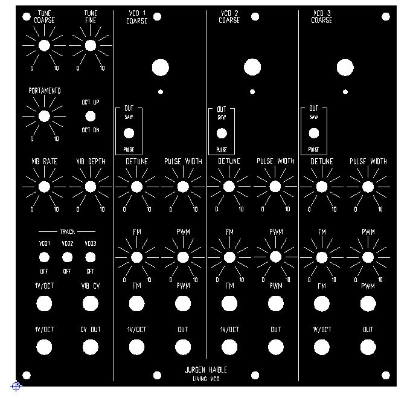

## Gallery:

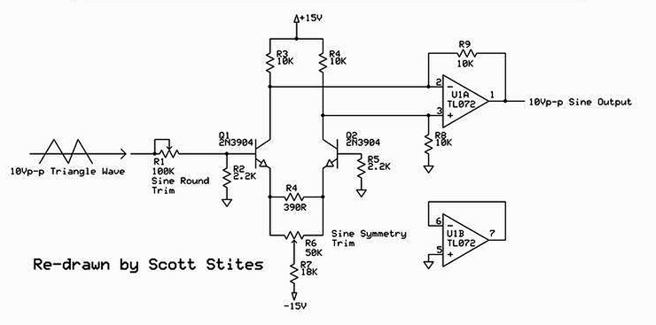

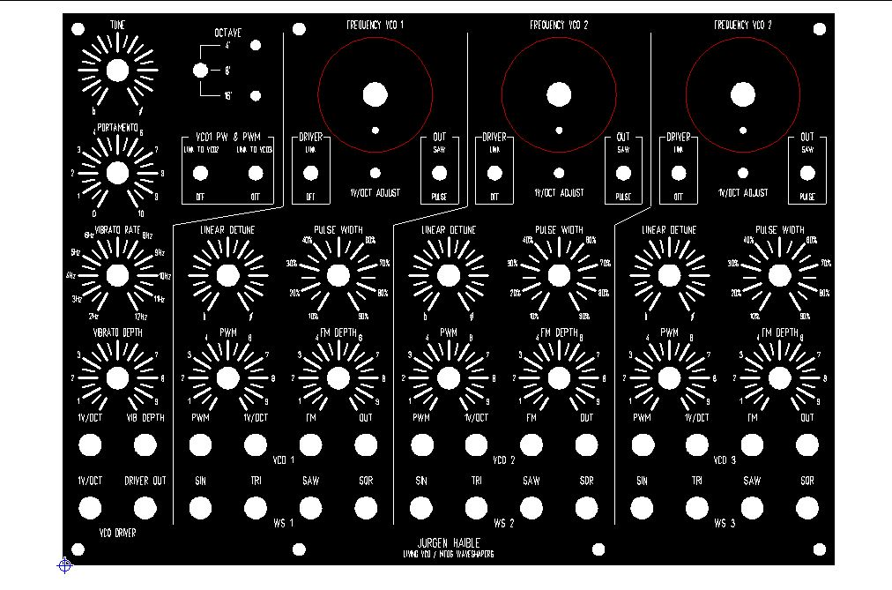

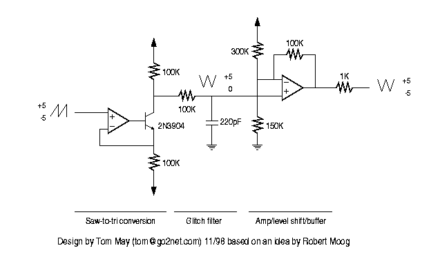

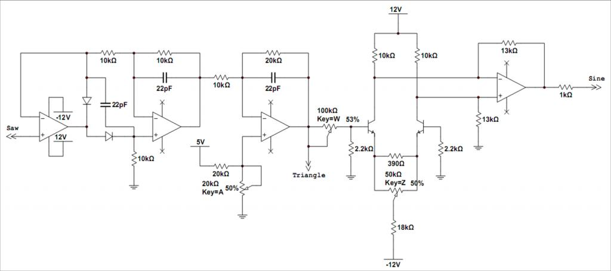

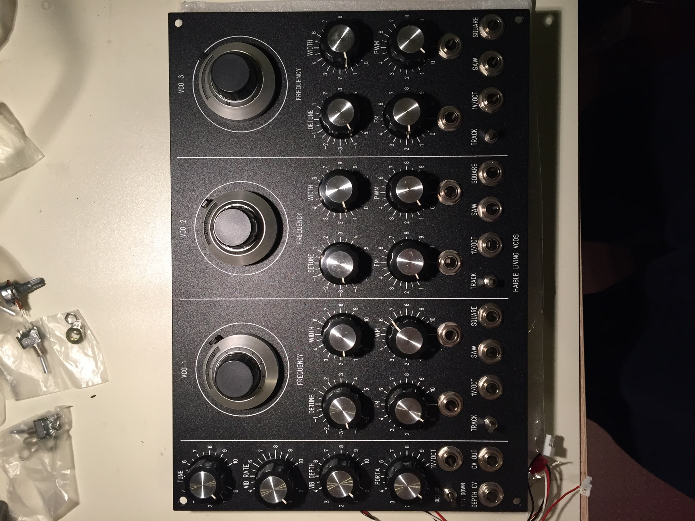

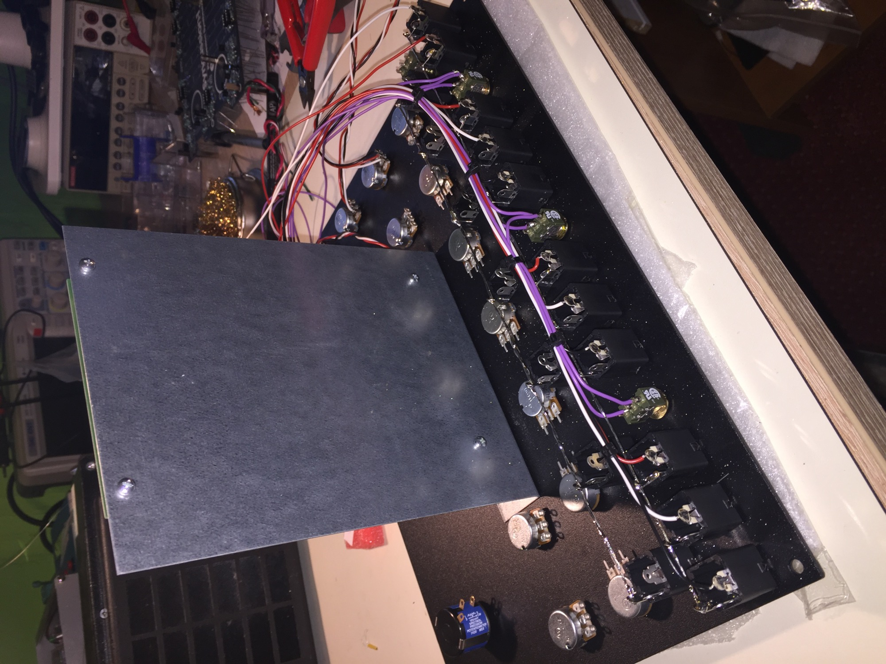

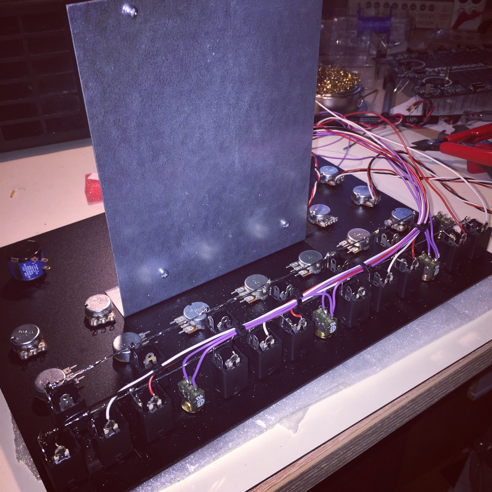

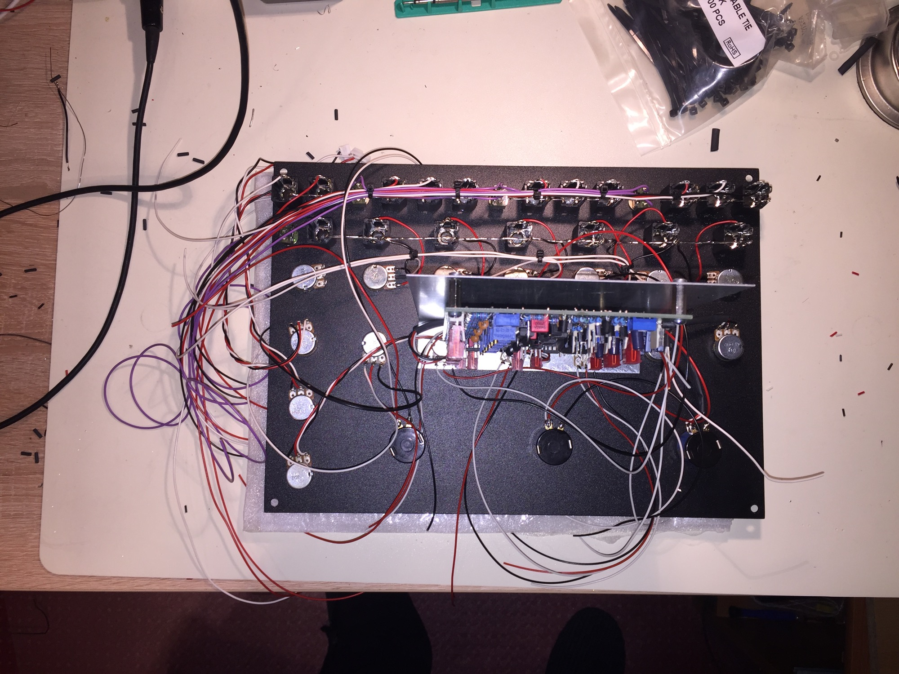

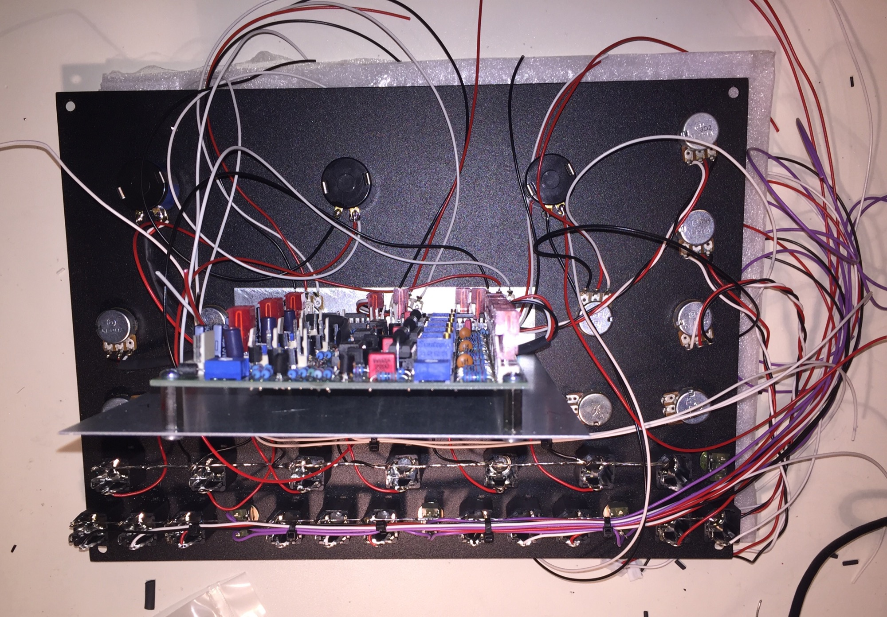

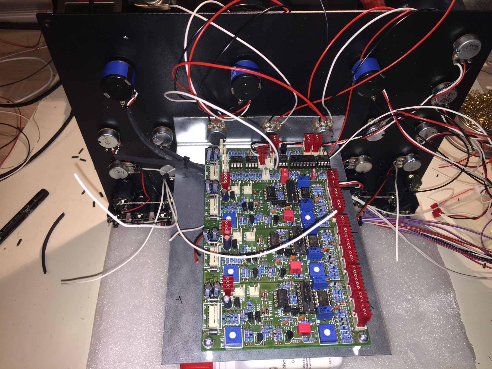

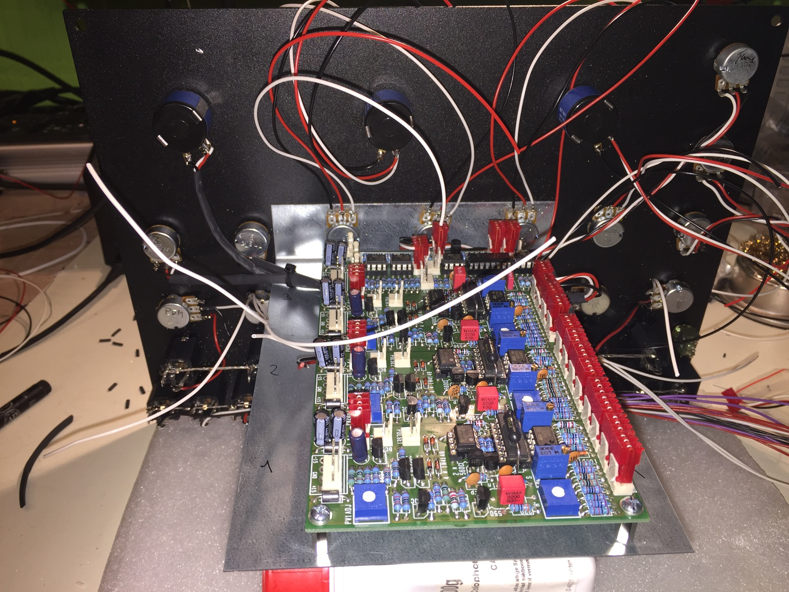

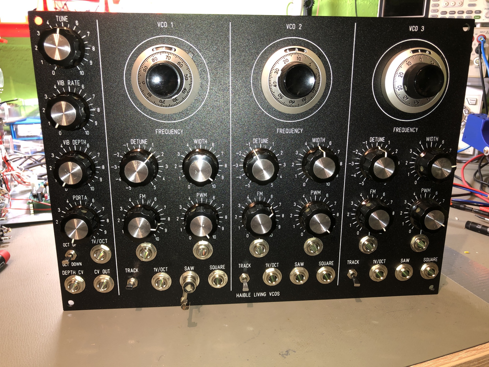

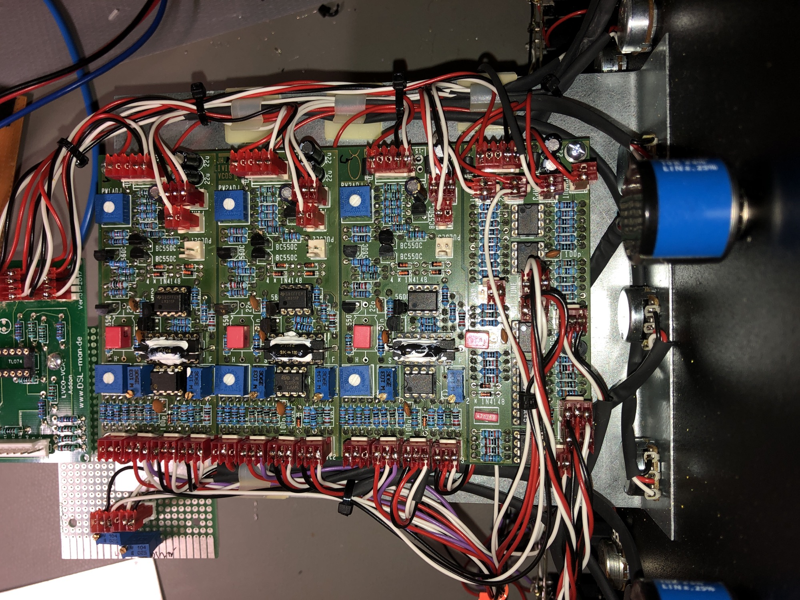

Attachments download:

- [Living VCO Core BoM.pdf](assets/Living-VCO-Core-BoM.pdf)
- [triangle_to_sine_converter_210.jpg](assets/triangle_to_sine_converter_210.jpg)
- [panel.JPG](assets/panel.jpg)
- [JHLivingVCO1.fpd](assets/JHLivingVCO1.fpd)
- [Living-VCO-Driver-BoM-v1.1.pdf](assets/Living-VCO-Driver-BoM-v1.1.pdf)
- [JHLivingVCO1_wo_red.fpd](assets/JHLivingVCO1_wo_red.fpd)
- [sawtotri.gif](assets/sawtotri.gif)
- [2077_sawtosine_shaper_2.jpg](assets/2077_sawtosine_shaper_2.jpg)
- [t_waveshape_156.gif](assets/t_waveshape_156.gif)
- [living_vco_waveshaper_stripboard_211.pdf](assets/living_vco_waveshaper_stripboard_211.pdf)
- [JHLivingVCO1_wo_red_wo_square.fpd](assets/JHLivingVCO1_wo_red_wo_square.fpd)
- [LVCO_DSL-man.JPG](assets/LVCO_DSL-man.jpg)
- [5U_LVCO_DSL-MAN.fpd](assets/5U_LVCO_DSL-MAN.fpd)
- [p1b1jo07faefu1eti1i821ceq14nj3.JPG](assets/p1b1jo07faefu1eti1i821ceq14nj3.jpg)
- [p1b1jo07fb1taca633m1bpp1iem4.JPG](assets/p1b1jo07fb1taca633m1bpp1iem4.jpg)
- [p1b1jo07fcrp01egr92n16841g8j5.JPG](assets/p1b1jo07fcrp01egr92n16841g8j5.jpg)
- [p1b1jo07fc5no19t240717ocinh6.JPG](assets/p1b1jo07fc5no19t240717ocinh6.jpg)
- [p1b1jo07fc1un83q91jlr1vf61avf7.JPG](assets/p1b1jo07fc1un83q91jlr1vf61avf7.jpg)
- [p1b1jo07fcfooa0l19i2102ai7u8.JPG](assets/p1b1jo07fcfooa0l19i2102ai7u8.jpg)
- [p1b1jo07fcq7p1suk1smo3l914in9.JPG](assets/p1b1jo07fcq7p1suk1smo3l914in9.jpg)
- [living_vcos_wiring_opt1.pdf](assets/living_vcos_wiring_opt1.pdf)
- [living_vcos_wiring_opt2.pdf](assets/living_vcos_wiring_opt2.pdf)
- [living_vcos_wiring_opt3.pdf](assets/living_vcos_wiring_opt3.pdf)
- [living_vcos_sch_1of4.pdf](assets/living_vcos_sch_1of4.pdf)
- [living_vcos_sch_2of4.pdf](assets/living_vcos_sch_2of4.pdf)
- [living_vcos_sch_3of4.pdf](assets/living_vcos_sch_3of4.pdf)
- [living_vcos_sch_4of4.pdf](assets/living_vcos_sch_4of4.pdf)
- [IMG_3964.JPG](assets/IMG_3964.jpg)
- [IMG_3968.JPG](assets/IMG_3968.jpg)
- [LVCO_2015_addons.pdf](assets/LVCO_2015_addons.pdf)
