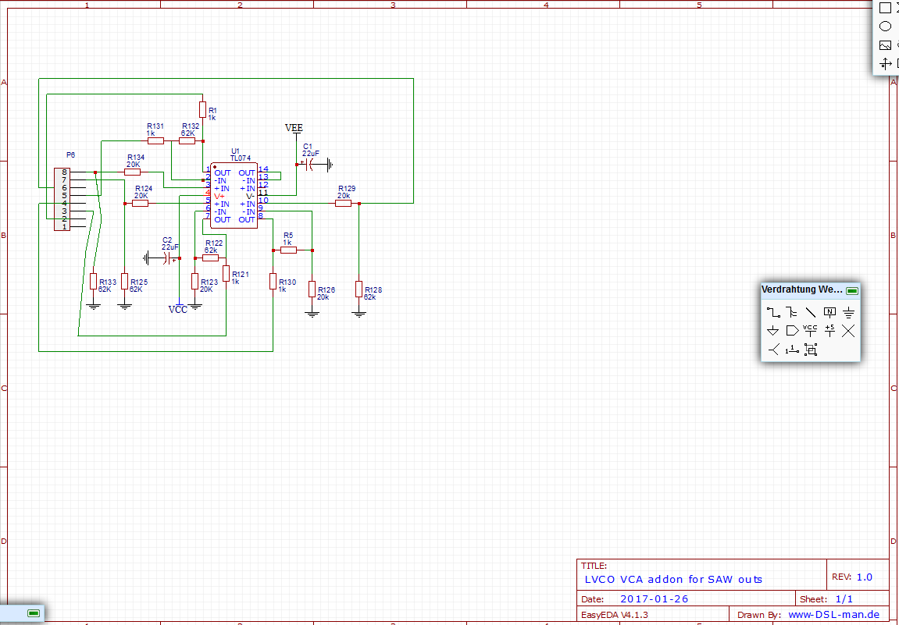
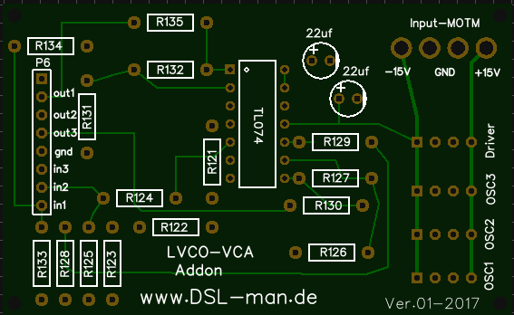
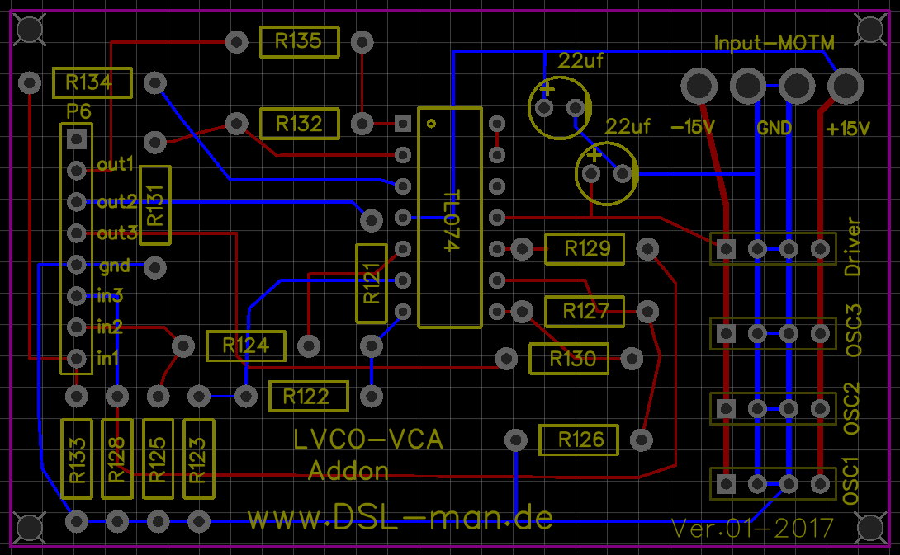

# LVCO addon

the original haible design has only 3 Amps for the pulse out or saw out,

its needed to boost for normal usage all outputs. (check the haible schematics - wiring guide, the original design is with a switch to choose SAW or pulse, if you want separate outputs you need a addional OPamp)

**i left 4 pcbs, feel free to ask me if you want one for 7€  (material costs)**

**BOM:**

you need 1x MOTM header and 4x MTA 100 - 4pin (for power wiring if needed)

[LVCO-BOM.csv](assets/LVCO-BOM.csv)

**Schematic:**

**Gerber files**

[doublelayer-tripleVCA3-power.zip](assets/doublelayer-tripleVCA3-power.zip)

**PCB Photo**

**reference designators**

