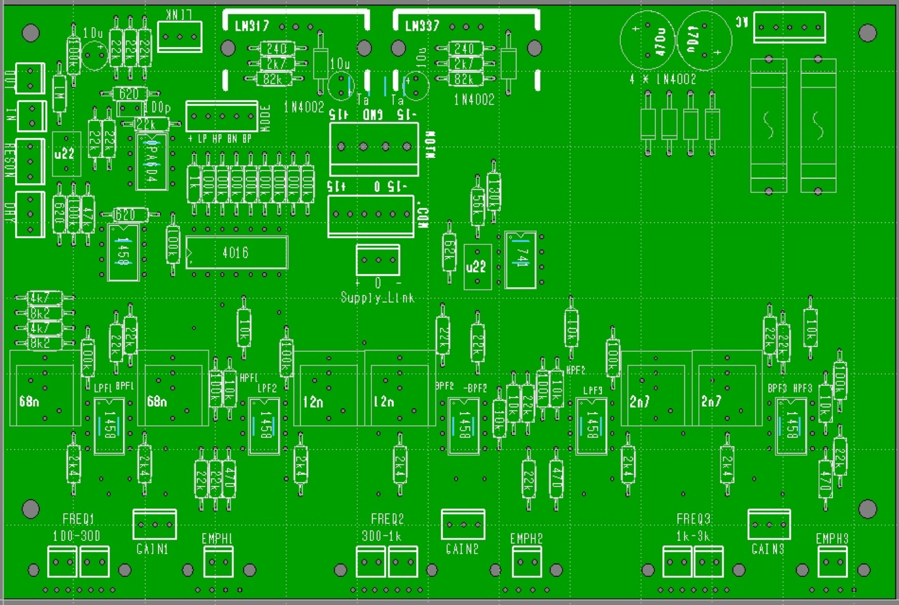
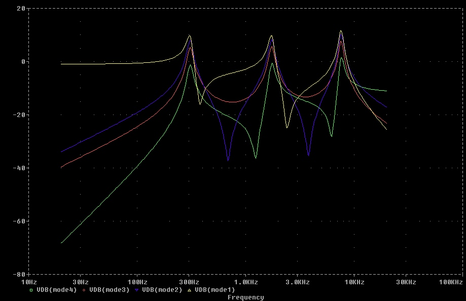
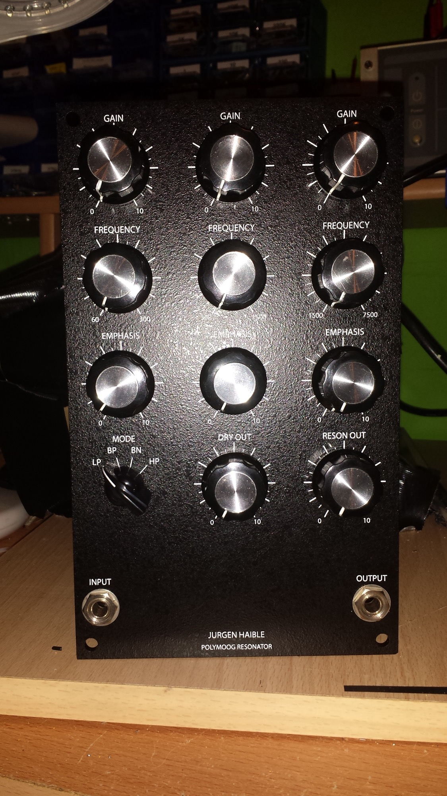
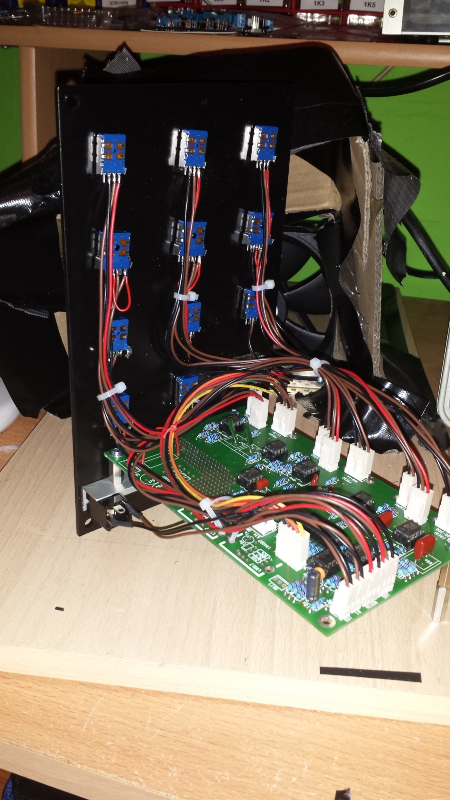

# Juergen Haible Resonator

> ## Project: Juergen Haible Resonator
>
> ### Status: `finished`
>
> ### Startdate: 15.10.2013
>
> ### Duedate: 25.11.2013
>
> ### Manufactore Website:[http://www.jhaible.info/resonator/resonator.html](http://www.jhaible.info/resonator/resonator.html)
>
> ### Shematics subpage of me: [Juergen Haible Resonator Schematics and technical stuff](juergen-haible-resonator-schematics-and-technical-stuff/index.md)

## Related articles from Juergen:

**JH. Polymoog® Resonator Clone**
("Moog" is a registered Trademarkof Moog Mucic ([http://www.moogmusic.com](http://www.moogmusic.com)). "Polymoog", as far as I know, is not. If you think this infringes anybody's rights, please contact me at [jhaible@debitel.net](mailto:jhaible@debitel.net), and I'll remove it immediately.)

The Polymoog, an early polyphonic synthesizer, featured a 3-band "Resonator" section that allows Formant-Filtering in addition to its dynamic Filters. Such a Resonator is a very useful feature for other analogue synthesizers, too, as Kenneth Elhardt expertly demo'ed on a [youtube video](http://www.youtube.com/watch?v=_XUiJi5153Y) he made.
 I decided to make a PCB especially for this resonator section, and I used the same old "vintage" / "Low Fi" opamps to re-create that circuit.
 Here's a glimpse of the board:

There is a power supply on this PCB, so all you need is a 15V ... 18V AC wallwart or a 15V ... 18V mains transformer to have a real standalone Effect device. Alternatively, you can power it with standart +/-15V DC, either with MOTM or Synthesizers.com connectors.

As I only provide the blank PCBs, it's up to you which opamps you are going to use!
 The 1458 type opamps that have been used in the original are merely something like a dual 741, with limited slew rate and all. If you want your resonator to sopund like the one in a Polymoog Synthesizer, with all its side effects - use these chips!
 If you want something more on the "clean" side, use your favorite high quality dual opamp instead. I have no bias in one direction whatever - you choose! (Use sockets, and do an A/B test if you like - it's all DIY.)

Here's a quick [audio sample](http://www.jhaible.com/resonator/polymoogresodemo1.mp3) I made with my prototype. I don't even try to achieve anything like Ken did in his youtube demo - I'm just demonstrating that everything works as intended, and that you can give a rather thin-sounding Oberheim OB-8 a gread deal of BASS, among other things. At the beginning, and when a new sound on the OB-8 is introduced, there are a few seconds of dry sound, then the resonator comes in. But you'll notice this by yourself, I'm sure. :)

You can link several boards for more than 3 bands, or use two boards for stereo processing. The power supply components are only needed once, in that case.

Pictures of the first Prototype (using rotary pots - but you can use sliders instead, of course!)

Here's a picture showing some typical frequency response courves you can create with this.
 Please not that you can select the 3 modes from the Polymoog (Low Pass, Band Pass, High Pass), plus a 4th mode I would describe as "Bandpass-Notch". Odd enough, this is implemented in the original Polymoog synthesizer, too, but it could not be selected from its front panel. It sounds quite interesting, IMO. Not as "heavy" as the normal Band Pass mode, because of the nothches between the peaks. (Due to phase cancellation between adjacent BPF bands). You can easily spot which mode is wich, on the picture below:

