# Juergen Haible Tau Pipe Phaser

> **Project**
>
> ### Projecttitel: Juergen Haible Tau Pipe Phaser
>
> ### Status:`finished`
>
> ### Startdate: Juni 2014
>
> ### Duedate: Juni 2014
>
> ### Manufacture link: [http://www.jhaible.info/tau/jh\_tau.html](http://www.jhaible.info/tau/jh_tau.html)

for Randomsource Version check my subpage:

**Fullkit build from bridechamber in MOTM Format with CA3046**

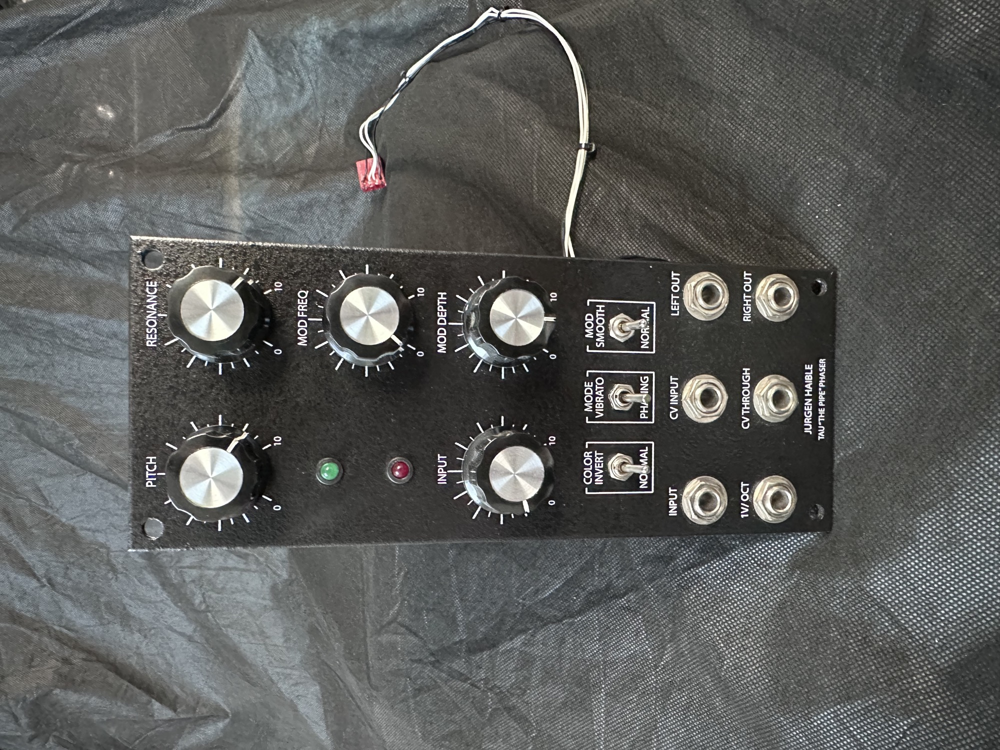

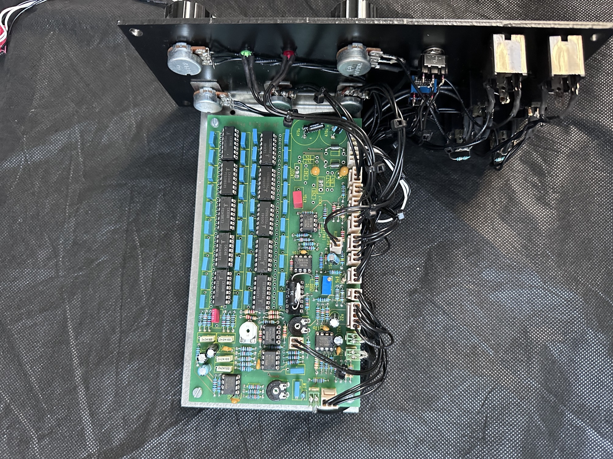

i have changed all cheap lowcost ceramic to MLCC capaciators and used IC-socks.

### **BOM**

[jh\_tau\_bom.pdf](assets/jh_tau_bom.pdf)

### Component Overlay

[jh\_tau\_component\_overlay\_with\_comments.pdf](assets/jh_tau_component_overlay_with_comments.pdf)

Important update: (from J.H)
I noticed that the 100nF 0805 SMD bypass capacitors that I've soldered into my prototype are only rated for 25V.
What you need, by any means, are 35V (or higher) rated capacitors.
While ordering new caps from Reichelt, I noticed that for 0805 parts, the 100nF come in 25V, but the 47nF are rated 63V.
So I ordered a bunch of 47nF/63V 0805 caps for future use in my electronics lab.
Bottom line for you:
If  you can actually get 0805 parts 100nF with 35V or more, it's fine to use these.
If not, go for 47nF with 35V or more.

I built the Tau pipe with CA3046 in Jun2014 as MOTM VERSION.

please pay attention by connecting the power connection.

 on the pcb is left pin -15V and pin 5(right) +15V  the second and fourth pin is ground.

**Haible pcb:**

pin 5 on mta100 connector (left pin on pcb)  (trace goes to diode)

pin4 = ground

pin3 = empty

pin2 = ground

pin1 = -15V (trace goes to diode)

**MOTM standard:** ✅ approved by DSL-man

1= +15V 

2= Ground

3= Ground

4= -15V

use a diodetester and check for shorts..between all pins.. further you can check that the ground goes to left headers like led etc.

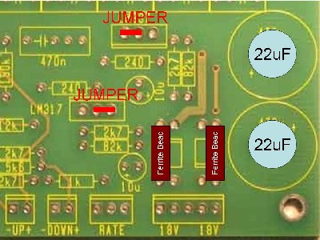

picture from dragonfly/bill & will tested by me ✅

**Tempco Resistors**

My version of the 20-pole-Phaser was designed with a 560 Ohm Tempco Resistor for Temperature compensation of the 1V/Octave tracking.
(The Tau "Pipe" Phaser used a 1.87 kOhm Tempco Resistor.)

You can use a 1 kOhm Tempco Resistor, which is a much more common value, if you also change two other component values.
This picture shows what you have to change. (Or click on image to enlarge.)

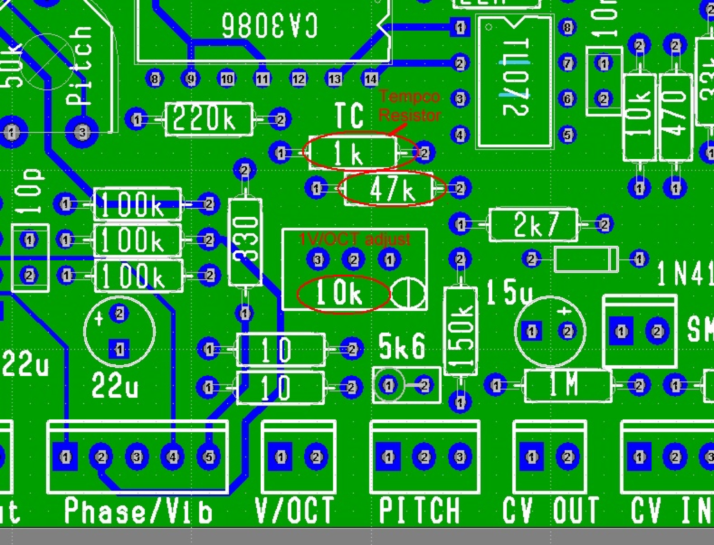

## **Calibration**

1. Pitch trimmer setting. (I guess No input signal is needed to do this, or Yes?)

a. The external “Pitch” pot to middle position (?)

b. The external “Modulation Depth (Oscil. Level)” pot to maximum (cw) position (?)

c. The external “Modulation Rate (Sweep Rate)” pot to lowest (ccw) position (?)

Then adjust the pitch trimmer for the most pleasant sweep sound.

2. Resonance trimmer setting. (Is an input signal necessary and if yes, any suggested frequency?)

a. The “Resonance” trimmer to maximum (cw).

b. The external “Resonance” pot to maximum.

c. The nice/screaming oscillation “switch” (if installed), to the “off” (nice) position.

Then reduce “Resonance” trimmer until you like it

## Frontpanel connections:

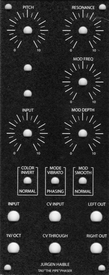

**Pots:**

Pitch Knob (Manual Sweep) 100k Linear - to "pitch" on PCB

Resonance Knob (Feedback) 100k Linear - to "reso" on PCB

LFO Rate Knob (Modulation Frequency) 100k Linear - to "rate" on PCB

Oscillator Level Knob (Modulation Depth) 10k Log - to "osc\_level" on PCB

Input  10K log

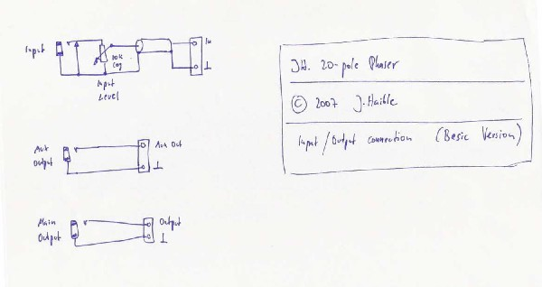

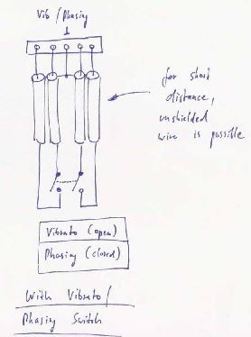

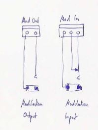

All other connections are reversed (ground is left on all pcb headers, on picture shown as right)

you double check by a diodetester between powersupply input and the pinheaders from pcb outputs.

Modification:

install only 14 filter by using 7 CA3046 and connect with a cable the output/input on the pcb.

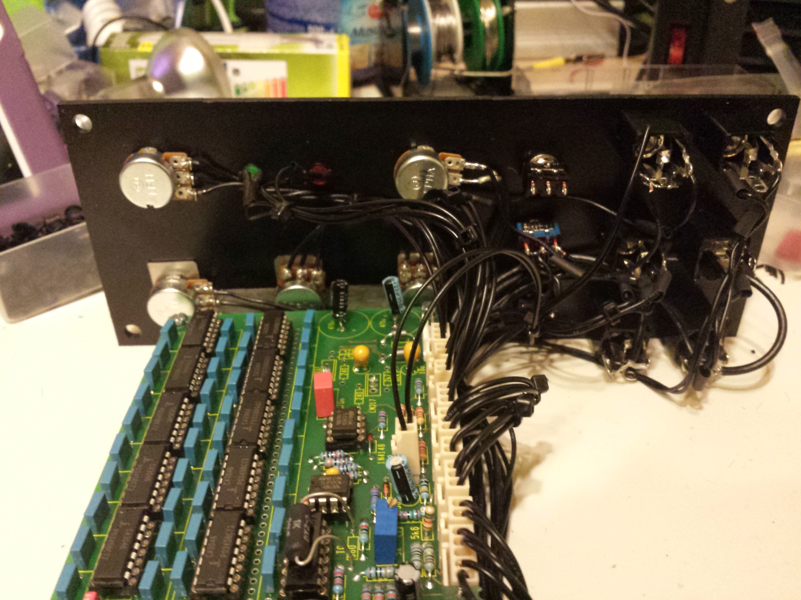

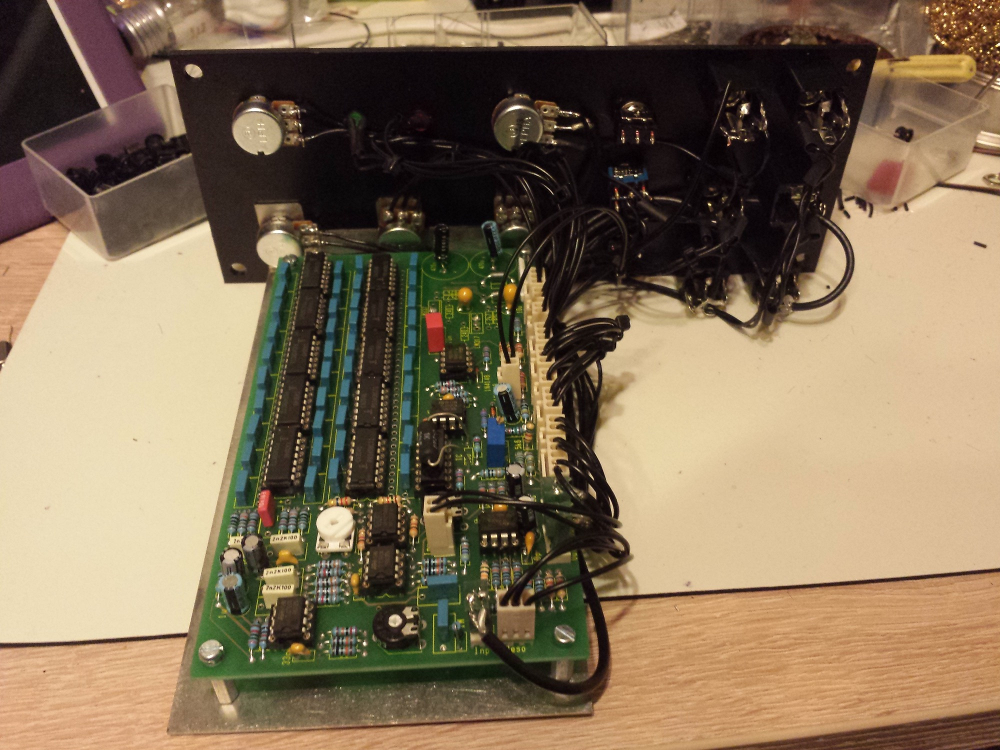

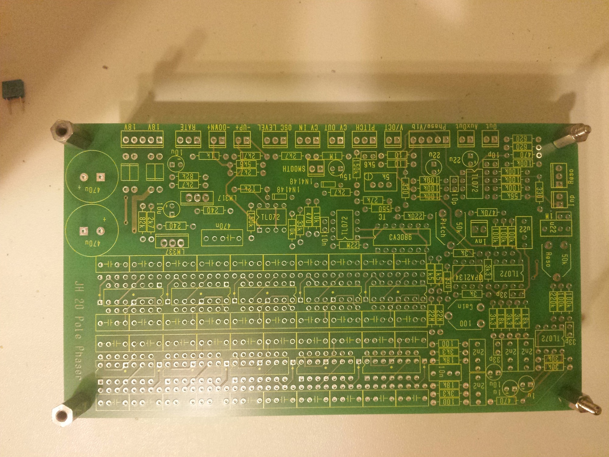

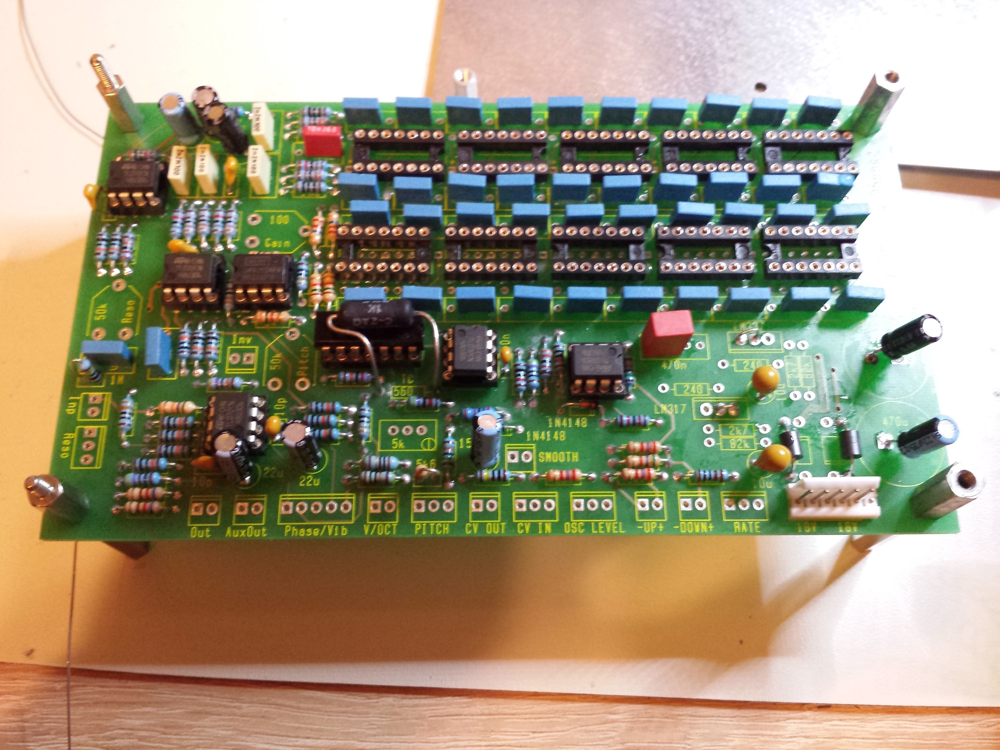

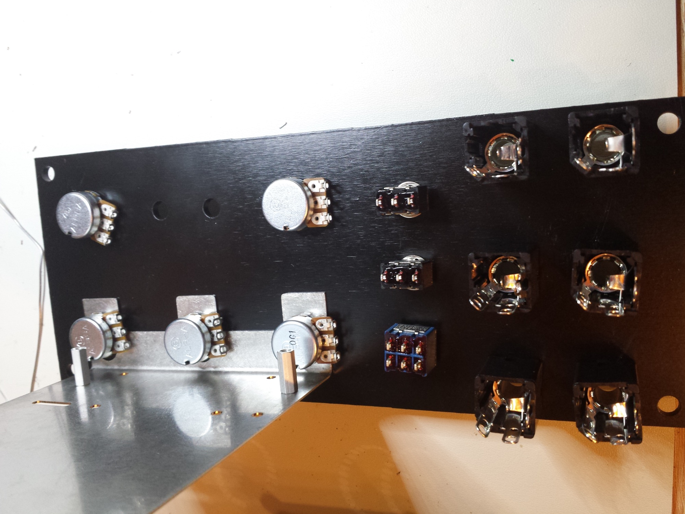

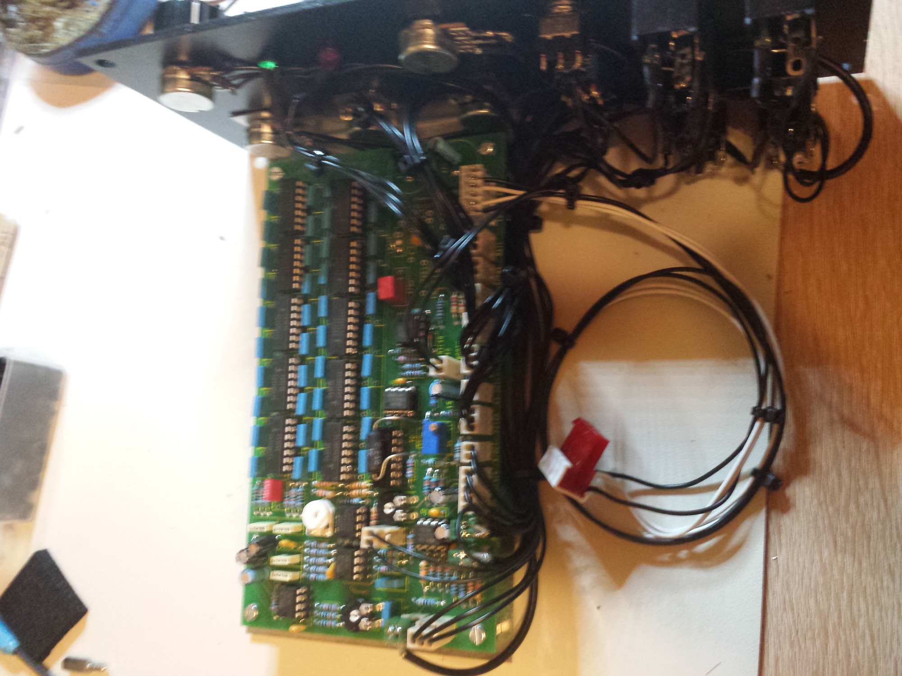

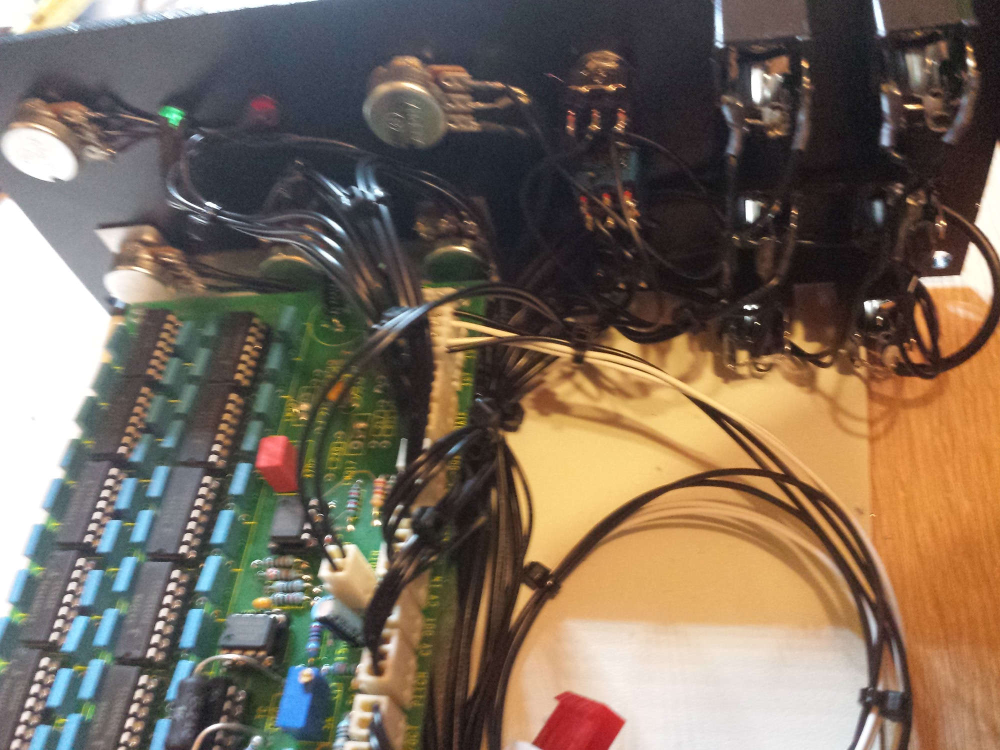

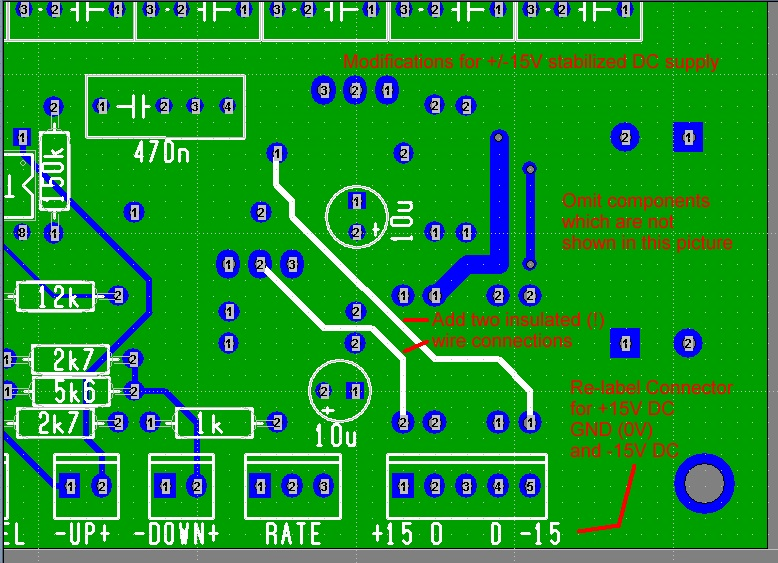

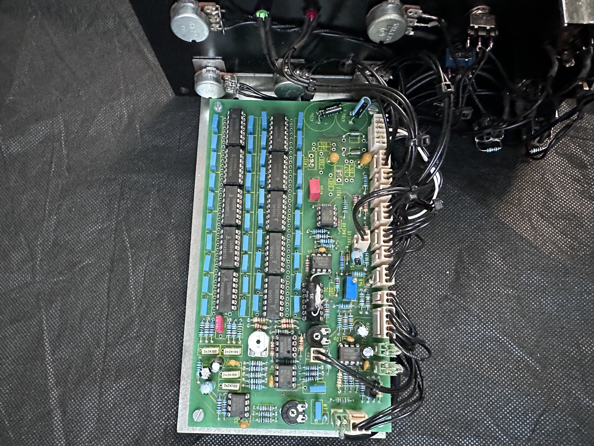
