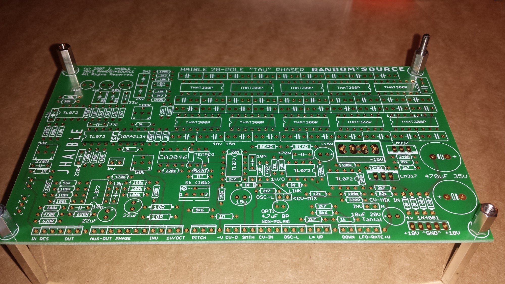
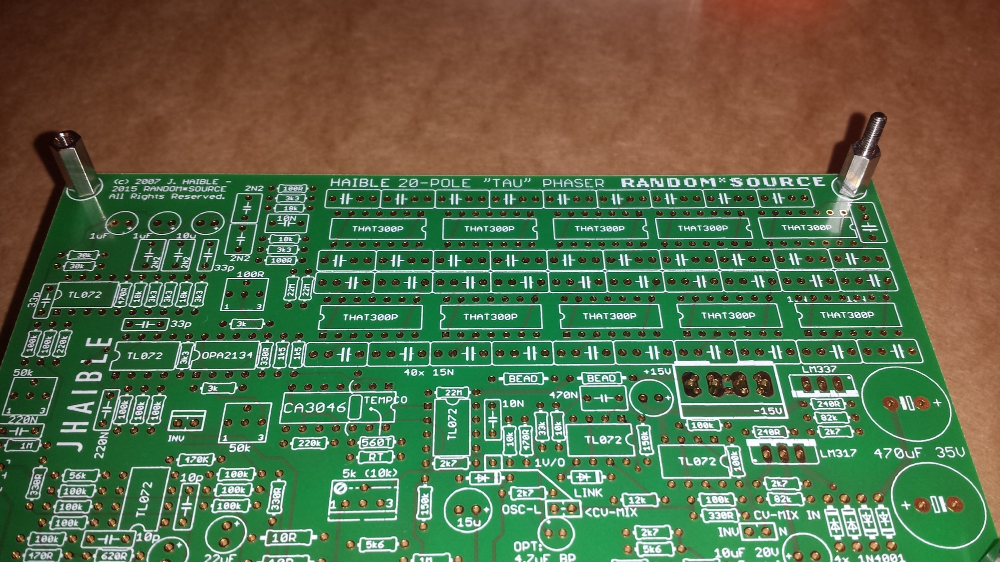
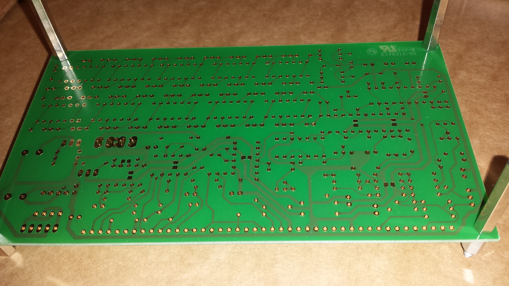
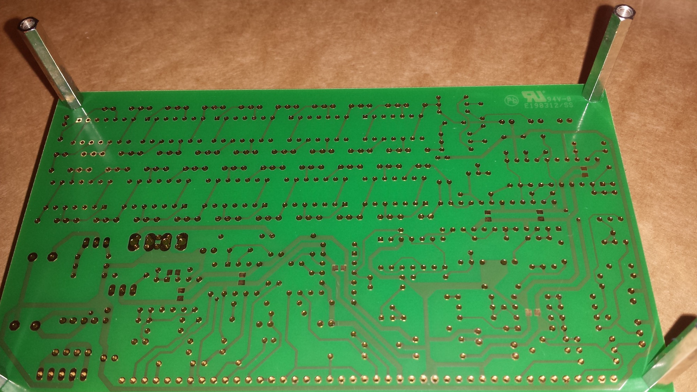
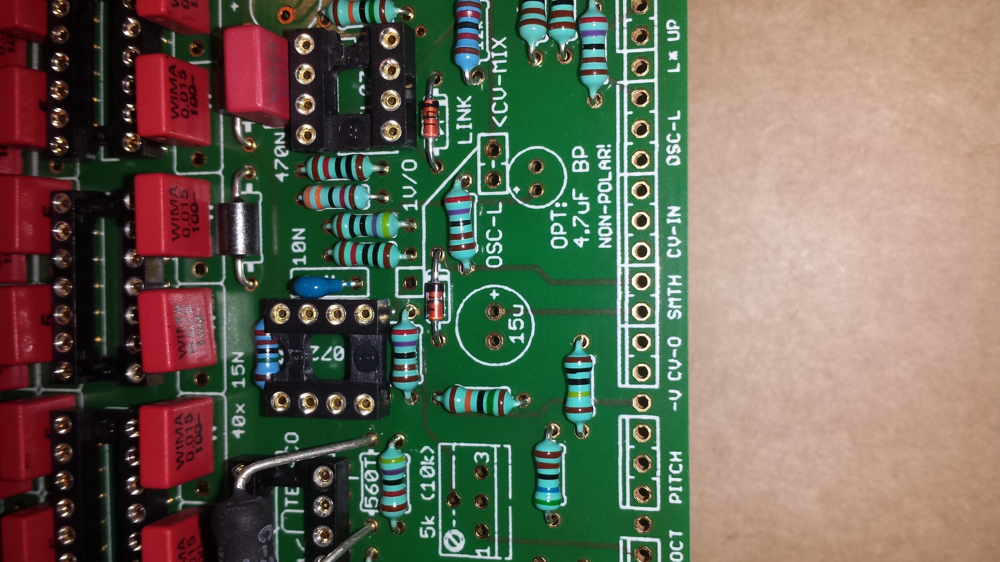
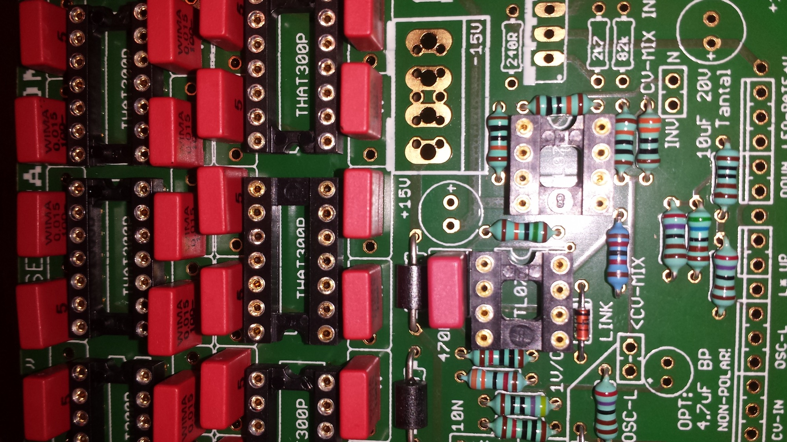
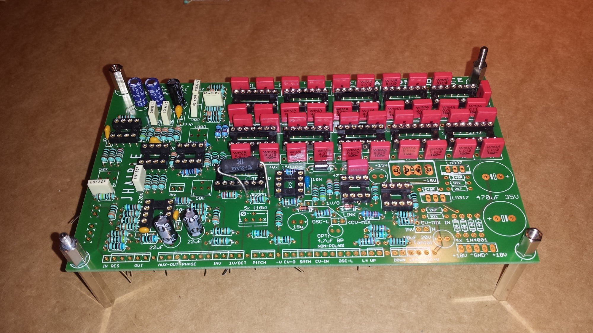

# Tau Pipe  Random Source Version

> **Project**
>
> ### Projecttitel: Tau Pipe Random Source Version
>
> ### Status: `finished`
>
> ### Startdate: 04/2015
>
> ### Duedate:
>
> ### Manufacture link: [http://jhaible.com/](http://jhaible.com/) (Randomsource)

Here are some Infos about the Randomsource Version from 2015

i finished this Version in MOTM Format with THAT300p  IC´s and it sounds great.

for BOM and more Infos please check  [http://jhaible.com/](http://jhaible.com/) and take a look at the original BOM on my "old" Version page: [Juergen Haible Tau Pipe Phaser](../index.md)

**lessons learned:**

issue:  pitch and CV input dosn't work,

make sure the CV input jack is wired with 3 cables - use the jack switch, otherwise the connection between Pitch and OSC  dosn't work.

(i dont used the CV Mixer)

**the PCB  of the new randomsource version is in ENIG instead of HASL, you need enough heat on your soldertip.**

